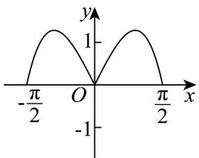
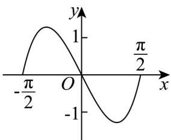
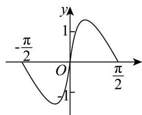

<!-- question-source:start -->
43. 函数 $f(x) = \frac{\left(\mathrm{e}^{2x} - 1\right)\cos x}{\mathrm{e}^x}\left(-\frac{\pi}{2} \leq x \leq \frac{\pi}{2}\right)$ 的图象大致为（）

A

B

C

D

<!-- question-source:end -->

![[高中/课堂同步/题库/人教A版高中数学同步讲义(2026)/04_选择性必修第二册/第五章一元函数的导数及其应用/专题02+利用导数研究函数的单调性六大常考题型（高效培优专项训练）数学人教A版2019高二选择性必修第二册/题型五_函数与导函数图象之间的关系/questions/answers/Q00083965A1.md]]
