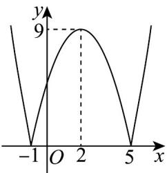

> [!faq]- 《专题02+利用导数研究函数的单调性六大常考题型（高效培优专项训练）数学人教A版2019高二选择性必修第二册》官方解析
>
> > [!success]- **【答案】**  A. $(-1,0)\cup (2,5)$ B. $(-1,2)\cup (5, + \infty)$ C. $(- \infty, 0) \cup (2, 5)$ D. $(- \infty, -1) \cup (0, 5)$
>
> > [!note]- **【分析】**
> > 由函数图象得出 $f'(x) > 0$ 和 $f'(x) < 0$ 的解，然后用分类讨论思想求得结论.
>
> > [!note]- **【解析】**
> > 由函数 $f(x)$ 的图象可得 $f'(x) > 0$ 的解集为 $(-1,2) \cup (5, +\infty)$ ， $f'(x) < 0$ 的解集为 $(- \infty - 1) \cup (2,5)$
> >
> > $x \cdot f'(x) < 0$ 等价于 $\left\{ \begin{array}{l} x < 0 \\ f'(x) > 0 \end{array} \right.$ 或 $\left\{ \begin{array}{l} x > 0 \\ f'(x) < 0 \end{array} \right.$ ，
> >
> > 所以 $-1 < x < 0$ 或 $2 < x < 5$
> >
> > 所以不等式 $x \cdot f'(x) < 0$ 的解集为 $(-1,0) \cup (2,5)$ .
> >
> > 故选 **A**.
