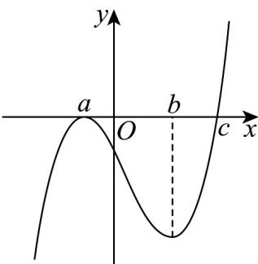

> [!faq]- 《专题02+利用导数研究函数的单调性六大常考题型（高效培优专项训练）数学人教A版2019高二选择性必修第二册》官方解析
>
> > [!success]- **【答案】**  A. $a$ 是 $f(x)$ 的极大值点 B. $c$ 是 $f(x)$ 的极小值点 C. $f(x)$ 在 $(- \infty, c)$ 上单调递减，在 $(c, +\infty)$ 上单调递增 D． $f(x)$ 在 $(-∞,a)$ 和 $(b,+∞)$ 上单调递增，在 $(a,b)$ 上单调递减
>
> > [!note]- **【分析】**
> > 结合 $f'(x)$ 的图象，先分析 $f'(x)$ 的符号与原函数 $f(x)$ 的单调性的关系判断单调性，再利用单调性判断出极值点.
>
> > [!note]- **【解析】**
> > 由图可知，当 $x \in (-\infty, c)$ 时， $f'(x) \leq 0$ ，当 $x \in (c, +\infty)$ 时， $f'(x) > 0$
> >
> > 所以 $c$ 是 $f(x)$ 的极小值点， $f(x)$ 无极大值点， $f(x)$ 在 $(- \infty, c)$ 上单调递减，在 $(c, +\infty)$ 上单调递增。
> >
> > 故答案为：BC.
