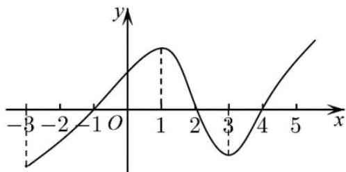

> [!faq]- 《专题02+利用导数研究函数的单调性六大常考题型（高效培优专项训练）数学人教A版2019高二选择性必修第二册》官方解析
>
> > [!success]- **【答案】**  A. $f(x)$ 在区间 $(-3,1)$ 上是增函数 B. $f(x)$ 在区间 $(2,4)$ 上是减函数，在区间 $(-1,2)$ 上是增函数 C. $x = 2$ 是 $f(x)$ 的极大值点 D. $x = -1$ 是 $f(x)$ 的极小值点
>
> > [!note]- **【分析】**
> > 根据导函数图象得出各区间导函数的符号，进而得出函数的单调性，再结合函数的极值的定义即可求解.
>
> > [!note]- **【解析】**
> > 根据图象知，当 $x \in (-1, 2)(4, +\infty)$ 时， $f'(x) > 0$ ，函数单调递增；
> >
> > 当 $x \in (-3, -1)(2, 4)$ 时， $f'(x) < 0$ ，函数单调递减，故A错误，故B正确；
> >
> > 当 $x = 2$ 时， $f(x)$ 取得极大值， $x = 2$ 是 $f(x)$ 的极大值点，故C正确；
> >
> > 当 $x = -1$ 时， $f(x)$ 取得极小值， $x = -1$ 是 $f(x)$ 的极小值点，故D正确.
> >
> > 故选 **A**.
