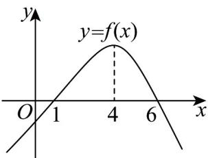

> [!faq]- 《专题02+利用导数研究函数的单调性六大常考题型（高效培优专项训练）数学人教A版2019高二选择性必修第二册》官方解析
>
> > [!success]- **【答案】**  A. $(1,6)$ B. $(1,4)$ C. $(- \infty, 1)$ D. $(1,4) \cup (6, +\infty)$
>
> > [!note]- **【分析】**
> > 根据图象找出 $\left\{\begin{aligned}f(x)>0\\ f'(x)>0\end{aligned}\right.$ 与 $\left\{\begin{aligned}f(x)<0\\ f'(x)<0\end{aligned}\right.$ 的解集，求解作答.
>
> > [!note]- **【解析】**
> > 由 $\frac{f'(x)}{f(x)} > 0$ 得 $f'(x)$ ， $f(x)$ 同号。
> >
> > 由图得当 $x \in (-\infty, 4)$ 时， $f(x)$ 单调递增， $f'(x) > 0$ ；当 $x \in (4, +\infty)$ ，时， $f(x)$ 单调递减， $f'(x) < 0$ 。故当 $x \in (1, 4)$ 时， $f'(x) > 0$ ， $f(x) > 0$ ， $\frac{f'(x)}{f(x)} > 0$ ；
> >
> > 当 $x\in (6, + \infty)$ 时， $f^{\prime}(x) <   0$ ， $f(x) <   0$ ， $\frac{f'(x)}{f(x)} >0$
> >
> > 综上， $\frac{f'(x)}{f(x)}>0$ 的解集为 $(1,4)\cup(6,+\infty)$ .
> >
> > 故选 **D**.
