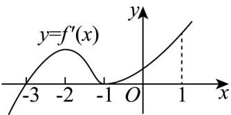

> [!faq]- 《专题02+利用导数研究函数的单调性六大常考题型（高效培优专项训练）数学人教A版2019高二选择性必修第二册》官方解析
>
> > [!success]- **【答案】**  A．-3是函数 $y=f(x)$ 的一个零点 B．-1是函数 $y=f(x)$ 的极小值点 C．-2是函数 $y=f(x)$ 的极大值点 D．函数 $y=f(x)$ 在区间 $(-3,1)$ 上单调递增
>
> > [!note]- **【分析】**
> > 由图可知为导函数 $y = f'(x)$ 的图象，导函数图象的正负即可判断原函数的增减，依次判断即可.
>
> > [!note]- **【解析】**
> > 根据导函数的图像可知，当 $x \in (-\infty, -3)$ 时， $f'(x) < 0$ ，当 $x \in (-3, 1)$ 时， $f'(x) = 0$
> >
> > 所以函数 $y = f(x)$ 在 $(- \infty, -3)$ 上单调递减，在 $(-3, 1)$ 上单调递增，
> >
> > 可知-3是函数 $y = f(x)$ 的极值点，不足以说明-3是函数 $y = f(x)$ 零点.
> >
> > 因为函数 $y = f(x)$ 在 $(-3, -1)$ 上单调递增，可知-1不是函数 $y = f(x)$ 的极小值点，-2也不是函数 $y = f(x)$
> >
> > 的极大值点，
> >
> > 所以 ABC 不正确，故 D 正确.
> >
> > 故选 **D**.
