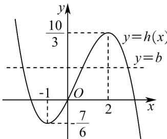

> [!faq]- 《专题02+利用导数研究函数的单调性六大常考题型（高效培优专项训练）数学人教A版2019高二选择性必修第二册》官方解析
>
> > [!success]- **【答案】** (1)答案见解析 (2)答案见解析
>
> > [!note]- **【分析】**
> > （1）求 $f'(x)$ ，根据a的范围分类讨论导数的正负，从而判断 $f(x)$ 的单调性；
> >
> > (2) 令 $g(x) = 0$ 并参变分离，将问题转化为三次函数与常数函数图象交点问题.
>
> > [!note]- **【解析】**
> > （1） $f(x)$ 的定义域为 R， $f'(x)=x^{2}-ax=x(x-a)$ .
> >
> > 若 $a > 0$ ，令 $f^{\prime}(x) > 0$ ，得 $x <   0$ 或 $x > a$ ，令 $f^{\prime}(x) <   0$ ，得 $0 <   x <   a$
> >
> > 若 $a < 0$ ，令 $f^{\prime}(x) > 0$ ，得 $x < a$ 或 $x > 0$ ，令 $f^{\prime}(x) < 0$ ，得 $a < x < 0$
> >
> > 综上，当 $a > 0$ 时， $f(x)$ 在 $(- \infty, 0)$ ， $(a, +\infty)$ 上单调递增，在 $(0, a)$ 上单调递减；
> >
> > 当 $a < 0$ 时， $f(x)$ 在 $(- \infty, a)$ ， $(0, +\infty)$ 上单调递增，在 $(a, 0)$ 上单调递减
> >
> > (2) 当 $a = 1$ 时， $g(x) = \frac{1}{3} x^3 - \frac{1}{2} x^2 - 2x + b$
> >
> > 令 $g(x)=0$ ，则 $b=-\frac{1}{3}x^{3}+\frac{1}{2}x^{2}+2x$ ，
> >
> > $$
> > \text { 令 } h (x) = - \frac {1}{3} x ^ {3} + \frac {1}{2} x ^ {2} + 2 x
> > $$
> >
> > 则 $h'(x) = -x^{2} + x + 2 = -(x - 2)(x + 1)$ .
> >
> > 当 $x < -1$ 和 $x > 2$ 时， $h'(x) < 0$ ， $h(x)$ 单调递减；
> >
> > 当 -1 < x < 2 时， $h'(x) > 0$ ， $h(x)$ 单调递增.
> >
> > 所以 $h(x)$ 的极小值为 $h(-1) = -\frac{7}{6}$ ， $h(x)$ 的极大值为 $h(2) = \frac{10}{3}$
> >
> > 画出函数 $y = h(x)$ 的大致图象，如图，
> >
> > 
> >
> > 由图可知，
> >
> > 当 $b < -\frac{7}{6}$ 或 $b > \frac{10}{3}$ 时，函数 $g(x)$ 有1个零点；
> >
> > 当 $b = -\frac{7}{6}$ 或 $b = \frac{10}{3}$ 时，函数 $g(x)$ 有2个零点；
> >
> > 当 $-\frac{7}{6} < b < \frac{10}{3}$ 时，函数 $g(x)$ 有3个零点.
