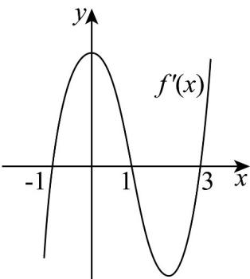

> [!faq]- 《专题03+利用导数研究函数最值五大常考题型（高效培优专项训练）数学人教A版2019高二选择性必修第二册》官方解析
>
> > [!success]- **【答案】** A. 函数 $f(x)$ 有最大值 $f(1)$ B. 函数 $f(x)$ 有最大值，但不一定是 $f(1)$ C. 函数 $f(x)$ 的最小值也可能是 $f(1)$ D. 函数 $f(x)$ 不一定有最大值
>
> > [!note]- **【分析】**
> > 根据函数的极值与最值的定义即可求解.
>
> > [!note]- **【解析】**
> > 函数 $y = f(x)$ 定义域为 $(-1, 2)$ ，是开区间，
> >
> > 则当 $x$ 趋近于-1或2时，若 $f(x)$ 趋于正无穷大，
> >
> > 此时函数 $f(x)$ 没有最大值，故AB错误，D正确；
> >
> > 因为函数 $y = f(x)$ 有唯一的极大值 $f(1)$ ,
> >
> > 所以在 $x = 1$ 附近，函数值小于 $f(1)$
> >
> > 所以函数 $f(x)$ 的最小值不可能是 $f(1)$ ，故 C 错误.
> >
> > 故选：D.
> >
> > 9. 函数 $f(x)$ 的导函数为 $f'(x)$ 的图象如图所示，关于函数 $f(x)$ ，下列说法不正确的是（）
> >
> > 【答案】
> >
> > 
> >
> > A. 函数 $(-1, 1)$ , $(3, +\infty)$ 上单调递增
> >
> > B．函数在 $(-∞,-1)$ ， $(1,3)$ 上单调递减
> >
> > C．函数存在两个极值点
> >
> > D．函数有最小值，但是无最大值
> >
> > 【答案】C
> >
> > 【分析】利用导函数图象，得到原函数单调性即可判断 AB，利用极值点的定义判断 C，利用函数的单调性及最值的概念判断 D.
> >
> > 【详解】根据 $f'(x)$ 的图象可知，
> >
> > 函数在 $(-1,1)$ 和 $(3,+\infty)$ 上 $f'(x)>0$ ， $f(x)$ 单调递增，A选项正确；
> >
> > 函数在 $(- \infty, -1)$ 和 $(1,3)$ 上 $f'(x) < 0$ ， $f(x)$ 单调递减，B选项正确；
> >
> > 所以 $f(x)$ 的极小值点为 -1, 3，极大值点为 1，C 选项错误；
> >
> > 由上述分析可知，函数的最小值是 $f(-1)$ 和 $f(3)$ 两者中较小的一个，没有最大值，D选项正确.
> >
> > 故选 **C**
