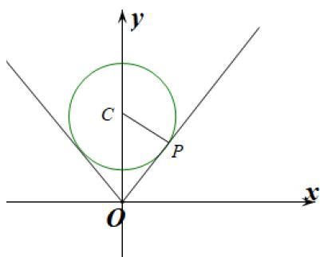

> [!faq]- 《专题03+利用导数研究函数最值五大常考题型（高效培优专项训练）数学人教A版2019高二选择性必修第二册》官方解析
>
> > [!success]- **【答案】** A. $\left[\frac{e^{2} + 1}{2}, +\infty\right)$ B. $\left[\sqrt{e^{2} + 1}, +\infty\right)$ C. $\left(\frac{e^{2} + 1}{2}, +\infty\right)$ D. $\left(\sqrt{e^{2} + 1}, +\infty\right)$
>
> > [!note]- **【分析】**
> > 根据向量垂直的条件得到两曲线点之间的关系，再利用圆与曲线的性质求解 $a$ 的取值范围.
>
> > [!note]- **【解析】**
> > 当点 $P$ 的坐标为 $(0, a \pm 1)$ 时，存在 $Q(1, 0)$ ，使得 $OP \cdot OQ = 0$
> >
> > 当点 $P$ 横坐标非零时， $\overline{OP} \cdot \overline{OQ} = 0$ ，即 $k_{OP} \cdot k_{OQ} = -1$ ，即 $-\frac{1}{k_{OP}} = k_{OQ}$
> >
> > 圆 $C: x^{2} + (y - a)^{2} = 1(a > 1)$ ，圆心 $C(0, a)$ ，半径 $r = 1$ ，
> >
> > 
> >
> > 当直线 OP 与圆相切于第一象限 P 时，此时 $k_{OP} = \frac{OP}{CP} = \frac{OP}{1} = OP = \sqrt{a^{2} - 1}$ ，当直线 OP 与圆相切于第二象限 P 时，此时 $k_{OP} = -\sqrt{a^{2} - 1}$ ，
> >
> > 因此可得当 P 在圆上时， $k_{OP} \in \left(-\infty, -\sqrt{a^{2}-1}\right] \cup \left[\sqrt{a^{2}-1}, +\infty\right)$
> >
> > 进而 $-\frac{1}{k_{OP}}\in \left[-\frac{1}{\sqrt{a^2 - 1}},0\right)\cup \left(0,\frac{1}{\sqrt{a^2 - 1}}\right]$
> >
> > 设 $Q(x,\ln x)$ ，则 $k_{OQ}=\frac{\ln x}{x}$ ，令函数 $f(x)=\frac{\ln x}{x}$ ，
> >
> > 对 $f(x)$ 求导，则 $f'(x)=\frac{1-\ln x}{x^{2}}$
> >
> > 令 $f'(x) = 0$ ，即 $\frac{1 - \ln x}{x^2} = 0$ ，解得： $x = e$ ，
> >
> > 当 $0 < x < \mathrm{e}$ 时， $f'(x) > 0$ ， $f(x)$ 单调递增；
> >
> > 当 $x > \mathrm{e}$ 时， $f'(x) < 0$ ， $f(x)$ 单调递减，
> >
> > 所以 $f(x)$ 在 $x = \mathrm{e}$ 处取得最大值 $f(\mathrm{e}) = \frac{\ln\mathrm{e}}{\mathrm{e}} = \frac{1}{\mathrm{e}}$
> >
> > 则 $f(x)$ 值域为 $\left(-\infty, \frac{1}{\mathrm{e}}\right]$
> >
> > 故 $k_{OQ} \in \left(-\infty, \frac{1}{\mathrm{e}}\right]$ ，又 $\left[-\frac{1}{\sqrt{a^2 - 1}}, 0\right) \cup \left(0, \frac{1}{\sqrt{a^2 - 1}}\right] \subseteq \left(-\infty, \frac{1}{\mathrm{e}}\right]$ ，则 $\frac{1}{\sqrt{a^2 - 1}} \leq \frac{1}{\mathrm{e}}$ ，
> >
> > 解得 $a \sqrt{\mathrm{e}^2 + 1}$
> >
> > 故选 **B**.
