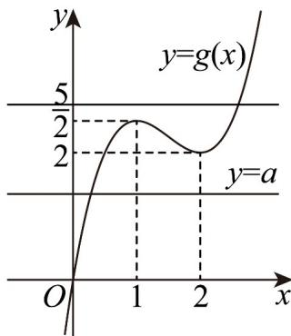

> [!faq]- 《专题04+导数的高级应用七大常考题型（高效培优专项训练）数学人教A版2019高二选择性必修第二册》官方解析
>
> > [!success]- **【答案】** $(- \infty, 2) \cup (\frac{5}{2}, + \infty)$
>
> > [!note]- **【分析】**
> > 利用函数与方程的思想，将函数有且只有一个零点问题，转化成直线 y = a 与函数
> >
> > $g(x)=x^{3}-\frac{9}{2}x^{2}+6x$ 的图象有且仅有一个交点问题，通过求导判断函数的单调性和极值，作出函数的图象，
> > 数形结合即可求得参数 a 的范围.
>
> > [!note]- **【解析】**
> > 由 $f(x) = x^3 - \frac{9}{2} x^2 + 6x - a = 0$ 可得 $a = x^3 - \frac{9}{2} x^2 + 6x$ ，
> >
> > 依题意，直线 $y = a$ 与函数 $g(x) = x^3 - \frac{9}{2} x^2 + 6x$ 的图象有且仅有一个交点
> >
> > 因 $g^{\prime}(x) = 3x^{2} - 9x + 6 = 3(x - 1)(x - 2)$ ，由 $g^{\prime}(x) > 0$ 可得 $x <   1$ 或 $x > 2$ ，由 $g^{\prime}(x) <   0$ 可得 $1 <   x <   2$
> >
> > 即函数 $g(x)$ 在 $(-∞,1),(2,+∞)$ 上单调递增；在 $(1,2)$ 上单调递减，
> >
> > 故函数 $g(x)$ 在 x=1 时取得极大值，即 $g(x)_{\text{极大值}} = g(1) = \frac{5}{2}$ ;
> >
> > 当 $x = 2$ 时取得极小值，即 $g(x)_{\text{极小值}} = g(2) = 2$
> >
> > 且当 $x \to -\infty$ 时， $g(x) \to -\infty$ ，当 $x \to +\infty$ 时， $g(x) \to +\infty$ ，如图所示。
> >
> > 
> >
> > 由图可得，要使直线 $y = a$ 与函数 $g(x) = x^3 - \frac{9}{2} x^2 + 6x$ 的图象有且仅有一个交点，需使 $a > \frac{5}{2}$ 或 $a < 2$ ，即实数 $a$ 的取值范围是 $(-\infty, 2) \cup (\frac{5}{2}, +\infty)$ .
> >
> > 故答案为： $(-∞,2)∪(\frac{5}{2},+∞)$ .
