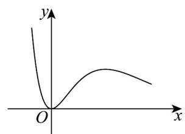
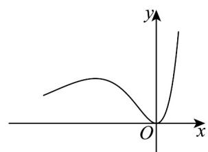
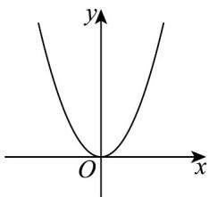
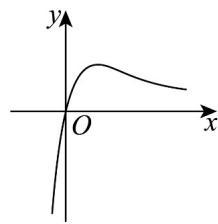

> [!faq]- 《专题04+导数的高级应用七大常考题型（高效培优专项训练）数学人教A版2019高二选择性必修第二册》官方解析
>
> > [!success]- **【答案】** (1) $b = -3, c = 1$ . (2)最大值为 $\mathbf{e}^3$ ，最小值为 $-\mathbf{e}^2$ (3) $m \in \left(-\mathrm{e}^2, 0\right] \cup \left\{\frac{5}{\mathrm{e}}\right\}$
>
> > [!note]- **【分析】**
> > (1)由函数 $f(x)=\left(x^{2}+bx+c\right)\mathrm{e}^{x}$ 在点 $P(0,f(0))$ 处的切线方程为 $2x+y-1=0$ . 可得 $f(0)$ ，再进行求导，令 $f'(0)=-2$ . 解方程可得 b, c.
> >
> > (2) 令导函数 $f'(x) = 0$ ，求解分析导函数的符号，可知函数的单调区间，再比较极值和区间端点函数值的
> >
> > 大小可得最值·
> >
> > (3) 方程 $f(x) = m$ 恰有两个不等实根，转化为 $f(x)$ 图像和 $y = m$ 有两个交点，根据 $f(x)$ 的单调性和变化情况，可求得.
>
> > [!note]- **【解析】**
> > （1） $f'(x)=\left[x^{2}+(b+2)x+b+c\right]e^{x}$ ，因为 $f(x)$ 在点P处的切线方程为 $2x+y-1=0$ .
> >
> > 所以有 $f'(0)=b+c=-2, f(0)=c=1$ . 所以解得 b=-3, c=1.
> >
> > (2) 由(1)可得 $f(x) = (x^2 - 3x + 1)e^x, f'(x) = (x^2 - x - 2)e^x = (x - 2)(x + 1)e^x$ . 当 $f'(x) = 0, x = -1$ 或 $x = 2$ .
> >
> > <table><tr><td>x</td><td>(-∞,-1)</td><td>-1</td><td>(-1,2)</td><td>2</td><td>(2,+∞)</td></tr><tr><td>f&#x27;(x)</td><td>+</td><td>0</td><td>-</td><td>0</td><td>+</td></tr><tr><td>f(x)</td><td>单调递增</td><td> $\frac{5}{e}$ </td><td>单调递减</td><td> $-e^{2}$ </td><td>单调递增</td></tr></table>
> >
> > 所以 $f(x)$ 在 $[-3, -1]$ 和 $[2, 3]$ 上单调递增， $[-1, 2]$ 上单调递减，又因为计算可得，
> >
> > $$
> > f (- 3) = 1 9 \mathrm{e} ^ {- 3}, f (- 1) = \frac {5}{\mathrm{e}}, f (2) = - \mathrm{e} ^ {2}, f (3) = \mathrm{e} ^ {3}.
> > $$
> >
> > 所以 $f(x)$ 在 $[-3,3]$ 的最大值为 $e^{3}$ ，最小值为 $-e^{2}$ .
> >
> > (3) 由 (2) 可知， $f(x)$ 的极大值为 $f(-1)=\frac{5}{e}$ ，极小值为 $f(2)=-e^{2}$ .
> >
> > 当 $x\left\langle 0, x^2 - 3x + 1 \right\rangle 0, \mathrm{e}^x > 0$ ，所以 $f(x) > 0$ ，当 $x \to +\infty$ 时， $f(x) \to +\infty$ 。所以当且仅当 $m \in \left(-\mathrm{e}^2, 0\right] \cup \left\{\frac{5}{\mathrm{e}}\right\}$ 时，方程 $f(x) = m$ 恰有两个不等实根。
> >
> > 38. 函数 $f(x) = \frac{x^2}{\mathrm{e}^{x - 1}}$ 的图象大致为（）
> >
> > 【答案】
> >
> > A
> > 
> >
> > B
> > 
> >
> > C
> >
> > D
> > 
> >
> > D
> >
> > 
> >
> > 【答案】A
> >
> > 【分析】利用导数判断函数的单调性即可得到函数的大致图象·
> >
> > 【详解】易知 $x \in \mathbb{R}$ ，因为 $f'(x) = \frac{x(2 - x)}{\mathrm{e}^{x - 1}}$ ，令 $f'(x) = 0$ ，得 $x = 0$ ，或 $x = 2$ ，
> >
> > 则 $x\in (-\infty ,0)\cup (2, + \infty)$ 时， $f^{\prime}(x) <   0$ ， $x\in (0,2)$ 时， $f^{\prime}(x) > 0$
> >
> > 所以 $f(x)$ 在 $(-\infty, 0)$ 和 $(2, +\infty)$ 上单调递减，在 $(0, 2)$ 上单调递增，
> >
> > 所以选项 A 符合题意，
> >
> > 故选 **A**.
