> [!faq]- 《专题04+导数的高级应用七大常考题型（高效培优专项训练）数学人教A版2019高二选择性必修第二册》官方解析
>
> > [!success]- **【答案】** A  B  C  
>
> > [!note]- **【分析】**
> > 首先对 $f(x)$ 求导，再利用奇偶性排除 B、D，然后通过取特殊值排除 C 即可.
>
> > [!note]- **【解析】**
> > 因为 $f(x) = \frac{1}{4} x^2 + \sin \left( \frac{\pi}{2} + x \right) = \frac{1}{4} x^2 + \cos x$ ，则 $f'(x) = \frac{1}{2} x - \sin x$
> >
> > 又因为 $f^{\prime}(-x) = -\frac{1}{2} + \sin x = -f^{\prime}(x)$ ，所以 $f^{\prime}(x)$ 为奇函数，由此可排除 B、D；
> >
> > $f^{\prime}(\frac{\pi}{2}) = \frac{\pi}{4} -1 <   0$ ，说明 $f^{\prime}(x)$ 的图像在 $(0, + \infty)$ 区间上函数值存在负数，由此C不满足，故A正确
> >
> > A
> >
> > B
> >
> > 故选：A
> >
> > 40. 函数 $f(x) = \log_2(2^x + 1) + \log_2(2^{-x} + 1)$ 的大致图像为（）
> >
> > 【答案】
> >
> > D
> > 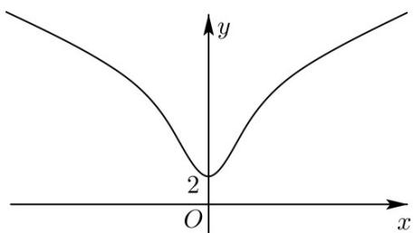
> >
> > 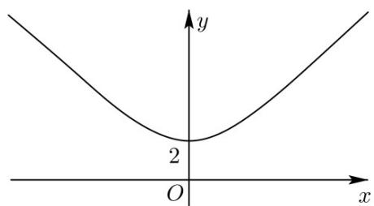
> >
> > C
> > 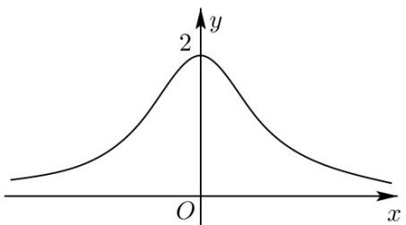
> >
> > 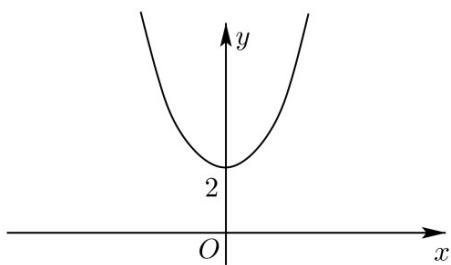
> >
> > 【答案】B
> >
> > 【分析】结合函数的奇偶性以及导数求得正确答案·
> >
> > 【详解】 $f(x)$ 的定义域为 R， $f(-x)=\log_{2}(2^{-x}+1)+\log_{2}(2^{x}+1)=f(x)$ ， $f(x)$ 为偶函数· $f'(x)=\frac{2^x}{2^x+1}-\frac{2^{-x}}{2^{-x}+1}=\frac{2^x}{2^x+1}-\frac{1}{2^x+1}=1-\frac{2}{2^x+1}$
> >
> > 当 $x > 0$ 时 $2^{x} + 1 > 2,0 <   \frac{1}{2^{x} + 1} <  \frac{1}{2}, - 1 <   \frac{-2}{2^{x} + 1} <  0,0 <   1 - \frac{2}{2^{x} + 1} <  1$
> >
> > 即 $f^{\prime}(x)\in (0,1)$ ，且 $f^{\prime}(x) = 1 - \frac{2}{2^{x} + 1}$ 在 $(0, + \infty)$ 上递增，
> >
> > 也即 $f(x)$ 在区间 $(0,+\infty)$ ，导数为正数且越来越大， $f'(x)$ 增加越来越快，但 $f'(x)<1$ ，
> > 所以 ACD 选项错误，B 选项正确·
> >
> > 故选：B
> >
> > 41. 函数 $y = \frac{\mathrm{e}^x(x - 2)}{x - 1}$ 的图象大致是（）
> >
> > 【答案】
> >
> > A
> > 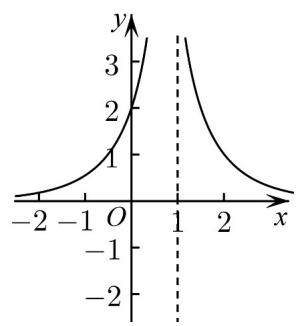
> >
> > B
> > 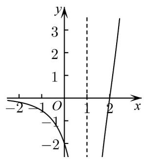
> >
> > C
> > 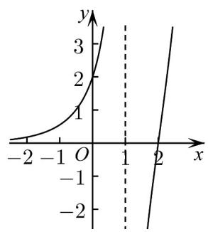
> >
> > D
> > 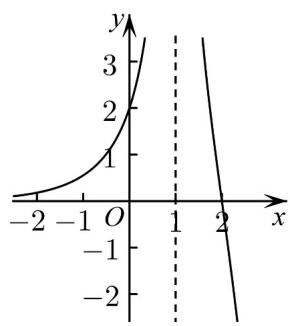
> >
> > 【答案】C
> >
> > 【分析】根据函数符号，单调性即可判断·
> >
> > 【详解】对于 $f(x) = \frac{\mathrm{e}^x(x - 2)}{x - 1}$ ，当 $x < 0$ 时， $f(x) > 0$ ，故B错误；
> >
> > $f^{\prime}(x) = \frac{x^{2} - 3x + 3}{(x - 1)^{2}}\mathrm{e}^{x} = \frac{\left(x - \frac{3}{2}\right)^{2} + \frac{3}{4}}{(x - 1)^{2}}\mathrm{e}^{x}$ ，显然在定义域内 $f^{\prime}(x) > 0$
> >
> > 即在 $(-∞,1)$ 和 $(1,+∞)$ 都是增函数，C 正确，AD 错误；
> >
> > 故选：C.
> >
> > 42. 函数 $f(x) = \mathrm{e}^{x}\cos x$ 的部分图象大致为（）
> >
> > 【答案】
> >
> > A
> > 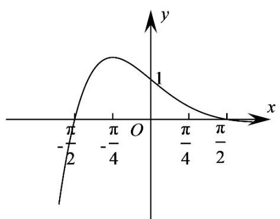
> >
> > B
> > 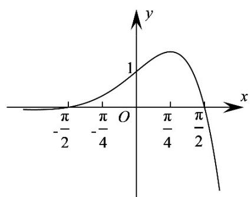
> >
> > D
> > C
> > 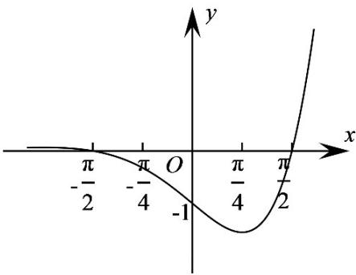
> >
> > 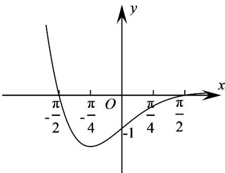
> >
> > 【答案】B
> >
> > 【分析】先根据 $x \in \left[-\frac{\pi}{2}, \frac{\pi}{2}\right]$ 时， $f(x) > 0$ 排除 CD，再根据导函数研究函数的单调性，排除 A
> >
> > 【详解】当 $x \in \left[-\frac{\pi}{2}, \frac{\pi}{2}\right]$ 时， $f(x) > 0$ 。排除CD；
> >
> > 又 $f^{\prime}(x) = \mathrm{e}^{x}(\cos x - \sin x)$ ，当 $x\in \left(-\frac{\pi}{2},\frac{\pi}{4}\right)$ 时， $f^{\prime}(x) > 0$ ， $f(x)$ 单调递增；当 $x\in \left(-\frac{\pi}{4},\frac{\pi}{2}\right)$ 时， $f^{\prime}(x) <   0$ ， $f(x)$ 单调递减，A错误，B正确
> >
> > 故选 **B**.
