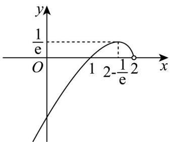

> [!faq]- 《专题04+导数的高级应用七大常考题型（高效培优专项训练）数学人教A版2019高二选择性必修第二册》官方解析
>
> > [!success]- **【答案】** B
>
> > [!note]- **【分析】**
> > 先将 $y=\ln(x+2)$ 关于 y 轴对称，转化为 $m=(x-2)\ln(2-x)$ 只有一个交点，令 $f(x)=(x-2)\ln(2-x)$ ，求导分析，根据函数相关性质作出函数图象，根据图象确定 m 范围即可求解。
>
> > [!note]- **【解析】**
> > 曲线 $y = \ln(x + 2)$ 关于 y 轴对称的曲线方程为 $y = \ln(2 - x)$ ，
> > 由题意可知方程 $\frac{m}{x-2} = \ln(2-x)$ 只有一个实数根，
> > 令 $f(x)=(x-2)\ln(2-x)$ ，x<2，则 $f'(x)=\ln(2-x)+1$ 令 $f'(x)=0$ ，解得 $x=2-\frac{1}{e}$ ，易知 $f'(x)$ 在 $(-∞,2)$ 单调递减，
> > 所以 $f(x)$ 在 $\left(-\infty,2-\frac{1}{e}\right)$ 单调递增，在 $\left(2-\frac{1}{e},2\right)$ 单调递减，
> > 则 $f(x)_{\max}=f\left(2-\frac{1}{e}\right)=\frac{1}{e}$ 又 $f(1)=0$ ，且 $x \to -\infty$ 时， $f(x) \to -\infty$ ， $x \to 2$ 时， $f(x) \to 0$ ，
> >
> > 
> >
> > 故 $m$ 的取值范围为 $\left(-\infty,0\right]\cup \left\{\frac{1}{\mathrm{e}}\right\}$ ，又 $m > 0$ ，故 $m = \frac{1}{\mathrm{e}}$ ：
> >
> > 故选 **B**.
