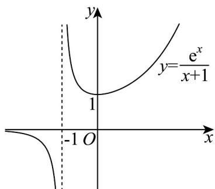

> [!faq]- 《专题04+导数的高级应用七大常考题型（高效培优专项训练）数学人教A版2019高二选择性必修第二册》官方解析
>
> > [!success]- **【答案】** (1)答案见解析； (2)答案见解析·
>
> > [!note]- **【分析】**
> > （1）利用导数的正负，结合函数定义域，即可判断单调性；
> >
> > (2) 利用分离参变量与数形结合，即可得到零点个数的判断.
>
> > [!note]- **【解析】**
> > （1）由 $f(x) = \frac{\mathrm{e}^x}{x + 1} + a (a \in \mathbf{R})$ ，求导得： $f'(x) = \frac{(x + 1)\mathrm{e}^x - \mathrm{e}^x}{(x + 1)^2} = \frac{x\mathrm{e}^x}{(x + 1)^2}$ ，当 $x > 0$ 时， $f'(x) = \frac{x\mathrm{e}^x}{(x + 1)^2} > 0$ ，当 $-1 < x < 0$ 或 $x < -1$ 时， $f'(x) = \frac{x\mathrm{e}^x}{(x + 1)^2} < 0$ ，所以 $f(x)$ 在 $(-\infty, -1), (-1, 0)$ 上单调递减，在 $(0, +\infty)$ 上单调递增；（2）由 $f(x) = \frac{\mathrm{e}^x}{x + 1} + a = 0$ 得， $-a = \frac{\mathrm{e}^x}{x + 1}$ ，根据（1）的单调性结合极小值点，可作出函数 $y = \frac{\mathrm{e}^x}{x + 1}$ 图象，
> >
> > 
> >
> > 所以当 -a > 1，即 a < -1 时，可判断 $f(x)$ 的零点个数为 2；
> >
> > 当 $-a = 1$ 或 $-a < 0$ ，即 $a = -1$ 或 $a > 0$ 时，可判断 $f(x)$ 的零点个数为1；
> >
> > 当 $0 \leq -a < 1$ ，即 $-1 < a \leq 0$ 时，可判断 $f(x)$ 的零点个数为 $0$ ，
> >
> > 综上可得：当 $a < -1$ 时， $f(x)$ 的零点个数为 $2$ ；
> >
> > 当 $-1 < a \leq 0$ 时 $f(x)$ 的零点个数为 0；当 a = -1 或 a > 0 时， $f(x)$ 的零点个数为 1.
