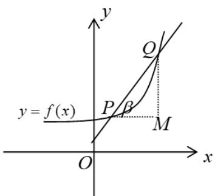
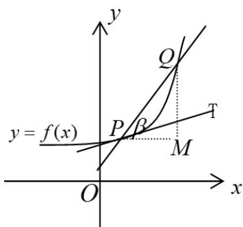
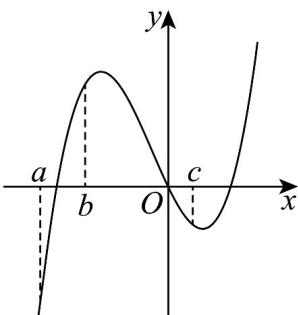
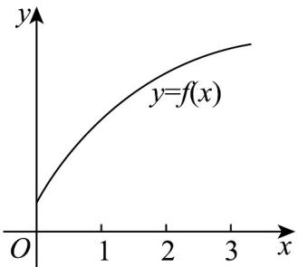

<!-- source-part:1 pages:1-43 -->

## 专题5.1 导数的概念及其意义

## 内容概览

## 教学目标、教学重难点

<table><tr><td>教学目标</td><td>1.初步了解导数概念的背景,掌握平均变化率与瞬时变化率的概念及几何意义。2.会求函数的平均变率与瞬时变化率。3.能结合实际问题求曲线在某点处与某点附近点的切线与割线的斜率的极限值。</td></tr><tr><td>教学重难点</td><td>1.重点求函数的平均变化率与瞬时变化率.,在与过的切线问题,利用定义求导数.2.难点</td></tr></table>

## 知识清单

## 知识点 01 平均变化率问题

1、变化率

事物的变化率是相关的两个量的“增量的比值”。如气球的平均膨胀率是半径的增量与体积增量的比值；

2、平均变化率

一般地，函数 $f(x)$ 在区间 $[x_1, x_2]$ 上的平均变化率为： $\frac{f(x_2) - f(x_1)}{x_2 - x_1}$

①本质：如果函数的自变量的“增量”为 $\Delta x$ ，且 $\Delta x = x_{2} - x_{1}$ ，相应的函数值的“增量”为 $\Delta y$ ， $\Delta y = f(x_{2}) - f(x_{1})$

则函数 $f(x)$ 从 $x_{1}$ 到 $x_{2}$ 的平均变化率为 $\frac{\Delta y}{\Delta x} = \frac{f(x_2) - f(x_1)}{x_2 - x_1}$

②函数的平均变化率可正可负，平均变化率近似地刻画了曲线在某一区间上的变化趋势。即递增或递减幅度

的大小.

对于不同的实际问题，平均变化率富于不同的实际意义．如位移运动中，位移 $S(m)$ 从 $t_1$ 秒到 $t_2$ 秒的平均变化

率即为 $t_1$ 秒到 $t_2$ 秒这段时间的平均速度.

3、如何求函数的平均变化率

求函数的平均变化率通常用“两步”法：

①作差：求出 $\Delta y = f(x_{2}) - f(x_{1})$ 和 $\Delta x = x_{2} - x_{1}$ ②作商：对所求得的差作商，即 $\frac{\Delta y}{\Delta x} = \frac{f(x_2) - f(x_1)}{x_2 - x_1}$

(1) $\Delta x$ 是 $x_{1}$ 的一个“增量”，可用 $x_{1} + \Delta x$ 代替 $x_{2}$ ，同样 $\Delta y = f(x_{2}) - f(x_{1})$ 。

(2) $\triangle x$ 是一个整体符号，而不是 $\triangle$ 与 $x$ 相乘.

（3）求函数平均变化率时注意 $\triangle x$ ， $\triangle y$ ，两者都可正、可负，但 $\triangle x$ 的值不能为零， $\triangle y$ 的值可以为零。若函数 $y = f(x)$ 为常函数，则 $\Delta y = 0$ 。

【即学即练】

1．（1）如果当 $\Delta x \to 0$ 时，平均变化率\_\_\_\_无限趋近于一个确定的值，即\_\_\_\_有极限，则称 $y = f(x)$ 在 $x = x_{0}$ 处可导，并把这个确定的值叫做 $y = f(x)$ 在 $x = x_{0}$ 处的 \_\_\_\_（也称\_\_\_\_），记作或\_\_\_\_，即 $f'(x_{0}) =$ \_\_\_\_ = \_\_\_\_.

【答案】

(2) 当 $x = x_0$ 时， $f'(x_0)$ 是一个唯一确定的数，当 $x$ 变化时， $y = f'(x)$ 就是 $x$ 的函数，我们称它为 $y = f(x)$

的导函数（简称导数），记为 $f'(x)$ （或 $y'$ ），即 $f'(x) = y' = \lim_{\Delta x \to 0} \frac{f(x + \Delta x) - f(x)}{\Delta x}$

【答案】 $\frac{\Delta y}{\Delta x}$ $\frac{\Delta y}{\Delta x}$ 导数 瞬时变化率 $f^{\prime}(x_0)$ $y^{\prime}|_{x = x_0}$ $\lim_{\Delta x\to 0}\frac{\Delta y}{\Delta x}$ $\lim_{\Delta x\to 0}\frac{f(x_0 + \Delta x) - f(x_0)}{\Delta x}$

【分析】略

【详解】略

2. 已知 $f(x) = -2x - 5$ 和 $g(x) = -3x + 7$ 在区间 $[m, n]$ 上的平均变化率分别为 a 和 b，则 $a + b = (\quad)$ A. \_3 B. \_5 C. 0 D. 1

【答案】B

【分析】由函数的平均变化率定义进行求解.

【详解】由题意，

$$
a = \frac {f (n) - f (m)}{n - m} = \frac {- 2 n - 5 - (- 2 m - 5)}{n - m} = - 2,
$$

$$
b = \frac {g (n) - g (m)}{n - m} = \frac {- 3 n + 7 - (- 3 m + 7)}{n - m} = - 3,
$$

故 $a + b = -5$

故选：B

## 知识点 02 导数的概念

函数 $f(x)$ 在 $x = x_0$ 处瞬时变化率是 $\lim_{\Delta x\to 0}\frac{\Delta y}{\Delta x} = \lim_{\Delta x\to 0}\frac{f(x_0 + \Delta x) - f(x_0)}{\Delta x}$ ，我们称它为函数 $y = f(x)$ 在 $x = x_0$ 处的

导数，记作 $f^{\prime}\left(x_{0}\right)$ 或 $y^{\prime}|_{x = x_0}$ ，即 $f^{\prime}\left(x_{0}\right) = \lim_{\Delta x\to 0}\frac{\Delta y}{\Delta x} = \lim_{\Delta x\to 0}\frac{f\left(x_0 + \Delta x\right) - f\left(x_0\right)}{\Delta x}$

①增量 $\Delta x$ 可以是正数，也可以是负，但是不可以等于0． $\Delta x\to 0$ 的意义： $\Delta x$ 与0之间距离要多近有多近，

即 $|\Delta x - 0|$ 可以小于给定的任意小的正数.

② $\Delta x \to 0$ 时， $\Delta y$ 在变化中都趋于 0，但它们的比值却趋于一个确定的常数。

即存在一个常数与 $\frac{\Delta y}{\Delta x} = \frac{f(x_0 + \Delta x) - f(x_0)}{\Delta x}$ 无限接近.

③导数的本质就是函数的平均变化率在某点处的极限，即瞬时变化率。如瞬时速度即是位移在这一时刻的瞬

间变化率.

【即学即练】

1. 已知函数 $f(x)$ 的导函数为 $f'(x)$ ，若 $\lim_{\Delta x \to 0} \frac{f(2) - f(2 + \Delta x)}{\Delta x} = -3$ ，则 $f'(2) = (\quad)$ A. -3 B. -2 C. 2 D. 3

【答案】D

【分析】利用导数的定义计算进行求解·

【详解】由 $\lim_{\Delta x\to 0}\frac{f(2) - f(2 + \Delta x)}{\Delta x} = -\lim_{\Delta x\to 0}\frac{f(2 + \Delta x) - f(2)}{\Delta x} = -3$ 则 $f^{\prime}(2) = \lim_{\Delta x\to 0}\frac{f(2 + \Delta x) - f(2)}{\Delta x} = 3.$

故选：D.

2. 若 $f'(x_0) = 2$ ，则 $\lim_{\Delta x \to 0} \frac{f(x_0 + \Delta x) - f(x_0)}{\Delta x} = (\quad)$ A. -4    B. 4    C. 2    D. -2

【答案】C

【分析】根据导数的定义即可求解·

【详解】 $\lim_{\Delta x\to0}\frac{f(x_{0}+\Delta x)-f(x_{0})}{\Delta x}=f'(x_{0})=2$

故选：C

## 知识点 03 求导数的方法

求导数值的一般步骤：

①求函数的增量： $\Delta y=f(x_{0}+\Delta x)-f(x_{0})$ ；②求平均变化率： $\frac{\Delta y}{\Delta x}=\frac{f(x_{0}+\Delta x)-f(x_{0})}{\Delta x}$ ；
③求极限，得导数： $f'(x_{0})=\lim_{\Delta x\to0}\frac{\Delta y}{\Delta x}=\lim_{\Delta x\to0}\frac{f(x_{0}+\Delta x)-f(x_{0})}{\Delta x}$ ．也可称为三步法求导数．

## 【即学即练】

1. 设函数 $f(x)$ 在 $x = x_0$ 处存在导数为 2，则 $\lim_{\Delta x \to 0} \frac{f(x_0 + \Delta x) - f(x_0)}{4\Delta x} =$ ( )

【答案】
A. $\frac{1}{2}$ B. $\frac{1}{4}$ C. 2 D. 4

【答案】A

【分析】根据给定条件，利用导数的定义计算得解·

【详解】由导数的定义可知 $\lim_{\Delta x\to 0}\frac{f(x_0 + \Delta x) - f(x_0)}{4\Delta x} = \frac{1}{4}\lim_{\Delta x\to 0}\frac{f(x_0 + \Delta x) - f(x_0)}{\Delta x} = \frac{1}{4} f'(x_0) = \frac{1}{2}.$

故选：A

2. 函数 $f(x)$ 在 $x = x_0$ 处可导，若 $\lim_{\Delta x \to 0} \frac{f(x_0 + 3\Delta x) - f(x_0)}{\Delta x} = 1$ ，则 $f'(x_0) = (\quad)$ A. 1 B. $\frac{1}{3}$ C. 3 D. -1

【答案】B

【分析】根据导数的定义，变形后，即可求解·

【详解】 $\lim_{\Delta x\to 0}\frac{f(x_0 + 3\Delta x) - f(x_0)}{\Delta x} = 1$ ，故 $3\lim_{\Delta x\to 0}\frac{f(x_0 + 3\Delta x) - f(x_0)}{3\Delta x} = 1$

由导数的定义可知， $f^{\prime}(x_{0})=\lim_{\Delta x\to0}\frac{f(x_{0}+3\Delta x)-f(x_{0})}{3\Delta x}=\frac{1}{3}$

故选：B

## 知识点 04 导数几何意义

## 1、平均变化率的几何意义——曲线的割线

函数 $y = f(x)$ 的平均变化率 $\frac{\Delta y}{\Delta x} = \frac{f(x_2) - f(x_1)}{x_2 - x_1}$ 的几何意义是表示连接函数 $y = f(x)$ 图像上两点割线的斜率.

如图所示，函数 $f(x)$ 的平均变化率 $\frac{\Delta y}{\Delta x} = \frac{f(x_2) - f(x_1)}{x_2 - x_1}$ 的几何意义是：直线 $AB$ 的斜率.

事实上， $k_{AB} = \frac{y_A - y_B}{x_A - x_B} = \frac{f(x_2) - f(x_1)}{x_2 - x_1} = \frac{\Delta y}{\Delta x}$ ．换一种表述：曲线上一点 $P(x_0, y_0)$ 及其附近一点

$Q(x_0 + \Delta x, y_0 + \Delta y)$ ，经过点 $P$ 、 $Q$ 作曲线的割线 $PQ$ ，则有 $k_{PQ} = \frac{(y_0 + \Delta y) - y_0}{(x_0 + \Delta x) - x_0} = \frac{\Delta y}{\Delta x}$

## 2、导数的几何意义——曲线的切线

图1

如图1，当 $P_{n}(x_{n},f(x_{n}))(n = 1,2,3,4)$ 沿着曲线 $f(x)$ 趋近于点 $P(x_0,f(x_0))$ 时，割线 $PP_{n}$ 的变化趋势是什么？我们发现，当点 $P_{n}$ 沿着曲线无限接近点 $P$ 即 $\Delta x\to 0$ 时，割线 $PP_{n}$ 趋近于确定的位置，这个确定位置的直线 $PT$

称为曲线在点 P 处的切线。

定义：如图，当点 $Q(x_0 + \Delta x, y_0 + \Delta y)$ 沿曲线无限接近于点 $P(x_0, y_0)$ ，即 $\Delta x \to 0$ 时，割线 $PQ$ 的极限位置直线 $PT$ 叫做曲线在点 $P$ 处的切线． $T$ 也就是：当 $\Delta x \to 0$ 时，割线 $PQ$ 斜率的极限，就是切线的斜率．

即： $k=\lim_{\Delta x\to0}\frac{\Delta y}{\Delta x}=\lim_{\Delta x\to0}\frac{f(x_{0}+\Delta x)-f(x)}{\Delta x}=f'(x_{0})$

【即学即练】

1. 如图是函数 $f(x)$ 的部分图象，记 $f(x)$ 的导函数为 $f'(x)$ ，则下列选项中值最小的是（）

【答案】

A. $f^{\prime}(a)$ B. $f(b)$ C. $f(c)$ D. $cf^{\prime}(c)$

【答案】C

【分析】由函数的图象，结合导数的几何意义，即可判断·

【详解】由图知 $f'(a) > 0$ ， $f(b) > 0$ ， $f(c) < 0$ ， $cf'(c) < 0$ ，所以排除 A，B；

设 $f(x)$ 的图象在 x=c 处的点为 A，

显然 $OA$ 的斜率 $k_{OA}$ 小于在 $A$ 处的切线斜率 $f^{\prime}(c)$

则 $\frac{f(c) - 0}{c - 0} < f'(c)$ ，且 $c > 0$ ，可转化为 $f(c) < cf'(c)$

所以 $f(c)$ 的值最小，排除 D.

故选：C.

2. 函数 $f(x)$ 的图像如图所示，下列数值排序正确的是（）

【答案】

A. $f^{\prime}(1) > f^{\prime}(2) > f^{\prime}(3) > 0$ B. $f^{\prime}(1) <   f^{\prime}(2) <   f^{\prime}(3) <   0$ C. $0 <   f^{\prime}(1) <   f^{\prime}(2) <   f^{\prime}(3)$ D. $f^{\prime}(1) > f^{\prime}(2) > 0 > f^{\prime}(3)$

【答案】A

【分析】由导数的几何意义分析可得 $f'(1)$ ， $f'(2)$ 和 $f'(3)$ 的几何意义，结合图像可得解。
【详解】由函数 $f(x)$ 的图像可知，
∵ 当 x 0 时， $f(x)$ 单调递增，
∴ $f'(1) > 0$ ， $f'(2) > 0$ ， $f'(3) > 0$ .

随着 $x$ 的增大，曲线在每个点处的斜率在逐渐减小，即导函数是单调递减的， $\therefore f'(1) > f'(2) > f'(3) > 0.$

故选：A.

## 知识点 05 曲线的切线

(1) 用导数的几何意义求曲线的切线方程的方法步骤：

①求出切点 $(x_0, f(x_0))$ 的坐标；

②求出函数 $y = f(x)$ 在点 $x_0$ 处的导数 $f'(x_0)$ ③得切线方程 $y - f(x_0) = f'(x)(x - x_0)$

(2) 在点 $(x_0, f(x_0))$ 处的切线与过点 $(x_0, y_0)$ 的切线的区别.

在点 $(x_0, f(x_0))$ 处的切线是说明点 $(x_0, f(x_0))$ 为此切线的切点；而过点 $(x_0, y_0)$ 的切线，则强调切线是过点 $(x_0, y_0)$ ，此点可以是切点，也可以不是切点。因此在求过点 $(x_0, y_0)$ 的切线方程时，先应判断点 $(x_0, y_0)$ 是否

为曲线 $f(x)$ 上的点，若是则为第一类解法，若不同则必须先在曲线上取一切点 $(x_{1}, f(x_{1}))$ ，求过此切点的切

线方程 $y - y_{1} = f'(x_{1})(x - x_{1})$ ，再将点 $(x_0, y_0)$ 代入，求得切点 $(x_{1}, f(x_{1}))$ 的坐标，进而求过点 $(x_0, y_0)$ 的切线方

程.

## 【即学即练】

1. 已知 $f(x)$ 为 $\mathbf{R}$ 上的奇函数，当 $x < 0$ 时， $f(x) = -x^2 + x$ ，则 $f(x)$ 的图象在 $x = 1$ 处的切线方程为

【答案】 $3x - y - 1 = 0$

【分析】根据奇函数的性质，结合导数的几何意义进行求解即可·

【详解】设 $x > 0$ ，则 $-x < 0, f(-x) = -x^2 - x$ ，又 $f(x)$ 为 $\mathbf{R}$ 上的奇函数，

所以 $f(x) = -f(-x) = x^{2} + x$

即当 $x > 0$ 时， $f(x) = x^2 + x$ ，当 $x > 0$ 时， $f'(x) = 2x + 1, f'(1) = 3, f(1) = 2$

所以 $f(x)$ 的图象在 $x = 1$ 处的切线方程为 $y - 2 = 3(x - 1)$ ，即 $3x - y - 1 = 0$

故答案为： $3x - y - 1 = 0$

2. 曲线 $y = x + \mathrm{e}^{x}$ 在 $x = 0$ 处的切线方程为 \_\_\_\_.

【答案】 $y = 2x + 1$

【分析】直接由导数的几何意义可得出·

【详解】由 $f(x) = x + \mathrm{e}^x$ ，可得 $f'(x) = 1 + \mathrm{e}^x \cdot$ 当 $x = 0$ 时， $f(0) = 1$ ， $f'(0) = 2$

则曲线 $y = x + \mathrm{e}^{x}$ 在 $x = 0$ 处的切线方程为 $y - 1 = 2(x - 0)$ ，即 $y = 2x + 1$ .

故答案为： $y = 2x + 1$ .

## 题型精讲

![[高中/课堂同步/题库/人教A版高中数学同步讲义(2026)/04_选择性必修第二册/第五章一元函数的导数及其应用/专题5.1+导数的概念及其意义（高效培优讲义）数学人教A版2019高二选择性必修第二册/题型01_函数的平均变化率/题型01_函数的平均变化率.md]]
![[高中/课堂同步/题库/人教A版高中数学同步讲义(2026)/04_选择性必修第二册/第五章一元函数的导数及其应用/专题5.1+导数的概念及其意义（高效培优讲义）数学人教A版2019高二选择性必修第二册/题型02_求瞬时速度/题型02_求瞬时速度.md]]
![[高中/课堂同步/题库/人教A版高中数学同步讲义(2026)/04_选择性必修第二册/第五章一元函数的导数及其应用/专题5.1+导数的概念及其意义（高效培优讲义）数学人教A版2019高二选择性必修第二册/题型03_求函数在某点处的导数/题型03_求函数在某点处的导数.md]]
![[高中/课堂同步/题库/人教A版高中数学同步讲义(2026)/04_选择性必修第二册/第五章一元函数的导数及其应用/专题5.1+导数的概念及其意义（高效培优讲义）数学人教A版2019高二选择性必修第二册/题型04_求切线方程/题型04_求切线方程.md]]
![[高中/课堂同步/题库/人教A版高中数学同步讲义(2026)/04_选择性必修第二册/第五章一元函数的导数及其应用/专题5.1+导数的概念及其意义（高效培优讲义）数学人教A版2019高二选择性必修第二册/题型05_利用图象理解导数的几何意义/题型05_利用图象理解导数的几何意义.md]]
![[高中/课堂同步/题库/人教A版高中数学同步讲义(2026)/04_选择性必修第二册/第五章一元函数的导数及其应用/专题5.1+导数的概念及其意义（高效培优讲义）数学人教A版2019高二选择性必修第二册/题型06_过某点的曲线的切线/题型06_过某点的曲线的切线.md]]
![[高中/课堂同步/题库/人教A版高中数学同步讲义(2026)/04_选择性必修第二册/第五章一元函数的导数及其应用/专题5.1+导数的概念及其意义（高效培优讲义）数学人教A版2019高二选择性必修第二册/题型07_利用定义求导函数/题型07_利用定义求导函数.md]]
![[高中/课堂同步/题库/人教A版高中数学同步讲义(2026)/04_选择性必修第二册/第五章一元函数的导数及其应用/专题5.1+导数的概念及其意义（高效培优讲义）数学人教A版2019高二选择性必修第二册/强化训练/强化训练.md]]
