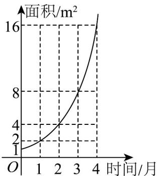

<!-- question-source:start -->
8. 某池塘中野生水葫芦的面积与时间的函数关系如图所示·假设其关系为指数函数，并给出下列说法，其中

正确的说法是（）·

A. 野生水葫芦每月的面积增长率为 $1$ B. 野生水葫芦的面积从 $4\mathrm{m}^2$ 蔓延到 $12\mathrm{m}^2$ 只需1.5个月
C. 设野生水葫芦面积蔓延到 $10\mathrm{m}^2$ ， $20\mathrm{m}^2$ ， $30\mathrm{m}^2$ 所需的时间分别为 $t_1$ ， $t_2$ ， $t_3$ ，则有 $t_1 + t_3 < 2t_2$ D. 野生水葫芦的面积从第 $1$ 个月到第 $3$ 个月蔓延的平均速度等于其从第 $2$ 个月到第 $4$ 个月蔓延的平均速

度
<!-- question-source:end -->

![[高中/课堂同步/题库/人教A版高中数学同步讲义(2026)/04_选择性必修第二册/第五章一元函数的导数及其应用/专题5.1+导数的概念及其意义（高效培优讲义）数学人教A版2019高二选择性必修第二册/强化训练/questions/answers/Q00081816A1.md]]
