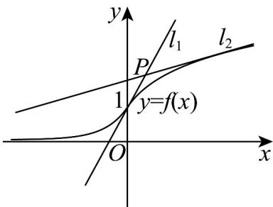

> [!faq]- 《专题5.1+导数的概念及其意义（高效培优讲义）数学人教A版2019高二选择性必修第二册》官方解析
>
> > [!success]- **【答案】** B
>
> > [!note]- **【分析】**
> > 利用分段函数在分界点处有公切线，从而猜想点在公切线上即可求解·
>
> > [!note]- **【解析】**
> > 作出函数 $f(x) = \begin{cases} \mathrm{e}^x, & x \leq 0 \\ \ln (1 + x) + 1, & x > 0 \end{cases}$ 的图象，
> >
> > 
> >
> > 求导得： $f^{\prime}(x)=\left\{\begin{aligned}&e^{x},x\leq0\\&\frac{1}{1+x},x>0\end{aligned}\right.$
> >
> > 由于函数 $f(x) = \mathrm{e}^{x}$ 在 $x = 0$ 处的切线为 $y - f(0) = f'(0)(x - 0) \Rightarrow y - 1 = x \Rightarrow y = x + 1$ ，
> >
> > 而函数 $f(x) = \ln (x + 1) + 1$ 在 $x = 0$ 处的切线为 $y - f(0) = f'(0)(x - 0) \Rightarrow y - 1 = x \Rightarrow y = x + 1$ ，
> >
> > 由于两分段函数在分界点处的切线相同，所以可取公切线 $y = x + 1$ 上的点 $P$ ，再作函数 $f(x)$ 的另一条切线即可，根据选项分析，只有 $(1,2)$ 在公切线 $y = x + 1$ 上，
> >
> > 故选 **B**
