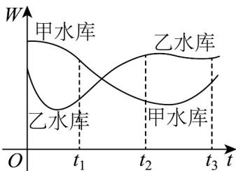

<!-- question-source:start -->
【变式2】建设大型水库可实现水资源的合理分配和综合利用，提高水资源的社会经济效益．已知一段时间

内，甲、乙两个水库的蓄水量 $W$ 与时间 $t$ 的关系如图所示，则下列叙述中正确的是（）

A. 在 $[0, t_3]$ 这段时间内，甲、乙两个水库蓄水量的平均变化率均大于 0
B. 在 $[t_1, t_2]$ 这段时间内，甲水库蓄水量的平均变化率小于乙水库蓄水量的平均变化率
C. 甲水库在 $t_2$ 时刻蓄水量的瞬时变化率大于乙水库在 $t_2$ 时刻蓄水量的瞬时变化率
D. 乙水库在 $t_1$ 时刻蓄水量的瞬时变化率大于乙水库在 $t_2$ 时刻蓄水量的瞬时变化率
<!-- question-source:end -->

![[高中/课堂同步/题库/人教A版高中数学同步讲义(2026)/04_选择性必修第二册/第五章一元函数的导数及其应用/专题5.1+导数的概念及其意义（高效培优讲义）数学人教A版2019高二选择性必修第二册/题型05_利用图象理解导数的几何意义/questions/answers/Q00081802A1.md]]
