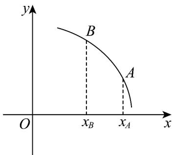
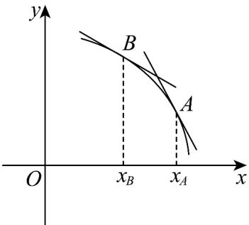

> [!faq]- 《专题5.1+导数的概念及其意义（高效培优讲义）数学人教A版2019高二选择性必修第二册》官方解析
>
> > [!success]- **【答案】** 
>
> > [!note]- **【分析】**
> > 利用导数的几何意义,根据图形中函数图象在点 A,B 处的切线下降和陡峭程度判断即可.
>
> > [!note]- **【解析】**
> > $f'(x_{A})$ 和 $f'(x_{B})$ 分别表示函数图象在点 A, B 处的切线斜率，
> >
> > 
> >
> > 由图知：函数图象在点 $A, B$ 处的切线斜率均为负，且 $A$ 处切线更陡，
> >
> > 所以 $f'\left(x_{A}\right) < 0, f'\left(x_{B}\right) < 0$ ， $\left|f'\left(x_{A}\right)\right| > \left|f'\left(x_{B}\right)\right|$
> >
> > 所以 $f'(x_{A}) < f'(x_{B})$
> >
> > 故答案为： $f'(x_{A})<f'(x_{B})$ .
