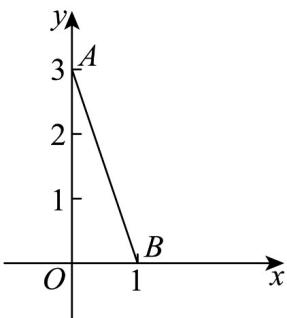

<!-- question-source:start -->
【变式2】如图，线段 $AB$ 是函数 $f(x)$ 的图像，则 $\lim_{\Delta x\to 0}\frac{f\left(\frac{1}{2} + \Delta x\right) - f\left(\frac{1}{2}\right)}{\Delta x} = ()$

A. $\frac{1}{2}$ B. $-\frac{1}{2}$ C. 3 D. -3
<!-- question-source:end -->

![[高中/课堂同步/题库/人教A版高中数学同步讲义(2026)/04_选择性必修第二册/第五章一元函数的导数及其应用/专题5.1+导数的概念及其意义（高效培优讲义）数学人教A版2019高二选择性必修第二册/题型06_过某点的曲线的切线/questions/answers/Q00081806A1.md]]
