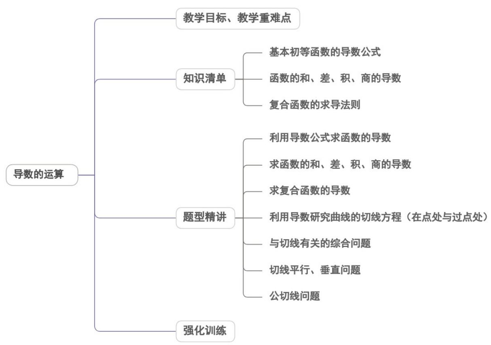

<!-- source-part:1 pages:1-49 -->

## 专题5.2 导数的运算

## 内容概览

## 教学目标、教学重难点

<table><tr><td>教学目标</td><td>1.能根据定义求函数的导数。2.能熟练应用给出的基本初等函数的导数公式求简单函数的导数。3.理解并熟练掌握函数的和、差、积、商的求导法则。4.了解复合函数的概念,熟练掌握复合函数的求导法则。</td></tr><tr><td>教学重难点</td><td>1.重点掌握基本初等函数的求导;熟练掌握导数的运算公式;能准确应用公式计算函数的导数.</td></tr></table>

会求简单的复合函数的导数；能解决与切线、切点、斜率、待定参数相关的问题...

## 知识清单

## 知识点 01 基本初等函数的导数公式

(1) $f(x) = C$ ( $C$ 为常数)， $f'(x) = 0$ (2) $f(x) = x^n$ ( $n$ 为有理数)， $f'(x) = n \cdot x^{n-1}$

(3) $f(x) = \sin x$ , $f'(x) = \cos x$ (4) $f(x) = \cos x$ , $f'(x) = -\sin x$ (5) $f(x) = e^x$ , $f'(x) = e^x$

(6) $f(x) = a^x$ , $f'(x) = a^x \cdot \ln a$ (7) $f(x) = \ln x$ , $f'(x) = \frac{1}{x}$ (8) $f(x) = \log_a x$ , $f'(x) = \frac{1}{x} \log_a e$ ，这样的形

式.

1、常数函数的导数为0，即 $C^{\prime} = 0$ （ $C$ 为常数）．其几何意义是曲线 $f(x) = C$ （ $C$ 为常数）在任意点处的切

线平行于x轴.

2、有理数幂函数的导数等于幂指数 $n$ 与自变量的 $(n - 1)$ 次幂的乘积，即 $(x^n)' = nx^{n - 1}$ （ $n \in Q$ ）.

特别地 $\left(\frac{1}{x}\right)^{\prime} = -\frac{1}{x^2}, (\sqrt{x})' = \frac{1}{2\sqrt{x}}$

3、正弦函数的导数等于余弦函数，即 $(\sin x)' = \cos x$ ．4、余弦函数的导数等于负的正弦函数，即 $(\cos x)' = -\sin x$ ．

5、指数函数的导数： $(a^{x})^{\prime} = a^{x}\ln a$ ， $(e^{x})^{\prime} = e^{x}$ .6、对数函数的导数： $\left(\log_a x\right)' = \frac{1}{x}\log_a e$ ， $(\ln x)' = \frac{1}{x}$

有时也把 $(\log_a x)' = \frac{1}{x} \log_a e$ 记作： $(\log_a x)' = \frac{1}{x \ln a}$

【即学即练】

1. 若函数 $f(x) = (1 - 3x)^5$ ，则 $\lim_{x\to 0}\frac{f(1 + x) + 32}{x} =$ \_\_\_\_.

【答案】-240

【分析】由题知 $f(1) = -32$ ，则 $\lim_{x\to 0}\frac{f(1 + x) + 32}{x} = \lim_{x\to 0}\frac{f(1 + x) - f(1)}{(1 + x) - 1}$ ，再利用导数的概念求解即可。

【详解】因为 $f(1) = -32$ ， $f'(x) = -15(1 - 3x)^{4}$

所以 $\lim_{x\to 0}\frac{f(1 + x) + 32}{x} = \lim_{x\to 0}\frac{f(1 + x) - f(1)}{x} = f'(1) = -15\times (-2)^4 = -240$

故答案为：-240

2. 若函数 $f(x) = \cos x$ ，则 $\lim_{\Delta x \to 0} \frac{f(1 + 4\Delta x) - f(1)}{\Delta x} = (\quad)$ A. $4\sin 1$ B. $-4\sin 1$ C. $\frac{1}{4}\sin 1$ D. $-\frac{1}{4}\sin 1$

【答案】B

【分析】根据求导公式及导数的定义求解·

【详解】由题意得， $f'(x) = -\sin x$

$$
\lim _ {\Delta x \rightarrow 0} \frac {f (1 + 4 \Delta x) - f (1)}{\Delta x} = \lim _ {\Delta x \rightarrow 0} \frac {4 [ f (1 + 4 \Delta x) - f (1) ]}{4 \Delta x} = 4 \lim _ {\Delta x \rightarrow 0} \frac {f (1 + 4 \Delta x) - f (1)}{4 \Delta x} = 4 f ^ {\prime} (1) = - 4 \sin 1
$$

故选：B

知识点 02 函数的和、差、积、商的导数

运算法则：

(1) 和差的导数： $[f(x)\pm g(x)]' = f'(x)\pm g'(x)$ (2) 积的导数： $[f(x)\cdot g(x)]' = f'(x)g(x) + f(x)g'(x)$

(3) 商的导数： $\left[\frac{f(x)}{g(x)}\right]'=\frac{f'(x)\cdot g(x)-f(x)\cdot g'(x)}{\left[g(x)\right]^{2}}\quad(g(x)\neq0)$

1、上述法则也可以简记为：

(i) 和（或差）的导数： $(u \pm v)' = u' \pm v'$ ，推广： $(u_{1} \pm u_{2} \pm \cdots \pm u_{n})' = u_{1}' \pm u_{2}' \pm \cdots \pm u_{n}'$

(ii) 积的导数： $(u\cdot v)' = u'v + uv'$ ，特别地： $(cu)' = cu'$ （ $c$ 为常数）.

(iii) 商的导数： $\left(\frac{u}{v}\right)^{\prime} = \frac{u^{\prime}v - uv^{\prime}}{v^{2}} (v\neq 0)$

两函数商的求导法则的特例 $\left[\frac{f(x)}{g(x)}\right]' = \frac{f'(x)g(x) - f(x)g'(x)}{g^2(x)} (g(x) \neq 0)$

当 $f(x) = 1$ 时， $\left[\frac{1}{g(x)}\right]' = \frac{1' \cdot g(x) - 1 \cdot g'(x)}{g^2(x)} = -\frac{g'(x)}{g^2(x)} (g(x) \neq 0)$ 。这是一个函数倒数的求导法则。

2、两函数积与商求导公式的说明

(1) 类比： $(u \cdot v)' = u'v + uv'$ ， $\left(\frac{u}{v}\right)' = \frac{u'v - uv'}{v^2} (v \neq 0)$ ，注意差异，加以区分。

(2) 注意： $\left(\frac{u}{v}\right)^{\prime} \neq \frac{u^{\prime}}{v^{\prime}}$ 且 $\left(\frac{u}{v}\right)^{\prime} \neq \frac{u^{\prime}v + uv^{\prime}}{v^{2}} (v \neq 0)$ .

## 3、求导运算的技巧

在求导数中，有些函数虽然表面形式上为函数的商或积，但在求导前利用代数或三角恒等变形可将函数先化

简（可能化去了商或积），然后进行求导，可避免使用积、商的求导法则，减少运算量。

【即学即练】

1. 已知函数 $f(x)=xe^{x}+\frac{k}{x}$ ，若 $f'(1)=0$ ，则 k=（）

【答案】
A. 2e B. e C. $\frac{e}{2}$ D. 1

【答案】A

【分析】由 $f(x)$ 求出 $f'(x)$ ，再由 $f'(1)=0$ 求出k的值。
【详解】因为 $f(x)=xe^{x}+\frac{k}{x}$ ，所以 $f'(x)=(x+1)e^{x}-\frac{k}{x^{2}}$ ，则 $f'(1)=(1+1)e^{1}-\frac{k}{1^{2}}=2e-k=0$ ，解得k=2e.

故选：A.

2．已知函数 $f(x)=\mathrm{e}^{x}-ax+b(a,b\in\mathbf{R}), g(x)=x^{2}+x$ ，若这两个函数的图象在公共点 $A(1,2)$ 处有相同的切线，
则 $a + b$ 的值为（）

【答案】A

【分析】分别表示出 $f'(x), g'(x)$ ，再根据 $f(x), g(x)$ 在 $x = 1$ 处的导数值和函数值分别相等可求结果。
【详解】因为 $f(x)=\mathrm{e}^{x}-ax+b(a,b\in\mathbb{R}), g(x)=x^{2}+x$

所以 $f^{\prime}(x) = \mathrm{e}^{x} - a, g^{\prime}(x) = 2x + 1$

因为 $f(x), g(x)$ 在公共点 $A(1,2)$ 处有相同的切线，则有 $\left\{ \begin{array}{l} g'(1) = f'(1) \\ f(1) = g(1) \end{array} \right.$ ，

即 $\left\{\begin{aligned}3&=e-a\\ e-a+b&=2\end{aligned}\right.$ ，所以 $\left\{\begin{aligned}a&=e-3\\ b&=-1\end{aligned}\right.,a+b=e-4$

故选：A.

## 知识点 03 复合函数的求导法则

## 1、复合函数的概念

对于函数 $y = f[\varphi(x)]$ ，令 $u = \varphi(x)$ ，则 $y = f(u)$ 是中间变量 $u$ 的函数， $u = \varphi(x)$ 是自变量 $x$ 的函数，则函数 $y = f[\varphi(x)]$ 是自变量 $x$ 的复合函数。

## 2、复合函数的导数

设函数 $u = \varphi (x)$ 在点 $x$ 处可导， $u_x' = \varphi'(x)$ ，函数 $y = f(u)$ 在点 $x$ 的对应点 $u$ 处也可导 $y_u' = f'(u)$ ，则复合函数 $y = f[\varphi (x)]$ 在点 $x$ 处可导，并且 $y_x' = y_u' \cdot u_x'$ ，或写作 $f_x'[\varphi (x)] = f'(u) \cdot \varphi'(x)$ .

## 3、掌握复合函数的求导方法

(1) 分层：将复合函数 $y = f[\varphi(x)]$ 分出内层、外层.

(2) 各层求导：对内层 $u = \varphi(x)$ ，外层 $y = f(u)$ 分别求导。得到 $\varphi'(x)$ ， $f'(u)$

(3) 求积并回代：求出两导数的积： $f'(u) \cdot \varphi'(x)$ ，然后将 u 用 $\varphi(x)$ 替换，即可得到 $y = f[\varphi(x)]$ 的导数。

## 【即学即练】

1. 若函数 $f(x) = (1 - 3x)^5$ ，则 $\lim_{x\to 0}\frac{f(1 + x) + 32}{x} =$ （ ）A.80 B.-80 C.240 D.-240

【答案】D

【分析】利用导数的概念即可求解·

【详解】因为 $f(1) = -32, f'(x) = -15(1 - 3x)^{4}$

所以 $\lim_{x\to 0}\frac{f(1 + x) + 32}{x} = \lim_{x\to 0}\frac{f(1 + x) - f(1)}{x} = f'(1) = -15\times (-2)^4 = -240.$

故选：D

2. 已知 $\left(x_{0}, y_{0}\right)$ 是函数 $f(x) = \ln (3x - 1) + 3$ 的图象上一点，函数 $g(x) = f'(x_{0})x$ 满足 $g(1) = 3$ ，则曲线 $f(x)$ 在点 $\left(x_{0}, y_{0}\right)$ 处的切线方程为 \_\_\_\_.

【答案】 $3x - y + 1 = 0$

【分析】先求出导函数，再由切线斜率求出切点坐标，代入点斜式直线方程即可求解·

【详解】由 $f(x)=\ln(3x-1)+3$ 得 $f'(x)=\frac{3}{3x-1}$

因为 $g(x) = f'(x_0)x$ ，且 $g(1) = f'(x_0) = 3$ ，所以 $\frac{3}{3x_0 - 1} = 3$ ，解得 $x_0 = \frac{2}{3}$

又 $f\left(\frac{2}{3}\right) = 3$ ，所以 $f(x)$ 在 $\left(\frac{2}{3},3\right)$ 处的切线方程为 $y - 3 = 3\left(x - \frac{2}{3}\right)$ ，即 $3x - y + 1 = 0$

故答案为： $3x - y + 1 = 0$

## 题型精讲

![[高中/课堂同步/题库/人教A版高中数学同步讲义(2026)/04_选择性必修第二册/第五章一元函数的导数及其应用/专题5.2+导数的运算（高效培优讲义）数学人教A版2019高二选择性必修第二册/题型01_利用导数公式求函数的导数/题型01_利用导数公式求函数的导数.md]]
![[高中/课堂同步/题库/人教A版高中数学同步讲义(2026)/04_选择性必修第二册/第五章一元函数的导数及其应用/专题5.2+导数的运算（高效培优讲义）数学人教A版2019高二选择性必修第二册/题型02_求函数的和_差_积_商的导数/题型02_求函数的和_差_积_商的导数.md]]
![[高中/课堂同步/题库/人教A版高中数学同步讲义(2026)/04_选择性必修第二册/第五章一元函数的导数及其应用/专题5.2+导数的运算（高效培优讲义）数学人教A版2019高二选择性必修第二册/题型03_求复合函数的导数/题型03_求复合函数的导数.md]]
![[高中/课堂同步/题库/人教A版高中数学同步讲义(2026)/04_选择性必修第二册/第五章一元函数的导数及其应用/专题5.2+导数的运算（高效培优讲义）数学人教A版2019高二选择性必修第二册/题型04_利用导数研究曲线的切线方程_在点_P_处与过点_P_处/题型04_利用导数研究曲线的切线方程_在点_P_处与过点_P_处.md]]
![[高中/课堂同步/题库/人教A版高中数学同步讲义(2026)/04_选择性必修第二册/第五章一元函数的导数及其应用/专题5.2+导数的运算（高效培优讲义）数学人教A版2019高二选择性必修第二册/题型05_与切线有关的综合问题/题型05_与切线有关的综合问题.md]]
![[高中/课堂同步/题库/人教A版高中数学同步讲义(2026)/04_选择性必修第二册/第五章一元函数的导数及其应用/专题5.2+导数的运算（高效培优讲义）数学人教A版2019高二选择性必修第二册/题型06_切线平行_垂直问题/题型06_切线平行_垂直问题.md]]
![[高中/课堂同步/题库/人教A版高中数学同步讲义(2026)/04_选择性必修第二册/第五章一元函数的导数及其应用/专题5.2+导数的运算（高效培优讲义）数学人教A版2019高二选择性必修第二册/题型07_公切线问题/题型07_公切线问题.md]]
![[高中/课堂同步/题库/人教A版高中数学同步讲义(2026)/04_选择性必修第二册/第五章一元函数的导数及其应用/专题5.2+导数的运算（高效培优讲义）数学人教A版2019高二选择性必修第二册/强化训练/强化训练.md]]
