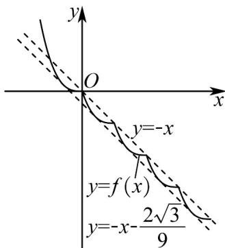

> [!faq]- 《专题5.2+导数的运算（高效培优讲义）数学人教A版2019高二选择性必修第二册》官方解析
>
> > [!success]- **【答案】** $\left(0, \frac{2\sqrt{3}}{9}\right)$
>
> > [!note]- **【分析】**
> > 根据题意先画出函数 $f(x)$ 的图象为函数 $y = -x^3$ 在 $x \in [-1, 0)$ 上的图象不断向右、向下平移 $^1$ 个单位
> >
> > $$
> > f (x)
> > $$
> >
> > $$
> > y = - x - m
> > $$
> >
> > $[0,2025]$ 上恰有 $4050$ 个交点，即函数 $f(x)$ 的图象与 $y = -x - m$ 在区间 $[n,n + 1)$ 上都有两个交点，所以只需函
> >
> > 数 $y = -x^3$ 的图象与 $y = -x - m$ 在区间 $x \in [-1, 0)$ 上有两个交点即可，利用导数的几何意义求解切线即可。
>
> > [!note]- **【解析】**
> > 根据题意，函数 $f(x)=\left\{\begin{aligned}-x^{3},&x<0,\\ f(x-1)&-1,x&0,\end{aligned}\right.$
> >
> > 将函数 $y = -x^3$ 在 $x \in [-1,0)$ 上的图象向右、向下平移 1 个单位可得函数 $f(x)$ 在 $x \in [0,1)$ 时的图象，
> >
> > 再向右、向下平移 $^{1}$ 个单位可得函数 $f(x)$ 在 $x \in [1,2)$ 时的图象，
> >
> > 继续向右、向下平移 $^{1}$ 个单位可得函数 $f(x)$ 在 $x\in[2,3)$ 时的图象……
> >
> > 如图可得函数 $f(x)$ 的图象，
> >
> > 
> >
> > 令 $g(x) = f(x) + x + m = 0$ ，即 $f(x) = -x - m$
> >
> > 因为 $g(x)$ 在区间[0,2025]上恰有4050个零点，
> >
> > 即函数 $f(x)$ 的图象与 $y = -x - m$ 在区间[0,2025]上恰有4050个交点，
> >
> > 即函数 $f(x)$ 的图象与 $y = -x - m$ 在区间 $[n, n + 1)$ 上都有两个交点，
> >
> > 所以只需函数 $y = -x^3$ 的图象与 $y = -x - m$ 在区间 $x \in [-1, 0)$ 上有两个交点即可，
> >
> > 当 $m = 0$ 时，函数 $y = -x^3$ 的图象与 $y = -x$ 在区间 $x \in [-1, 0)$ 上有1个交点
> >
> > 再求函数 $y = -x^3$ 斜率为-1的切线，
> >
> > 导数为 $y' = -3x^2$ ，令 $y' = -1$ ，得 $x = -\frac{\sqrt{3}}{3}$ ，则切点为 $\left(-\frac{\sqrt{3}}{3}, \frac{\sqrt{3}}{9}\right)$
> >
> > 代入 $y = -x - m$ ，可得 $m = \frac{2\sqrt{3}}{9}$
> >
> > 所以 $m \in \left(0, \frac{2\sqrt{3}}{9}\right)$ 时，函数 $y = -x^3$ 的图象与 $y = -x - m$ 在区间 $x \in [-1, 0)$ 上有两个交点，这样函数 $f(x)$ 的图象与 $y = -x - m$ 在区间[0,2025]上恰有4050个交点.故答案为： $\left(0,\frac{2\sqrt{3}}{9}\right)$
