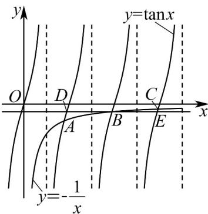

> [!faq]- 《专题5.2+导数的运算（高效培优讲义）数学人教A版2019高二选择性必修第二册》官方解析
>
> > [!success]- **【答案】** A. $x_{1} \tan x_{1} < x_{2} \tan x_{2}$ B. $x_{1} \tan x_{1} > x_{2} \tan x_{2}$ C. $\frac{1}{x_1} + \frac{1}{x_3} < \frac{2}{x_2}$ D. $\frac{1}{x_1} + \frac{1}{x_3} > \frac{2}{x_2}$
>
> > [!note]- **【分析】**
> > 对 AB，利用导数的几何意义求得切线的斜率，结合切线过原点列式可得 $x_{i} \tan x_{i} = -1$ ，可判断；对 CD，作函数 $y = \tan x$ 与 $y = -\frac{1}{x}$ 的图象，设交点分别为 $A(x_{1}, \tan x_{1})$ ， $B(x_{2}, \tan x_{2})$ ， $C(x_{3}, \tan x_{3})$ ，过点 B 作 x 轴的平行线与 $y = \tan x (0 < x < 3\pi)$ 的图象交于 D，E 两点，由图可得 $\tan x_{2} - \tan x_{1} > \tan x_{3} - \tan x_{2}$ ，运算得解.
> >
> > 解·
>
> > [!note]- **【解析】**
> > 对于 AB，由题意知 $f'(x) = -\sin x$ ，则曲线在点 $(x_i, \cos x_i)$ （i = 1, 2, 3）处的切线的斜率 $k_i = -\sin x_i$ ，
> > 又 $k_{i}=\frac{\cos x_{i}-0}{x_{i}-0}=\frac{\cos x_{i}}{x_{i}}$ ，即 $x_{i}\tan x_{i}=-1$ ，故 A，B 错误；
> >
> > 对于 CD，作函数 $y = \tan x$ 与 $y = -\frac{1}{x}$ 的图象如图，
> >
> > 设交点分别为 $A(x_{1},\tan x_{1})$ ， $B(x_{2},\tan x_{2})$ ， $C(x_{3},\tan x_{3})$
> >
> > 过点 $B$ 作 $x$ 轴的平行线与 $y = \tan x$ （ $0 < x < 3\pi$ ）的图象交于 $D$ ， $E$ 两点，
> >
> > $$
> > D \left(x _ {2} - \pi , \tan x _ {2}\right) E \left(x _ {2} + \pi , \tan x _ {2}\right)
> > $$
> >
> > 由 $y = -\frac{1}{x}$ 的函数图象可知 $\tan x_2 - \tan x_1 > \tan x_3 - \tan x_2$
> >
> > 即 $-\frac{1}{x_{2}}+\frac{1}{x_{1}}>-\frac{1}{x_{3}}+\frac{1}{x_{2}}$ ，所以 $\frac{1}{x_{1}}+\frac{1}{x_{3}}>\frac{2}{x_{2}}$ ，故 C 错误，D 正确。
> >
> > 故选：D.
> >
> > 
