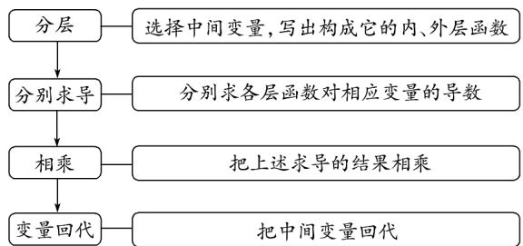

> [!faq]- 《专题5.2+导数的运算（高效培优讲义）数学人教A版2019高二选择性必修第二册》官方解析
>
> > [!success]- **【答案】** 2
>
> > [!note]- **【分析】**
> > 先利用导数的几何意义求出切线方程，然后利用导数几何的意义求得曲线 $y = \ln(x + 1) + a$ 的切点坐
> >
> > 标，即可求解·
>
> > [!note]- **【解析】**
> > 设 $f(x)=\mathrm{e}^{x}+1$ ，则 $f(0)=2$ ，又 $f'(x)=\mathrm{e}^{x}$ ，所以 $f'(0)=1$ ，
> >
> > 则切线方程为 $y = x + 2$
> >
> > 设 $g(x)=\ln(x+1)+a$ ，则 $g'(x)=\frac{1}{x+1}$ ，令 $\frac{1}{x+1}=1$ ，解得 x=0 ，
> >
> > 所以 $g(0)=a=2$
> >
> > 故答案为：2
> >
> > ## 方法技巧
> >
> > (1) 求复合函数的导数的步骤
> >
> > 
> >
> > （2）求复合函数的导数的注意点：①分解的函数通常为基本初等函数；
> > - **②**：求导时分清是对哪个变量求导；
> > - **③**：计算结果尽量简洁.
