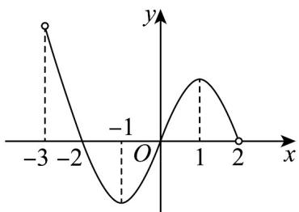

<!-- question-source:start -->
12. 若 $f(x)$ 是定义在区间 $(-3, 2)$ 上的函数，其图象如图所示，设 $f(x)$ 的导函数为 $f'(x)$ ，则 $f(x)f'(x) > 0$

的解集为（）

A. $(-2, - 1)\cup (1,2)$ B. $(-2, - 1)\cup (0,1)$

C. $(-3, - 2)\cup (0,1)$ D. $(-1,0)\cup (1,2)$
<!-- question-source:end -->

![[高中/课堂同步/题库/人教A版高中数学同步讲义(2026)/04_选择性必修第二册/第五章一元函数的导数及其应用/专题5.3.1+函数的单调性（高效培优讲义）数学人教A版2019高二选择性必修第二册/强化训练/questions/answers/Q00081892A1.md]]
