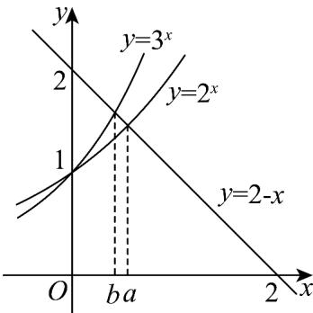

> [!faq]- 《专题5.3.1+函数的单调性（高效培优讲义）数学人教A版2019高二选择性必修第二册》官方解析
>
> > [!success]- **【答案】** D
>
> > [!note]- **【分析】**
> > 由题意可证明 0 < a < 1 且 0 < b < 1 ，可判定 A 错误；将 a, b 看作 $y = 2^{x}$ ， $y = 3^{x}$ 的图象与直线
> >
> > $y = 2 - x$ 交点的横坐标，数形结合可判断 $^{B}$ ；由题意可知 $2^{a} < 3^{b}$ ，又0 < b < a < 1，所以 $b + 2^{a} < a + 3^{b}$ ，即可判
> >
> > 断 $^{C}$ ；构造函数 $f(x)=\frac{\ln2x}{x}(x>0)$ ，利用其单调性即可判断 $^{D}$ .
>
> > [!note]- **【解析】**
> > 若 b < a < 0，则 $2^{a} < 1$ ， $3^{b} < 1$ ，则 $a + 2^{a} = b + 3^{b} = 2$ 不成立，A 错误；
> >
> > 若 $a = b = 1$ ，则 $2^{a} = 2$ ， $3^{b} = 3$ ， $a + 2^{a} = b + 3^{b} = 2$ 不成立，
> >
> > 若 $a > 1$ ， $b > 1$ ，则 $a + 2^{a} > 3$ ， $b + 3^{b} > 4$
> >
> > 所以 $a+2^{a}=b+2^{b}=2$ 不成立，所以 0<a<1 且 0<b<1
> >
> > 又 $2^{a} = 2 - a$ ， $3^{b} = 2 - b$ ，则 $a$ ， $b$ 可以分别看作 $y = 2^{x}$ ， $y = 3^{x}$ 的图象与直线 $y = 2 - x$ 交点的横坐标，
> >
> > 作出 $y = 2^{x}$ ， $y = 3^{x}$ 与 y = 2 - x 的图象如图所示，
> >
> > 
> >
> > 结合图象可知 b < a ，
> >
> > 综上所述 0 < b < a < 1，故 B 错误；
> >
> > 由 $0 < b < a < 1$ ， $a + 2^{a} = b + 3^{b} = 2$ ，可得 $2^{a} < 3^{b}$
> >
> > 所以 $b+2^{a}<a+3^{b}$ ，C 错误；
> >
> > 令 $f(x)=\frac{\ln2x}{x}(x>0)$ ，则 $f'(x)=\frac{1-\ln2x}{x^{2}}$ ，
> >
> > 当 $0 < x < \frac{\mathrm{e}}{2}$ 时， $f'(x) > 0$ ，所以 $f(x)$ 在 $\left(0, \frac{\mathrm{e}}{2}\right)$ 上单调递增，
> >
> > 当 $x > \frac{e}{2}$ 时， $f'(x) < 0$ ，所以 $f(x)$ 在 $\left(\frac{e}{2}, +\infty\right)$ 上单调递减，
> >
> > 因为 $0 < b < a < 1 < \frac{e}{2}$ ，所以 $f(b) < f(a)$ ，即 $\frac{\ln 2b}{b} < \frac{\ln 2a}{a}$ ，
> >
> > 所以 $b\ln 2a > a\ln 2b$ ，D正确.
> >
> > 故选 **D**.
