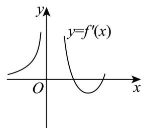
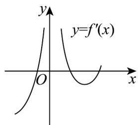
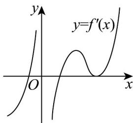

> [!faq]- 《专题5.3.1+函数的单调性（高效培优讲义）数学人教A版2019高二选择性必修第二册》官方解析
>
> > [!success]- **【答案】**  A  B  <!-- source-part:2 pages:51-53 --> C  D 
>
> > [!note]- **【分析】**
> > 根据 $y = f(x)$ 图象的单调性与导函数 $f'(x)$ 的符号之间的关系逐项分析判断.
>
> > [!note]- **【解析】**
> > 由图象知， $x\in (-\infty ,0)$ ， $y = f(x)$ 的图象为增函数，则 $f^{\prime}(x) > 0$
> >
> > 故排除 B，D.
> >
> > 当 $x \in (0, +\infty)$ 时， $y = f(x)$ 的图象先增，后减，再增，
> >
> > 所以 $y = f'(x)$ 的图象先正，后负，再正，所以 A 正确，C 错误.
> >
> > 故选 **A**
