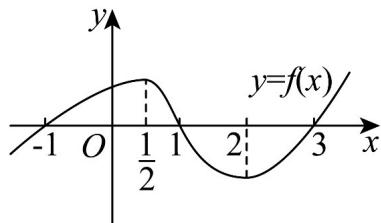

> [!faq]- 《专题5.3.1+函数的单调性（高效培优讲义）数学人教A版2019高二选择性必修第二册》官方解析
>
> > [!success]- **【答案】** 
>
> > [!note]- **【分析】**
> > 利用图象判断 $f(x)$ 的单调性，进而得到 $f'(x)$ 的正负，最后求出不等式解集即可·
>
> > [!note]- **【解析】**
> > 由图象得 $f(x)$ 在 $\left(-\infty, \frac{1}{2}\right)$ ， $(2, +\infty)$ 上单调递增，在 $\left(\frac{1}{2}, 2\right)$ 上单调递减，
> >
> > 则当 $x\in \left(-\infty ,\frac{1}{2}\right)\cup (2, + \infty)$ 时， $f^{\prime}(x) > 0$ ，当 $x\in \left(\frac{1}{2},2\right)$ 时， $f^{\prime}(x) <   0$
> >
> > 若 $\frac{f'(x)}{x - 1} < 0$ ，则当 $x - 1 < 0$ 时， $f'(x) > 0$ 或当 $x - 1 > 0$ 时， $f'(x) < 0$
> >
> > 当 $x - 1 < 0$ ， $f'(x) > 0$ 时，解得 $x \in \left(-\infty, \frac{1}{2}\right)$
> >
> > 当 $x - 1 > 0$ ， $f'(x) < 0$ 时，解得 $x \in (1,2)$
> >
> > 综上可得不等式 $\frac{f'(x)}{x-1}<0$ 的解集为 $\left(-\infty,\frac{1}{2}\right)\mathrm{U}(1,2)$ .
> >
> > 故答案为： $\left(-\infty,\frac{1}{2}\right)\mathrm{U}(1,2)$
