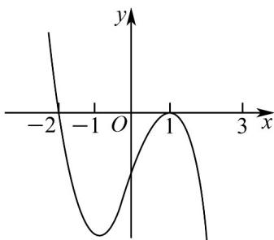

> [!faq]- 《专题5.3.1+函数的单调性（高效培优讲义）数学人教A版2019高二选择性必修第二册》官方解析
>
> > [!success]- **【答案】**  A. 函数 $f(x)$ 有2个极值点 B. $\exists M\in \mathbf{R}$ ，使得 $f(x)\leq M$ 恒成立 C. 函数 $f(x)$ 在区间 $(-1, 1)$ 上单调递增 D．函数 $f(x)$ 在区间 $(-2,-1)$ 上没有零点
>
> > [!note]- **【分析】**
> > 由导函数图象的性质逐一判断即可·
>
> > [!note]- **【解析】**
> > 由图象可知，函数 $f(x)$ 在 $(-∞,-2)$ 上单调递增，在 $(-2,+∞)$ 上单调递减，在x=-2处取得极大值，
> > 对于 A，函数 $f(x)$ 有 1 个极大值点，故 A 错误；
> >
> > 对于 $^{B}$ ， $\exists M \in \mathbf{R}$ ，使得 $f(x) \leq M$ 恒成立，只需 $M \quad f(-2)$ 即可，故 $^{B}$ 正确；
> >
> > 对于 C，因为在区间 $(-1,1)$ 上 $f'(x)<0$ ，所以函数 $f(x)$ 在区间 $(-1,1)$ 上单调递减，故 C 错误；
> >
> > 对于 D，函数 $f(x)$ 在区间 $(-2,-1)$ 上单调递减，无法判断零点情况，故 D 错误；
> >
> > 故选 **B**.
