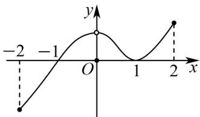

> [!faq]- 《专题5.3.1+函数的单调性（高效培优讲义）数学人教A版2019高二选择性必修第二册》官方解析
>
> > [!success]- **【答案】**  A. $f(x)$ 在 $[-1,0]$ 上单调递减 B. $f(x)$ 在 $[0,1]$ 上单调递减 C. $f(x)$ 在 $[-1,2]$ 上单调递增 D. $f(x)$ 在 $[-2,0]$ 上单调递增
>
> > [!note]- **【分析】**
> > 结合图象确定导函数 $f'(x)$ 在区间 $(-2,-1)$ ， $(-1,0)$ ， $(0,1)$ ， $(1,2)$ 上的正负，结合导数与单调性的
> >
> > 关系判断结论·
>
> > [!note]- **【解析】**
> > 由图象可得当 $-2 \leq x < -1$ 时， $xf'(x) < 0$ ，
> >
> > 此时 $f'(x) > 0$ ，函数 $f(x)$ 在 $[-2, -1)$ 上单调递增，
> >
> > 当 $-1 < x < 0$ 时， $xf'(x) > 0$
> >
> > 此时 $f'(x) < 0$ ，函数 $f(x)$ 在 $(-1, 0)$ 上单调递减，
> >
> > 当 0 < x < 1 时， $xf'(x) > 0$
> >
> > 此时 $f'(x) > 0$ ，函数 $f(x)$ 在 $(0,1)$ 上单调递增，
> >
> > 当 $1 < x \leq 2$ 时， $xf'(x) > 0$
> >
> > 此时 $f'(x) > 0$ ，函数 $f(x)$ 在 $(1,2]$ 上单调递增，
> >
> > 又 $f'(-1)=0,\quad f'(1)=0,\quad f(x)$ 为连续函数，
> >
> > 故 BCD 都错误，A 正确·
> >
> > 故选 **A**.
