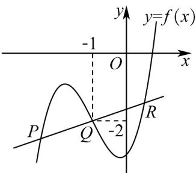

> [!faq]- 《专题5.3.2+函数的极值与最大+(小)+值（高效培优讲义）数学人教A版2019高二选择性必修第二册》官方解析
>
> > [!success]- **【答案】** A. 当 $m = 4$ 时，函数 $f(x)$ 单调递增 B．当 $m \leq 3$ 时，函数 $f(x)$ 有两个极值 C．过点 $(0,1)$ 且与曲线 $y=f(x)$ 相切的直线有且仅有一条 D．当 m=1 时，若 $2b=a+c$ ，直线 ax-by-c=0 与曲线 $y=f(x)$ 有三个交点 $P(x_{1},y_{1}), Q(x_{2},y_{2})$ $R\left(x_{3},y_{3}\right)$ ，则 $x_{1} + x_{2} + x_{3} = -3$
>
> > [!note]- **【分析】**
> > 因为 $f(x) = x^3 + 3x^2 + mx - 3$ ，所以 $f'(x) = 3x^2 + 6x + m$ . 当 $m = 4$ 时，
> >
> > $f'(x)=3x^{2}+6x+4=3(x+1)^{2}+1>0$ ，即可判断选项 A；当 m=3 时， $f'(x)=3x^{2}+6x+3=3(x+1)^{2}\quad0$ ，此时
> >
> > $f(x)$ 单调递增，函数 $f(x)$ 无极值，即可判断选项B；设过点 $\left(0,1\right)$ 的直线与曲线 $y = f(x)$ 相切于点
> >
> > $\left(x_{0},x_{0}^{3} + 3x_{0}^{2} + mx_{0} - 3\right)$ ，则切线方程为 $y - \left(x_0^3 +3x_0^2 +mx_0 - 3\right) = \left(3x_0^2 +6x_0 + m\right)(x - x_0)$ ，代入 $(0,1)$ 并整理得
> >
> > $2x_{0}^{3} + 3x_{0}^{2} + 4 = 0$ 令 $g(x) = 2x^{3} + 3x^{2} + 4$ ，求导研究函数 $g(x)$ 的单调性及极值，进一步判断函数 $g(x)$ 的零点个
> >
> > 数，即方程 $2x_0^3 + 3x_0^2 + 4 = 0$ 解的个数，即可判断选项C；当 $m = 1$ 时， $f(x) = x^3 + 3x^2 + x - 3$ ，因为 $2b = a + c$
> >
> > 所以直线 $ax - by - c = 0$ 即为直线 $a(x + 1) - b(y + 2) = 0$ ，过定点 $(-1, - 2)$ ，且此点在曲线 $y = f(x)$ 上，画出
> >
> > $y = f(x)$ 的大致图象与直线 ax - by - c = 0，求出函数 $y = f(x)$ 图象的对称中心，根据对称性即可判断选项 D.
>
> > [!note]- **【解析】**
> > 因为 $f(x)=x^{3}+3x^{2}+mx-3$ ，所以 $f'(x)=3x^{2}+6x+m$ .
> >
> > 当 $m = 4$ 时， $f'(x) = 3x^2 + 6x + 4 = 3(x + 1)^2 + 1 > 0$ ，所以当 $x \in (-\infty, +\infty)$ 时， $f'(x) > 0, f(x)$ 单调递增故选项A正
> >
> > 确；
> >
> > 当 $m \leq 3$ 时，令 $f'(x) = 3x^2 + 6x + m = 0$ ，则 $\Delta = 36 - 12m \quad 0$ ，所以当 $m = 3$ 时，
> >
> > $f^{\prime}(x) = 3x^{2} + 6x + 3 = 3(x + 1)^{2}\quad 0$ ，所以 $f(x)$ 单调递增，此时函数 $f(x)$ 无极值．故选项B不正确；
> >
> > 设过点 $(0,1)$ 的直线与曲线 $y=f(x)$ 相切于点 $\left(x_{0},x_{0}^{3}+3x_{0}^{2}+mx_{0}-3\right)$ ，则切线方程为 $y-\left(x_{0}^{3}+3x_{0}^{2}+mx_{0}-3\right)=$
> >
> > $\left(3x_{0}^{2} + 6x_{0} + m\right)(x - x_{0})$ ，代入 $(0,1)$ 得 $1 - \left(x_{0}^{3} + 3x_{0}^{2} + mx_{0} - 3\right) = -x_{0}\left(3x_{0}^{2} + 6x_{0} + m\right)$ ，整理得 $2x_{0}^{3} + 3x_{0}^{2} + 4 = 0$ 。令
> >
> > $g(x) = 2x^{3} + 3x^{2} + 4$ ，则 $g^{\prime}(x) = 6x^{2} + 6x = 6x(x + 1)$ ，所以当时， $g^{\prime}(x) > 0,g(x)$ 单调递增；当
> >
> > $$
> > x \in (- 1, 0) _ {\text {时，}} g ^ {\prime} (x) <   0, g (x) _ {\text {单调递减；当}} x \in (0, + \infty) _ {\text {时，}} g ^ {\prime} (x) > 0, g (x) _ {\text {单调递增.又}} g (- 1) = 5 > 0, g (0) = 4 > 0
> > $$
> >
> > 所以 $g(x)$ 只有一个零点，即方程 $2x_0^3 + 3x_0^2 + 4 = 0$ 只有一个解，所以过点 $(0,1)$ 且与曲线 $y = f(x)$ 相切的直线有
> >
> > 且仅有一条. 故选项 C 正确；
> >
> > 当 $m = 1$ 时， $f(x) = x^3 + 3x^2 + x - 3$ ，因为 $2b = a + c$ ，所以直线 $ax - by - c = 0$ 即为直线 $ax - by + a - 2b = 0$ ，即 $a(x + 1) - b(y + 2) = 0$ ，所以直线过定点 $(-1, -2)$ ，且此点在曲线 $y = f(x)$ 上，画出 $y = f(x)$ 的大致图象（对 $f(x)$ 求导，可得 $f(x)$ 的单调区间和极值，进而可作出 $f(x)$ 的大致图象）与直线 $ax - by - c = 0$ ，如图
> >
> > 
> >
> > 设函数 $y = f(x)$ 图象的对称中心为 $(m, n)$ （提示：任一三次函数的图象都有对称中心），则有
> >
> > $f(2m - x) + f(x) = 2n$ ，即 $(2m - x)^{3} + 3(2m - x)^{2} + (2m - x) - 3 + x^{3} + 3x^{2} + x - 3 = 2n$ ，整理得
> >
> > $6(m + 1)x^{2} - 12m(m + 1)x + 8m^{3} + 12m^{2} + 2m - 6 = 2n$ ，所以 $\left\{ \begin{array}{l}6(m + 1) = 0\\ 12m(m + 1) = 0\\ 8m^3 +12m^2 +2m - 6 = 2n \end{array} \right.$ ，解得 $\left\{ \begin{array}{l}m = -1\\ n = -2 \end{array} \right.$ ，所以函数
> >
> > $f(x)$ 的图象关于点 $(-1, -2)$ 对称·设 $x_{1} < x_{2} < x_{3}$ ，则有 $x_{1} + x_{3} = (-1) \times 2 = -2, x_{2} = -1$ ，所以 $x_{1} + x_{2} + x_{3} = -3$ 故选项
> >
> > D 正确.
> >
> > 故选 **ACD**.
