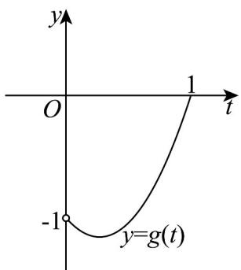
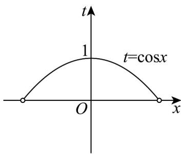

> [!faq]- 《专题5.3.2+函数的极值与最大+(小)+值（高效培优讲义）数学人教A版2019高二选择性必修第二册》官方解析
>
> > [!success]- **【答案】** $\left[-1,0\right)$
>
> > [!note]- **【分析】**
> > 求导，将问题转化为 $f'(x) = 0$ 在 $\left(-\frac{\pi}{2}, \frac{\pi}{2}\right)$ 上在上有两个不相等实数根，换元，令
> >
> > $\cos x = t, \because x \in \left(-\frac{\pi}{2}, \frac{\pi}{2}\right) \therefore t \in (0,1]$ ，进而根据二次函数 $g(t) = 2t^2 - t - 1 = 2\left(t - \frac{1}{4}\right)^2 - \frac{9}{8}, t \in (0,1]$ 的图像以及
> >
> > $t = \cos x$ 的图像交点个数求解.
>
> > [!note]- **【解析】**
> > $\because f(x) = \frac{1}{2}\sin 2x - \sin x - ax\therefore f'(x) = \cos 2x - \cos x - a = 2\cos^2 x - \cos x - 1 - a$
> >
> > 要使 $f(x)$ 在 $\left(-\frac{\pi}{2}, \frac{\pi}{2}\right)$ 上有两个极值点，则 $f'(x) = 0$ 在 $\left(-\frac{\pi}{2}, \frac{\pi}{2}\right)$ 上在上有两个不相等实数根，
> >
> > 令 $\cos x = t, \because x \in \left(-\frac{\pi}{2}, \frac{\pi}{2}\right) \therefore t \in (0,1]$ ，由 $f'(x) = 0$ ，则 $2t^{2} - t - 1 - a = 0$ 。
> >
> > 令 $g(t) = 2t^2 - t - 1 = 2\left(t - \frac{1}{4}\right)^2 - \frac{9}{8}, t \in (0,1]$ ；故 $g(t) \in \left[-\frac{9}{8}, 0\right]$ ，
> >
> > 由 $y = g(t), t \in (0,1]; t = \cos x, x \in \left(-\frac{\pi}{2}, \frac{\pi}{2}\right)$ 图象如下：
> >
> > 
> >
> > 
> >
> > 当 $a > 0$ 或 $a < -\frac{9}{8}$ 时，此时 $t = \cos x$ 无实数根，不符合题意，
> >
> > 当 $a \in [-1, 0)$ ，函数 $g(t)$ 在 $x \in \left(-\frac{\pi}{2}, \frac{\pi}{2}\right)$ 时与 $y = a$ 只有一个交点，对应的 $x$ 值有两个，符合题意；
> >
> > 当 $a = -\frac{9}{8}$ 时， $2t^2 - t - 1 - a = 0$ 无变号零点，不合题意；
> >
> > 而 $g(1)=0$ ， $t=\cos x=1$ 对应的 x 值有 1 个，故 a 不为 0.
> >
> > 故答案为： $\left[-1,0\right)$
