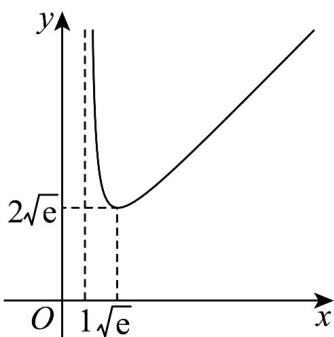

> [!faq]- 《专题5.3.2+函数的极值与最大+(小)+值（高效培优讲义）数学人教A版2019高二选择性必修第二册》官方解析
>
> > [!success]- **【答案】** (1)0； (2)答案见解析； (3) $\left(\mathrm{e}^{\frac{1}{2}},+\infty\right)$ .
>
> > [!note]- **【分析】**
> > （1）由题可得 $g(x)$ 在 $\frac{1}{e}$ 处取得极大值，据此可得答案.
> >
> > (2) 由题可得 $f'(x) = \frac{[x - (a - 1)](x - 1)}{x}$ ，然后分 $a > 2$ ， $a = 2$ ， $1 < a < 2$ 三种情况解不等式 $f'(x) > 0, f'(x) < 0$ 可得单调区间；
> >
> > （3）将问题转化为函数 $y=\frac{\frac{1}{2}x+x\ln x}{\ln x}$ 与直线 $y=2m$ 在 $[1,+\infty)$ 上有 2 个交点，然后通过导数研究函数 $p(x)=\frac{\frac{1}{2}x+x\ln x}{\ln x}$ ，x>1，可得 $p(x)$ 大致图像，据此可得答案.
>
> > [!note]- **【解析】**
> > （1）由 $g(x) = b - x\ln x$ ，得 $g'(x) = -1 - \ln x$
> >
> > 由 $g'(x) > 0$ ，得 $0 < x < \frac{1}{\mathrm{e}}$ ，由 $g'(x) < 0$ ，得 $x > \frac{1}{\mathrm{e}}$
> >
> > 则 $g(x)$ 在 $\left(0,\frac{1}{\mathrm{e}}\right)$ 上单调递增，在 $\left(\frac{1}{\mathrm{e}},+\infty\right)$ 上单调递减.
> >
> > 则 $g(x)$ 在 $x = \frac{1}{\mathrm{e}}$ 处取得极大值 $g\left(\frac{1}{\mathrm{e}}\right) = b - \frac{1}{\mathrm{e}}\ln \frac{1}{\mathrm{e}} = b + \frac{1}{\mathrm{e}} = \frac{1}{\mathrm{e}}$ ，得 $b = 0$ ；
> >
> > (2) 由 $f(x) = \frac{1}{2} x^2 - ax + (a - 1) \ln x$ ，得 $f'(x) = x - a + \frac{a - 1}{x} = \frac{x^2 - ax + a - 1}{x} = \frac{[x - (a - 1)](x - 1)}{x}$
> >
> > 若 $a > 2$ ，则 $a - 1 > 1$ ，由 $f^{\prime}(x) > 0$ ，得 $0 < x < 1$ 或 $x > a - 1$ ，由 $f^{\prime}(x) < 0$ ，得 $1 < x < a - 1$
> >
> > 则此时， $f(x)$ 在 $(0,1),(a-1,+\infty)$ 上单调递增，在 $(1,a-1)$ 上单调递减；
> >
> > 若 $a = 2$ ， $f^{\prime}(x) = \frac{(x - 1)^{2}}{x} >0$ ，则此时 $f(x)$ 在 $(0, + \infty)$ 上单调递增；
> >
> > 若 $1 < a < 2$ ，则 $0 < a - 1 < 1$ ，由 $f'(x) > 0$ ，得 $0 < x < a - 1$ 或 $x > 1$ ，由 $f'(x) < 0$ ，得 $a - 1 < x < 1$
> >
> > 则此时 $f(x)$ 在 $(0, a - 1), (1, +\infty)$ 上单调递增，在 $(a - 1, 1)$ 上单调递减；
> >
> > (3) 由 (1)，结合 $a = 1$ ，可得 $F(x) = \frac{1}{2} x^2 - x - (x - 2m)(-x\ln x) + x = \frac{1}{2} x^2 + x(x - 2m)\ln x$ ， $x > 0$ 。
> >
> > 因 $F(x)$ 在 $[1, +\infty)$ 有两个零点，则 $\frac{F(x)}{x} = \frac{1}{2} x + (x - 2m)\ln x$ 在 $[1, +\infty)$ 上有2个零点.
> >
> > 令 $h(x) = \frac{1}{2} x + (x - 2m)\ln x, x = 1$ ，得1不是其零点，
> >
> > 令 $h(x) = 0 \Rightarrow 2m = \frac{\frac{1}{2}x + x\ln x}{\ln x}$ ，
> >
> > 则原题等价于函数 $y = \frac{\frac{1}{2}x + x\ln x}{\ln x}$ 与直线 $y = 2m$ 在 $[1, +\infty)$ 上有2个交点.
> >
> > 令 $p(x) = \frac{\frac{1}{2}x + x\ln x}{\ln x}, x > 1$
> >
> > 则 $p^{\prime}(x) = \frac{(\frac{3}{2} + \ln x)\ln x - \frac{1}{2} - \ln x}{(\ln x)^{2}} = \frac{(\ln x + 1)(\ln x - \frac{1}{2})}{(\ln x)^{2}}$
> >
> > 由 $p'(x)>0$ ，得 $x>\mathrm{e}^{\frac{1}{2}}$ ，由 $p'(x)<0$ ，得 $1<x<\mathrm{e}^{\frac{1}{2}}$ ，
> >
> > 则 $p(x)$ 在 $\left(1, \mathrm{e}^{\frac{1}{2}}\right)$ 上单调递减，在 $\left(\mathrm{e}^{\frac{1}{2}}, +\infty\right)$ 上单调递增.
> >
> > 从而 $p(x)$ $p\left(\mathrm{e}^{\frac{1}{2}}\right)=2\mathrm{e}^{\frac{1}{2}}$
> >
> > 当 $x \to 1$ ， $p(x) \to +\infty$ ，当 $x \to +\infty$ ， $p(x) \to +\infty$ 。
> >
> > 则可得 $p(x)$ 大致图象如下：则 $2m > 2\mathrm{e}^{\frac{1}{2}} \Rightarrow m > \mathrm{e}^{\frac{1}{2}}$ 时，满足题意
> >
> > 
