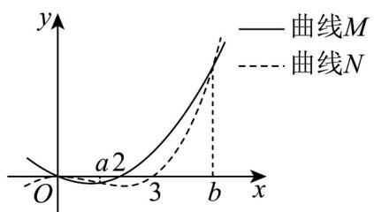

> [!faq]- 《第五章+一元函数的导数及其应用（高效培优单元测试·强化卷）数学人教A版2019高二选择性必修第二册》官方解析
>
> > [!success]- **【答案】**  A. 曲线 $M$ 为函数 $f(x)$ 的图象 B. 曲线 $N$ 为函数 $f(x)$ 的图象 C．函数 $g(x)$ 在区间 $[0,2]$ 上是增函数 D．函数 $g(x)$ 在区间 $[a,b]$ 上是减函数
>
> > [!note]- **【解析】**
> > 对于 AB，因为 $f'(x) > 0$ 时 $f(x)$ 单调递增， $f'(x) < 0$ 时 $f(x)$ 单调递减，
> >
> > 所以由图可知曲线 $M$ 为函数 $f^{\prime}(x)$ 的图象，曲线 $N$ 为函数 $f(x)$ 的图象，
> >
> > 故 $^{A}$ 错误， $^{B}$ 正确；
> >
> > 对于 CD，由图可知当 $x \in (0, a)$ 时 $f(x) - f'(x) > 0$ ， $x \in (a, b)$ 时 $f(x) - f'(x) < 0$
> >
> > 因为 $g'(x)=\frac{\mathrm{e}^{x}\left[f(x)-f'(x)\right]}{f^{2}(x)}$ ，所以当 $x\in(0,a)$ 时 $g'(x)>0$ ， $x\in(a,b)$ 时 $g'(x)<0$ ，
> >
> > 所以函数 $g(x)$ 在区间 $[0,a]$ 上是增函数，在区间 $[a,b]$ 上是减函数，
> >
> > 故 $^{C}$ 错误， $^{D}$ 正确·
> >
> > 故选 **BD**
