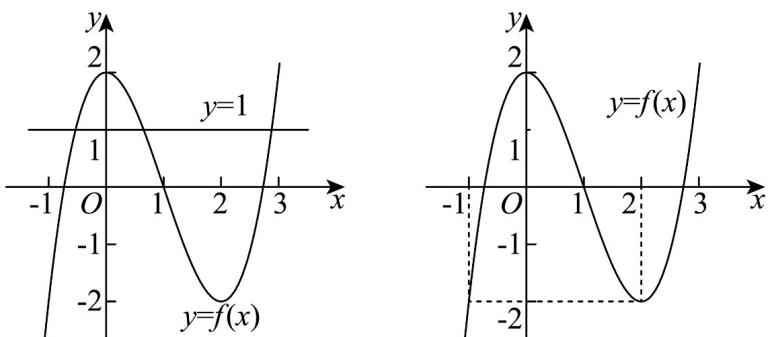

> [!faq]- 《第五章+一元函数的导数及其应用（高效培优单元测试·强化卷）数学人教A版2019高二选择性必修第二册》官方解析
>
> > [!success]- **【答案】** AC
>
> > [!note]- **【解析】**
> > 对于 A，因为 x=1 为函数 $f(x)=x^{3}-3x^{2}+a$ 的一个零点，
> >
> > 所以 $1 - 3 + a = 0$ ，解得 $a = 2$ ，故 $\mathsf{A}$ 正确；
> >
> > 对于 B，因为函数 $f(x)$ 的定义域为 R， $f'(x)=3x^{2}-6x=3x(x-2)$ ，
> >
> > 当 $x \in (0, 2)$ 时， $f'(x) < 0$ ，所以 $f(x)$ 在 $(0, 2)$ 上单调递减，
> >
> > 当 $x \in (-\infty, 0) \cup (2, +\infty)$ 时， $f'(x) > 0$ ，所以 $f(x)$ 在 $(- \infty, 0)$ 和 $(2, +\infty)$ 上单调递增，故 $x = 0$ 是函数 $f(x)$ 的
> >
> > 极大值点，故 $^{B}$ 错误；
> >
> > 对于 $C$ ，如图所示，曲线 $y = f(x)$ 与直线 $y = 1$ 有3个不同的交点，所以方程 $f(x) = 1$ 有3个不同的实数解，
> >
> > 故 $^{C}$ 正确；
> >
> > 对于 D，如图，当 $x \in [1, 2]$ 时， $f(x) \in [-2, 0]$ ，
> >
> > $$
> > - x \in [ - 2, - 1 ] \quad f (- x) \in [ - 1 8, - 2 ]
> > $$
> >
> > 所以当 $x \in [1, 2]_{时}$ ， $f(x) > f(-x)$ ，故 D 错误
> >
> > 
> >
> > 故选 **AC**.
