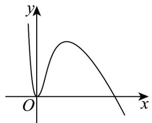
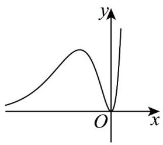
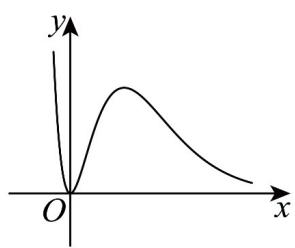
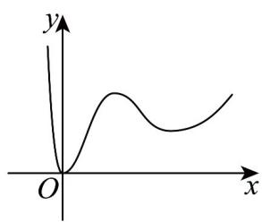

> [!faq]- 《第五章+一元函数的导数及其应用（高效培优单元测试·提升卷）数学人教A版2019高二选择性必修第二册》官方解析
>
> > [!success]- **【答案】** A. 9.6 米 B. 9.7 米 C. 9.8 米 D. 9.9 米
>
> > [!note]- **【解析】**
> > 设高度 h 与时间 t 的函数关系式为 $h(t)$ ，则 $h'(t) = v(t) = -9.8t + 4.7$ ，故可设 $h(t) = -4.9t^{2} + 4.7t + k$ ，因为 $h(0) = k = 10$ ，所以 $h(t) = -4.9t^{2} + 4.7t + 10$ ，则该运动员在 t = 1 秒时离水面的高度为 $h(1) = -4.9 + 4.7 + 10 = 9.8$ 米。
> >
> > 故选：C.
> >
> > 4. 将函数 $f(x)=\cos x$ 的图象向左平移 $\frac{\pi}{2}$ 个单位长度，得到函数 $g(x)$ 的图象，则（）
> >
> > 【答案】
> > A. $g(x)$ 是偶函数
> > B. $g(x)=f'(x)$ C. $g'(x)$ 是奇函数
> > D. $g'(x)=f(x)$
> >
> > 【答案】B
> >
> > 【详解】函数 $f(x)=\cos x$ 的图象向左平移 $\frac{\pi}{2}$ 个单位长度，
> > 得到函数 $g(x)=\cos\left(x+\frac{\pi}{2}\right)=-\sin x$ ，则 $g(x)$ 是奇函数，A选项错误. $f'(x)=-\sin x=g(x)$ ，B选项正确. $g'(x)=-\cos x$ 为偶函数，C选项错误. $g'(x)=-\cos x \neq f(x)$ ，D选项错误.
> >
> > 故选：B
> >
> > 5. 函数 $f(x) = \frac{x^2}{\mathrm{e}^{x - 2}}$ 的部分图象大致为（）
> >
> > 【答案】
> >
> > A
> >
> > 
> >
> > B
> >
> > 
> >
> > C
> >
> > 
> >
> > D
> >
> > 
> >
> > 【答案】C
> >
> > 【详解】因为 $f(x)=\frac{x^{2}}{\mathrm{e}^{x-2}}$ 0 ，所以排除 A.
> >
> > 又因为 $f^{\prime}(x) = \frac{x(2 - x)}{\mathrm{e}^{x - 2}}$
> >
> > 所以 $f(x)$ 在 $(-∞,0)$ 和 $(2,+∞)$ 上 $f'(x)<0$ ， $f(x)$ 单调递减，
> >
> > 在 $(0,2)$ 上 $f'(x)>0,f(x)$ 单调递增，所以C选项正确，BD选项错误
> >
> > 故选 **C**.
