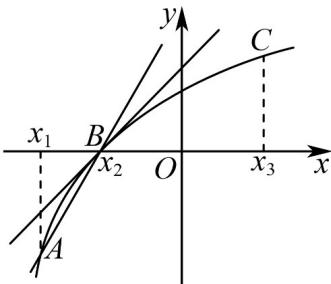
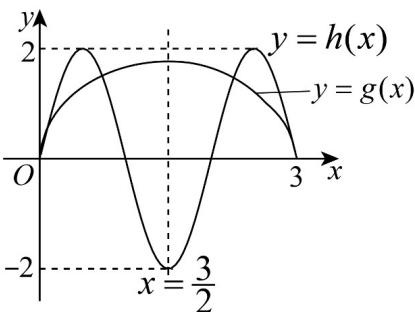
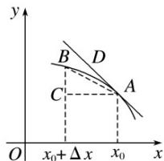
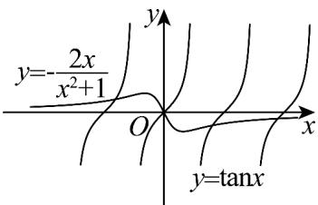
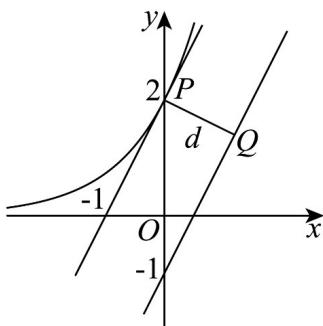

<!-- source-part:1 pages:1-50 -->

## 第五章 一元函数的导数及其应用

内容概览

## 教学目标、教学重难点

<table><tr><td>教学目标</td><td>1.梳理导数与函数性质之间的逻辑关系,构建知识体系。2.掌握利用导数研究函数性质的一般方法和步骤。3.在利用导数研究函数性质及应用的过程中,促进学生深刻体会数形结合思想,转化思想、类比思想的应用,提升学生数学运算、直观想象和逻辑推理等素养。4.复习函数零点的概念和梳理解决函数零点问题的常用方法。5.掌握利用导数研究函数零点问题的一般步骤。6.在利用导数研究函数零点的过程中,体会转化思想、类比思想、数形结合等思想方法的应用。7.进一步体会利用导数研究函数性质的一般方法。8.将问题与概念建立联系的意识,分类讨论、转化与化归、类比思想的应用。9.通过数形结合的方式,对问题的解答过程进行严格论证。10.学生能选择合适的方法研究函数零点问题,对参数进行分类讨论。11.学生能够结合函数图象,利用零点存在性定理,对零点的存在性进行严格证明。</td></tr><tr><td>教学重难点</td><td>1.重点1导数的概念、物理和几何意义。2基本初等函数的导数公式、导数的四则运算法则、简单复合函数的导数。3利用导数求函数单调性、极值和最值。4能够利用导数求切线问题、图象问题。2.难点1物理和几何意义。2导数的四则运算法则、简单复合函数的导数。3利用导数求单调性和极值。</td></tr></table>

## 知识清单

## 知识点 01 函数的平均变化率

函数 $y = f(x)$ 从 $x_{1}$ 到 $x_{2}$ 的平均变化率

(1)定义式：=。

(2)实质：函数值的增量与自变量的增量之比.

(3)作用：刻画函数值在区间 $[x_1, x_2]$ 上变化的快慢。

(4)几何意义：已知 $P_{1}(x_{1}, f(x_{1}))$ ， $P_{2}(x_{2}, f(x_{2}))$ 是函数 $y = f(x)$ 的图象上两点，则平均变化率 $=$ 表示割线 $P_{1}P_{2}$ 的斜率。

【即学即练】

1. 已知函数 $f(x)$ 在 $\mathbf{R}$ 上可导，其部分图象如图所示，则下列不等式正确的是（）

【答案】

A. $\frac{f(5) - f(2)}{3} < f'(2) < f'(5)$ B. $f'(5) < \frac{f(5) - f(2)}{3} < f'(2)$ C. $f'(5) < f'(2) < \frac{f(5) - f(2)}{3}$ D. $f'(2) < \frac{f(5) - f(2)}{3} < f'(5)$

【答案】B

【分析】根据给定条件，利用导数的几何意义，借助图形判断得解·

【详解】由导数的几何意义，得 $f'(2)$ 为函数 $f(x)$ 图象在 x=2 处切线的斜率， $f'(5)$ 为函数 $f(x)$ 的图象在 x=5 处切线的斜率， $\frac{f(5)-f(2)}{5-2}=k_{AB}$ 为函数 $f(x)$ 图象上点 $A(2,f(2)),B(5,f(5))$ 确定直线的斜率，

观察图象，得 $f'(5)<\frac{f(5)-f(2)}{3}<f'(2)$ .

故选：B

2. 设函数 $y = f(x)$ 在 R 上处处存在导数，其导函数为 $y = f'(x)$ · 已知点 $A(x_{1}, y_{1})$ 、 $B(x_{2}, y_{2})$ 、 $C(x_{3}, y_{3})$ ，在曲线 $y = f(x)$ 上如图，则在下列选项中正确的是（）

【答案】

A $f^{\prime}\left(x_{1}\right) <   f^{\prime}\left(x_{2}\right) <   f^{\prime}\left(x_{3}\right);$

B．函数 $y = f(x)$ 在 $x = x_{2}$ 处附近的平均变化率均小于 $f'(x_{2})$ ;

C. 点 $x = x_{2}$ 是函数 $y = f(x)$ 的一个极值点;

D．函数 $y = f(x)$ 在区间 $\left[x_{1}, x_{3}\right]$ 上不存在驻点.

【答案】D

【分析】根据导数的几何意义、极值点的定义、驻点的定义逐一判断即可·

【详解】A：根据导数几何意义可知： $f'(x_1) > f'(x_2) > f'(x_3)$ ，因此本选项说法不正确；

B：由函数 $y = f(x)$ 的图象可知： $k_{AB} > f'(x_2)$ ，因此本选项说法不正确；

C：点 $\left(x_{2},0\right)$ 左右两侧的单调性都是单调递增，所以点 $x = x_{2}$ 不是函数 $y = f(x)$ 的极值点，

因此本选项说法不正确；

D：由图象可知函数 $y = f(x)$ 在区间 $[x_1, x_3]$ 上不存在导函数为零的点，所以不存在驻点，因此本选项说法正

确，·

故选：D

知识点 02 瞬时速度

(1)物体在某一时刻的速度称为瞬时速度.

(2)一般地，设物体的运动规律是 $s = s(t)$ ，则物体在 $t_0$ 到 $t_0 + \Delta t$ 这段时间内的平均速度为 $=$ 。如果 $\Delta t$ 无限趋近于

0 时，无限趋近于某个常数 v，我们就说当 $\Delta t$ 趋近于 0 时，的极限是 v，这时 v 就是物体在时刻 $t = t_{0}$ 时的瞬时速度，即瞬时速度 $v = \lim = \lim$ .

(3)瞬时速度与平均速度的关系：从物理角度看，当时间间隔 $|\Delta t|$ 无限趋近于0时，平均速度就无限趋近于 $t = t_0$ 时的瞬时速度.

【即学即练】

1. 一个质量为 $4\mathrm{kg}$ 的物体做直线运动，该物体的位移 $y$ （单位： $\mathrm{m}$ ）与时间 $t$ （单位：s）之间的关系为 $y(t) = \frac{1}{3} t^3 -2t^2 +5t + 1$ ，且 $E_{\mathrm{k}} = \frac{1}{2} mv^{2}(E_{\mathrm{k}}$ 表示物体的动能，单位：J， $m$ 表示物体的质量，单位： $\mathrm{kg}$ ，v表示物体的瞬时速度，单位： $\mathrm{m / s}$ ），则（ ）A.该物体瞬时速度的最小值为 $1\mathrm{m / s}$ B.该物体瞬时速度的最小值为 $1.5\mathrm{m / s}$ C.该物体在第1秒末的动能为10JD.该物体在第1秒末的动能为8J

【答案】AD

【分析】求出函数的导数后结合配方法可求瞬时速度的最小值，故可判断 $^{AB}$ 的正误，结合导数及题设中的动能公式计算后可判断 $^{CD}$ 的正误.

【详解】对于 $^{AB}$ ，由题意得 $y'(t)=t^{2}-4t+5=(t-2)^{2}+1\quad1$ ，

则该物体瞬时速度的最小值为1m/s，A正确，B错误.

对于 CD，由 $y'(1)=2$ ，得 $E_{k}=\frac{1}{2}\times4\times2^{2}=8J$ ，所以该物体在第1秒末时的动能为8J，

故 $^{C}$ 错误， $^{D}$ 正确·

故选：AD.

2. 某物体的位移 $s$ 与时间 $t$ 的函数为 $s = 3t^2 + 2t(t > 0)$ ，其中 $s$ 的单位是米， $t$ 的单位是秒，那么物体在 1 秒末的瞬时速度是（）A. 5 米/秒 B. 6 米/秒 C. 8 米/秒 D. 110 米/秒

【答案】C

【分析】求导，代入 t=1 ，得到答案·

【详解】因为位移 $s$ 与时间 $t$ 的函数为 $s = 3t^2 + 2t(t > 0)$

所以 $s^{\prime} = 6t + 2$ ，当 $t = 1$ 时， $s^{\prime} = 6 + 2 = 8$

故物体在 $^{1}$ 秒末的瞬时速度是 $^{8}$ 米/秒.

故选：C

## 知识点 03 函数在某点处的导数

如果当 $\Delta x\to 0$ 时，平均变化率无限趋近于一个确定的值，即有极限，则称 $y = f(x)$ 在 $x = x_0$ 处可导，并把这个确定的值叫做 $y = f(x)$ 在 $x = x_0$ 处的导数(也称为瞬时变化率)，记作 $f^{\prime}(x_0)$ 或 $\left.\mathcal{Y}^{\prime}\right|_{x = x_0}$ ，即 $f^{\prime}(x_0) = \lim = \lim$ 。

【即学即练】

1. 函数 $f(x) = 2\sin \pi x - \sqrt{3x - x^2}$ 所有零点的和等于（）

【答案】

A.6 B.7.5 C.9 D.12

【答案】C

【分析】首先确定函数定义域为 $[0,3]$ ，分别画出函数 $h(x) = 2\sin \pi x$ 与函数 $g(x) = \sqrt{3x - x^2}$ 的图象，再根据在端点处的斜率关系求出零点个数为 $^6$ 个，再由对称性可求出所有零点之和为 $^9$ .

【详解】易知 $3x - x^2$ 0，可得 $0 \leq x \leq 3$ ，即函数 $g(x)$ 的定义域为 $[0,3]$ ，

函数的零点即方程 $2\sin \pi x = \sqrt{3x - x^2}$ 的解，即函数 $h(x) = 2\sin \pi x$ 与函数 $g(x) = \sqrt{3x - x^2}$ 的图象交点的横坐标. $\because h(0) = g(0), h(3) = g(3) = 0$ (0,0)，故两函数的图象都是从原点出发，且是一个交点，

且两个函数的图象都关于直线 $x=\frac{3}{2}$ 对称.

函数 $g(x)$ 对应的曲线方程为 $\left(x - \frac{3}{2}\right)^2 + y^2 = \frac{9}{4}(y - 0)$ ，表示一个半圆，如图所示：

半圆在 x=0 、 x=3 处的切线斜率不存在，

而 $h(x)$ 在 $x = 0$ 、 $x = 3$ 处的切线斜率分别为 $h^{\prime}(0) = 2\pi$ ， $h^{\prime}(3) = -2\pi$

可见，这两个函数的图象在区间 $[0,3]$ 上有6个交点，且这些交点关于直线 $x=\frac{3}{2}$ 对称，

而两个关于直线 $x=\frac{3}{2}$ 对称的点的横坐标之和等于 $^{3}$ ，故函数 $f(x)$ 所有零点的和是 $^{9}$

故选：C

2. 若函数 $f(x) = (1 - 3x)^5$ ，则 $\lim_{x\to 0}\frac{f(1 + x) + 32}{x} =$ （ ）A.80 B.-80 C.240 D.-240

【答案】D

【分析】利用导数的概念即可求解·

【详解】因为 $f(1) = -32, f'(x) = -15(1 - 3x)^{4}$

所以 $\lim_{x\to0}\frac{f(1+x)+32}{x}=\lim_{x\to0}\frac{f(1+x)-f(1)}{x}=f'(1)=-15\times(-2)^{4}=-240$

故选：D

## 知识点 04 割线斜率与切线斜率及导数的几何意义

1. 切线：设函数 $y = f(x)$ 的图象如图所示，直线 $AB$ 是过点 $A(x_0, f(x_0))$ 与点 $B(x_0 + \Delta x, f(x_0 + \Delta x))$ 的一条割线，此割线的斜率是 $=$ .

当点 $B$ 沿曲线趋近于点 $A$ 时，割线 $AB$ 绕点 $A$ 转动，它的极限位置为直线 $AD$ ，直线 $AD$ 叫做此曲线在点 $A$ 处的切线．

2．切线的斜率：当 $\Delta x \to 0$ 时，割线 AB 的斜率无限趋近于过点 A 的切线 AD 的斜率 k，即 $k = f'(x_0) = \lim_{n \to \infty}$

3. 切线的斜率与割线的斜率的关系：从几何图形上看，当横坐标间隔 $|\Delta x|$ 无限变小时，点 $B$ 无限趋近于点 $A$ ，于是割线AB无限趋近于点 $A$ 处的切线 $AD$ ，这时，割线AB的斜率无限趋近于点 $A$ 处的切线 $AD$ 的斜

率 $k$

## 4. 导数的几何意义

函数 $y = f(x)$ 在点 $x = x_0$ 处的导数的几何意义是曲线 $y = f(x)$ 在点 $P(x_0, f(x_0))$ 处的切线的斜率。也就是说，曲线 $y = f(x)$ 在点 $P(x_0, f(x_0))$ 处的切线的斜率是 $f'(x_0)$ 。相应地，切线方程为 $y - f(x_0) = f'(x_0)(x - x_0)$ 。

【即学即练】

1. 已知函数 $f(x)=\frac{x}{\mathrm{e}^{x}}$ ，则下列说法正确的是（）

【答案】

A. 函数 $f(x)$ 的极大值为 $\frac{1}{e}$ B. 若 0<x<1，则 $f(x)>f(x^{2})$ C. 若方程 $f(x)=m$ 有两个不等的实根，则 $m<\frac{1}{e}$ D. 若过点 $A(0,m)$ 恰有三条与曲线 $y=f(x)$ 相切的直线，则 $0<m<\frac{4}{e^{2}}$

【答案】ABD

【分析】求导确定函数单调性即可判断 ABC，对于 D，设切点坐标为 $\left(x_{0}, \frac{x_{0}}{\mathrm{e}^{x_{0}}}\right)$ ，通过斜率得到 $\frac{\frac{x_{0}}{\mathrm{e}^{x_{0}}} - m}{x_{0}} = \frac{1 - x_{0}}{\mathrm{e}^{x_{0}}}$

化简可得： $m=\frac{x_{0}^{2}}{e^{x_{0}}}$ ，问题转化成方程 $m=\frac{x_{0}^{2}}{e^{x_{0}}}$ 有3个不同的根，进而可求解。
【详解】 $f(x)=\frac{x}{e^{x}}$ 定义域为R， $f'(x)=\frac{1-x}{e^{x}}$ 由 $f'(x)=\frac{1-x}{e^{x}}<0$ 得 x>1 ，由 $f'(x)=\frac{1-x}{e^{x}}>0$ 得 x<1 ，

所以 $f(x) = \frac{x}{\mathrm{e}^x}$ 在 $(- \infty, 1)$ 单调递增，在 $(1, +\infty)$ 单调递减，

当 $x \to +\infty$ 时， $f(x) \to 0$ ，当 $x \to -\infty$ 时， $f(x) \to -\infty$

在 x=1 时，取得极大值 $f(1)=\frac{1}{e}$ ; A 正确，

当 $0 < x < 1$ 时， $0 < x^2 < x < 1$ ，由单调性可知 $f(x) > f(x^2)$ ；B 正确，

由函数单调性和极值可知：若方程 $f(x) = m$ 有两个不等的实根，则 $0 < m < \frac{1}{\mathrm{e}}$ ，C 错误；

设切点坐标为 $\left(x_{0},\frac{x_{0}}{\mathrm{e}^{x_{0}}}\right)$ ，则切线斜率为 $\frac{1-x_{0}}{e^{x_{0}}}$ ，

由两点得切线斜率 $\frac{\frac{x_0}{\mathrm{e}^{x_0}} - m}{x_0} = \frac{1 - x_0}{\mathrm{e}^{x_0}}$ ，化简可得： $m = \frac{x_0^2}{\mathrm{e}^{x_0}}$

若过点 $A(0,m)$ 恰有三条与曲线 $y=f(x)$ 相切的直线，则方程 $m=\frac{x_{0}^{2}}{e^{x_{0}}}$ 有 3 个不同的根，

令 $g(x)=\frac{x^{2}}{\mathrm{e}^{x}}$ ，定义域为 R， $g'(x)=\frac{2x-x^{2}}{\mathrm{e}^{x}}$

由 $g'(x)=\frac{2x-x^{2}}{\mathrm{e}^{x}}<0$ 得：x<0 或 x>2，由 $g'(x)=\frac{2x-x^{2}}{\mathrm{e}^{x}}>0$ 得：0<x<2，

所以 $g(x) = \frac{x^2}{\mathrm{e}^x}$ 在 $(- \infty, 0), (2, +\infty)$ 单调递减，在 $(0, 2)$ 单调递增，

极小值为 $g(0) = 0$ ，极大值 $g(2) = \frac{4}{\mathrm{e}^2}$ ，当 $x\to -\infty$ 时， $g(x)\rightarrow +\infty$ ，当 $x\to +\infty$ 时， $g(x)\rightarrow 0$

所以方程 $m=\frac{x_{0}^{2}}{e^{x_{0}}}$ 有 3 个不同的根，即 y=m 和 $g(x)=\frac{x^{2}}{e^{x}}$ 的图象有 3 个交点，则 $0<m<\frac{4}{e^{2}}$ ，D 正确；

故选：ABD

2. 曲线 $y = \ln x + ax + \frac{1}{x}$ 在点 $(1, a + 1)$ 处的切线 l 过定点（）

【答案】

A. (1,2)

B. (1,1)

C. (1,0)

D. (0,1)

【答案】D

【分析】利用导数的几何意义求出切线斜率，写出切线方程，即可求得直线经过的定点·

【详解】令函数 $f(x) = \ln x + ax + \frac{1}{x}$ ，则 $f^{\prime}(x) = \frac{1}{x} +a - \frac{1}{x^{2}}$ ，故 $f^{\prime}(1) = a$

所以 $l$ 的方程为 $y - (a + 1) = a(x - 1)$ ，整理得 $y = ax + 1$

所以 l 经过定点 $(0,1)$ .

故选：D.

## 知识点 05 函数的单调性与导数的关系

若 $f'(x_0) = 0$ ，则函数在 $x = x_0$ 处切线斜率 $k = \underline{0}$ ；

若 $f'(x_0) > 0$ ，则函数在 $x = x_0$ 处切线斜率 $k \geq 0$ ，且函数在 $x = x_0$ 附近单调递增，且 $f'(x_0)$ 越大，说明函数图象变化的越快；

若 $f'(x_0) < 0$ ，则函数在 $x = x_0$ 处切线斜率 $k \leq 0$ ，且函数在 $x = x_0$ 附近单调递减，且 $|f'(x_0)|$ 越大，说明函数图象变化的越快。

【即学即练】

1. 已知定义在 $\mathbf{R}$ 上的函数 $f(x) = \begin{cases} \ln x, & x > 1, \\ |x^2 - x|, & x \leq 1, \end{cases}$ 若方程 $f(x) - a(x - 1) = 0$ 恰有两个解，则实数 $a$ 的取值范围为（） $\mathrm{A}_{\cdot}(-\infty, -1] \cup [0,1]$ $\mathrm{B}_{\cdot}[0,1]$

C. $(- \infty, -1) \cup [0, 1)$ D. $(- \infty, -1] \cup [0, 1)$

【答案】D

【分析】根据方程 $f(x) - a(x - 1) = 0$ 恰有两个解，得出 $y = a$ 与 $g(x) = \begin{cases} \frac{\ln x}{x - 1}, & x > 1 \\ -|x|, & x < 1 \end{cases}$ 有一个交点，结合图象可得

参数范围.

【详解】因为方程 $f(x) - a(x - 1) = 0$ 恰有两个解，又因为 $f(1) - a(1 - 1) = f(1) = 0$

则 x=1 为方程 $f(x)-a(x-1)=0$ 的一个解，

当 $x \neq 1$ 时，由 $f(x) - a(x - 1) = 0$

则 $a = \frac{f(x)}{x - 1} = \begin{cases} \frac{\ln x}{x - 1}, & x > 1 \\ \frac{|x^2 - x|}{x - 1}, & x < 1 \end{cases} = \begin{cases} \frac{\ln x}{x - 1}, & x > 1 \\ -|x|, & x < 1 \end{cases}$ 有一个解，

所以 $y = a$ 与 $g(x) = \begin{cases} \frac{\ln x}{x - 1}, & x > 1 \\ -|x|, & x < 1 \end{cases}$ 有一个交点，

当 $x > 1$ 时， $g(x) = \frac{\ln x}{x - 1}, g'(x) = \frac{\frac{x - 1}{x} - \ln x}{(x - 1)^2} = \frac{1 - \frac{1}{x} - \ln x}{(x - 1)^2}$ ，

设 $t(x)=1-\frac{1}{x}-\ln x$ ，x>1 ，

则 $t^{\prime}(x) = \frac{1}{x^{2}} -\frac{1}{x} = \frac{1 - x}{x^{2}} < 0$ ，即 $t(x)$ 在 $(1, + \infty)$ 上单调递减，

所以 $t(x) < t(1) = 0$

所以 $g^{\prime}(x) = \frac{1 - \frac{1}{x} - \ln x}{(x - 1)^{2}} < 0$ ，则 $g(x)$ 在 $(1, + \infty)$ 上单调递减，

当 $x \to 1, g(x) \to 1$ ，且 $x > 1$ 时， $g(x) > 0$

做出函数 $g(x)$ 的图象，如下：

结合图象可得，要使 $y = a$ 与 $g(x) = \begin{cases} \frac{\ln x}{x - 1}, & x > 1 \\ -|x|, & x < 1 \end{cases}$ 有一个交点，

则 $a \leq -1$ 或 $0 \leq a < 1$

故选：D.

2. 设 $a > 0$ ，若函数 $f(x) = x \ln x - \frac{3}{2} x^2 + 2x$ 在区间 $(a, +\infty)$ 上单调，则 $a$ 的取值范围是 \_\_\_\_.

【答案】 $\left[1,+\infty\right)$

【分析】利用导数求 $f(x)$ 的单调区间，由 $f(x)$ 在区间 $(a, +\infty)$ 上单调，求 a 的取值范围.

【详解】因为 $f(x)=x\ln x-\frac{3}{2}x^{2}+2x$

所以 $f'(x)=\ln x+1-3x+2=\ln x-3x+3$

设 $g(x)=\ln x-3x+3$ ，则 $g'(x)=\frac{1}{x}-3=\frac{1-3x}{x}$ ，

所以 $x > \frac{1}{3}$ 时， $g'(x) < 0$ ，故 $g(x)$ 在 $\left(\frac{1}{3}, +\infty\right)$ 上单调递减，即 $f'(x)$ 在 $\left(\frac{1}{3}, +\infty\right)$ 上单调递减，

又 $f^{\prime}(1) = 0$ ，所以 $x\in \left(\frac{1}{3},1\right)$ 时 $f^{\prime}(x) > 0$ ； $x\in (1, + \infty)$ 时 $f^{\prime}(x) <   0$

所以 $f(x)$ 在区间 $\left(\frac{1}{3}, 1\right]$ 上单调递增，在区间 $[1, +\infty)$ 上单调递减，

故 $(a,+\infty)\subseteq(1,+\infty)$ ，所以a的取值范围是 $[1,+\infty)$ .

故答案为： $[1, + \infty)$

## 知识点 06 导函数的定义

从求函数 $f(x)$ 在 $x = x_0$ 处导数的过程可以看出，当 $x = x_0$ 时， $f'(x_0)$ 是一个唯一确定的数。这样，当 $x$ 变化时， $y = f'(x)$ 就是 $x$ 的函数，我们称它为 $y = f(x)$ 的导函数（简称导数）。 $y = f(x)$ 的导函数记作 $f'(x)$ 或 $y'$ ，即 $f'(x) = y' = \lim$ 。

<table><tr><td></td><td>区别</td><td>联系</td></tr><tr><td> $f'(x_0)$ </td><td> $f'(x_0)$ 是具体的值,是数值</td><td>在 $x = x_0$ 处的导数 $f'(x_0)$ 是导函数 $f'(x)$ </td></tr><tr><td> $f'(x)$ </td><td> $f'(x)$ 是函数 $f(x)$ 在某区间I上每一点都存在导数而定义的一个新函数,是函数</td><td>在 $x = x_0$ 处的函数值,因此求函数在某一点处的导数,一般先求导函数,再计算导函数在这一点的函数值</td></tr></table>

【即学即练】

1. 已知函数 $f(x)$ 的导函数为 $f'(x)$ ，且 $\lim_{\Delta x \to 0} \frac{f(2 + \Delta x) - f(2)}{2\Delta x} = 2$ ，则 $f'(2) = (\quad)$ A. 2 B. 1 C. 4 D. 8

【答案】C

【分析】由导数的定义即可求解·

【详解】由 $\lim_{\Delta x\to 0}\frac{f(2 + \Delta x) - f(2)}{2\Delta x} = 2$

可得： $\frac{1}{2}\lim_{\Delta x\to0}\frac{f(2+\Delta x)-f(2)}{\Delta x}=2$

即 $\lim_{\Delta x\to 0}\frac{f(2 + \Delta x) - f(2)}{\Delta x} = 4$

所以 $f'(2)=4$

故选：C

2. 若定义在 $\mathbf{R}$ 上的函数 $f(x)$ 满足对任意 $x_{1}, x_{2}$ ，都有 $\frac{f(x_0 + x_2) - f(x_1 - x_0)}{x_0} < 0$ ，其中 $x_0 = x_1 - x_2, x_1 \neq x_2$ ，则称 $f(x)$ 为 $T$ 函数。给出下列函数：① $y = -\mathrm{e}^x - x$ ；② $y = -x^3 + 3x^2 - 3x + 1$ ；③ $y = \frac{\ln x}{x}$ ；④ $y = -x - \sin x$ 。其中是 $T$ 函数的个数为（）A.2 B.4 C.1 D.3

【答案】D

【分析】由题可得 $\frac{f(x_{0}+x_{2})-f(x_{1}-x_{0})}{x_{0}}=\frac{f(x_{1})-f(x_{2})}{x_{1}-x_{2}}$ ，由题设可得：若过函数 $f(x)$ 图象上任意两不同点 $P(x_{1},f(x_{1})),Q(x_{2},f(x_{2}))$ 的割线的斜率小于 0，则函数 $f(x)$ 为“T 函数”·结合导数的几何意义，可知 T 函数 $f(x)$ 的导数 $f'(x)\leq0$ 在定义域上恒成立·逐项求导研究导数的符号即可求解·

【详解】由题可得 $\frac{f(x_{0}+x_{2})-f(x_{1}-x_{0})}{x_{0}}=\frac{f(x_{1}-x_{2}+x_{2})-f(x_{1}-x_{1}+x_{2})}{x_{1}-x_{2}}=\frac{f(x_{1})-f(x_{2})}{x_{1}-x_{2}}$

由题设可得：若过函数 $f(x)$ 图象上任意两不同点 $P(x_1, f(x_1)), Q(x_2, f(x_2))$ 的割线的斜率小于0，则函数 $f(x)$ 为“ $T$ 函数”.

结合导数的几何意义，可知 $T$ 函数 $f(x)$ 的导数 $f'(x) \leq 0$ 在定义域上恒成立

$y = -e^{x} - x$ 的定义域为 R， $y' = -e^{x} - 1 < 0$ 恒成立，

所以 $y = -e^{x} - x$ 是 T 函数，故①正确；

$y = -x^{3} + 3x^{2} - 3x + 1$ 的定义域为 R， $y' = -3x^{2} + 6x - 3 = -3(x - 1)^{2} \leq 0$ 恒成立，

所以 $y = -x^{3} + 3x^{2} - 3x + 1$ 是 $T$ 函数，故②正确；

$y=\frac{\ln x}{x}$ 的定义域为 $(0,+\infty)$ ，不是 R，所以 $y=\frac{\ln x}{x}$ 不是 T 函数，故③错误；

$y = -x - \sin x$ 的定义域为 R， $y' = -1 - \cos x \leq 0$ 恒成立，所以 $y = -x - \sin x$ 是 T

故选：D.

知识点 07 基本初等函数的导数公式

<table><tr><td></td><td>原函数</td><td>导函数</td></tr><tr><td>1</td><td> $f(x) = c$ (c为常数)</td><td> $f'(x) = 0$ (常数的导数为0)</td></tr><tr><td>2</td><td> $f(x) = x^{n}$ ( $n \in \mathbf{Q}^{*}$ )</td><td> $f'(x) = n \cdot x^{n-1}$ </td></tr><tr><td></td><td> $f(x) = x$ </td><td> $f'(x) = 1$ </td></tr><tr><td></td><td> $f(x) = x^{2}$ </td><td> $f'(x) = 2x$ </td></tr><tr><td></td><td> $f(x) = x^{3}$ </td><td> $f'(x) = 3x^{2}$ </td></tr><tr><td></td><td> $f(x) = \sqrt{x} = x^{\frac{1}{2}}$ </td><td> $f'(x) = \frac{1}{2}x^{-\frac{1}{2}} = \frac{1}{2\sqrt{x}}$ </td></tr><tr><td></td><td> $f(x) = \frac{1}{x} = x^{-1}$ (熟记)</td><td> $f'(x) = -x^{-2} = -\frac{1}{x^{2}}$ </td></tr><tr><td>3</td><td> $f(x) = \sin x$ </td><td> $f'(x) = \cos x$ </td></tr><tr><td>4</td><td> $f(x) = \cos x$ </td><td> $f'(x) = -\sin x$ </td></tr><tr><td>5</td><td> $f(x) = a^{x} (a > 0, \text{且 } a \neq 1)$ </td><td> $f'(x) = a^{x} \ln a$ </td></tr><tr><td>6</td><td> $f(x) = e^{x}$ </td><td> $f'(x) = e^{x}$ </td></tr><tr><td>7</td><td> $f(x) = \log_{a} x (a > 0, \text{且 } a \neq 1)$ </td><td> $f'(x) =$ </td></tr><tr><td>8</td><td> $f(x) = \ln x$ </td><td> $f'(x) =$ </td></tr><tr><td></td><td> $f(x) = \ln |x|$ </td><td> $f'(x) = \frac{1}{x}$ </td></tr><tr><td></td><td> $f(x) = x \ln x$ </td><td> $f'(x) = \ln x + 1$ </td></tr></table>

【即学即练】

1. 已知 $f(x)$ 为奇函数，当 $x < -1$ 时， $f(x) = \ln \frac{x + 1}{x - 1}$ ，则曲线 $f(x)$ 在点 $(3, f(3))$ 处的切线方程是（）A. $x + 4y - 4\ln 2 - 3 = 0$ B. $x + 2y + 2\ln 2 - 3 = 0$ C. $x - 4y + 4\ln 2 - 3 = 0$ D. $x - 2y - 2\ln 2 - 3 = 0$

【答案】A

【分析】首先根据函数的奇偶性求出 $x > 1$ 时的函数解析式，然后再根据导数的几何意义求解切线方程即可

【详解】若 $x > 1$ ，则 $-x < -1$

则当 $-x < -1$ 时， $f(-x) = \ln \frac{-x + 1}{-x - 1} = \ln \frac{x - 1}{x + 1}$ ，

$\because f(x)$ 为奇函数， $\therefore f(x) = -f(-x) = -\ln \frac{x - 1}{x + 1}$

即当 $x > 1$ 时， $f(x) = -\ln \frac{x - 1}{x + 1}$

$f(3) = -\ln \frac{3 - 1}{3 + 1} = -\ln \frac{1}{2} = \ln 2$

$f'(x)=-\frac{2}{(x-1)(x+1)}$ ，则 $f'(3)=-\frac{2}{(3-1)(3+1)}=-\frac{1}{4}$

即曲线 $f(x)$ 在点 $(3, f(3))$ 处的切线斜率 $k = -\frac{1}{4}$ .

因此可得：切线方程为 $y - \ln 2 = -\frac{1}{4}(x - 3)$ ，

即： $x + 4y - 4\ln 2 - 3 = 0$

故选：A

2. 已知函数 $f(x) = \ln \frac{x}{2 - x} + ax + b(x - 1)^3$

(1)若 $b = 0$ ，且 $f^{\prime}(x)\quad 0$ ，求 $a$ 的最小值；

(2)证明：曲线 $y=f(x)$ 关于点 $(1,a)$ 中心对称；

(3)若 $f(x) > -2$ 当且仅当 $1 < x < 2$ ，求 $b$ 的取值范围·

【答案】(1)-2

(2)证明见解析

(3) $b - \frac{2}{3}$

【分析】 $(1)$ 求出 $f'(x)_{\min}=2+a$ 后根据 $f'(x)$ 0 可求 a 的最小值；

(2) 设 $P(m,n)$ 为 $y=f(x)$ 图象上任意一点，可证 $P(m,n)$ 关于 $(1,a)$ 的对称点为 $Q(2-m,2a-n)$ 也在函数的

图象上，从而可证对称性；

(3) 根据题设可判断 $f(1) = -2$ 即 a = -2，再根据 $f(x) > -2$ 在 $(1, 2)$ 上恒成立可求得 b $-\frac{2}{3}$ .

【详解】（1） $b = 0$ 时， $f(x) = \ln \frac{x}{2 - x} + ax$ ，其中 $x \in (0,2)$

则 $f^{\prime}(x) = \frac{1}{x} +\frac{1}{2 - x} +a = \frac{2}{x(2 - x)} +a,x\in (0,2)$

因为 $x(2-x) \leq \left(\frac{2-x+x}{2}\right)^{2} = 1$ ，当且仅当 x = 1 时等号成立，

故 $f^{\prime}(x)_{\min} = 2 + a$ ，而 $f^{\prime}(x)\quad 0$ 成立，故 $a + 2\quad 0$ 即 $a\quad -2$

所以 a 的最小值为 -2；

(2) $f(x) = \ln \frac{x}{2 - x} + ax + b(x - 1)^3$ 的定义域为 $(0,2)$

设 $P(m,n)$ 为 $y=f(x)$ 图象上任意一点，

$P(m,n)$ 关于 $(1,a)$ 的对称点为 $Q(2-m,2a-n)$

因为 $P(m,n)$ 在 $y = f(x)$ 图象上，故 $n = \ln \frac{m}{2 - m} + am + b(m - 1)^3$

$$
f (2 - m) = \ln \frac {2 - m}{m} + a (2 - m) + b (2 - m - 1) ^ {3} = - \left[ \ln \frac {m}{2 - m} + a m + b (m - 1) ^ {3} \right] + 2 a
$$

$$
= - n + 2 a
$$

所以 $Q(2-m,2a-n)$ 也在 $y=f(x)$ 图象上，

由 $P$ 的任意性可得 $y = f(x)$ 图象为中心对称图形，且对称中心为 $(1,a)$

(3) 因为 $f(x) > -2$ 当且仅当 1 < x < 2，故 x = 1 为 $f(x) = -2$ 的一个解，

所以 $f(1) = -2$ 即 $a = -2$

先考虑1<x<2时， $f(x)>-2$ 恒成立.

此时 $f(x) > -2$ 即为 $\ln \frac{x}{2 - x} + 2(1 - x) + b(x - 1)^3 > 0$ 在 $(1,2)$ 上恒成立，

设 $t = x - 1 \in (0,1)$ ，则 $\ln \frac{t + 1}{1 - t} - 2t + bt^3 > 0$ 在 $(0,1)$ 上恒成立，

设 $g(t)=\ln\frac{t+1}{1-t}-2t+bt^{3}, t\in(0,1)$

则 $g'(t)=\frac{2}{1-t^{2}}-2+3bt^{2}=\frac{t^{2}\left(-3bt^{2}+2+3b\right)}{1-t^{2}}$

当 $b = 0$ ， $-3bt^{2} + 2 + 3b - 3b + 2 + 3b = 2 > 0$

故 $g^{\prime}(t) > 0$ 恒成立，故 $g(t)$ 在 $(0,1)$ 上为增函数，

故 $g(t) > g(0) = 0$ 即 $f(x) > -2$ 在 $(1,2)$ 上恒成立.

当 $-\frac{2}{3} \leq b < 0$ 时， $-3bt^{2} + 2 + 3b - 2 + 3b - 0$

故 $g'(t)$ 0 恒成立，故 $g(t)$ 在 $(0,1)$ 上为增函数，

故 $g(t) > g(0) = 0$ 即 $f(x) > -2$ 在 $(1,2)$ 上恒成立.

当 $b<-\frac{2}{3}$ ，则当 $0<t<\sqrt{1+\frac{2}{3b}}<1$ 时， $g'(t)<0$

故在 $\left(0, \sqrt{1 + \frac{2}{3b}}\right)$ 上 $g(t)$ 为减函数，故 $g(t) < g(0) = 0$ ，不合题意，舍；

综上， $f(x)>-2$ 在 $(1,2)$ 上恒成立时 $b=-\frac{2}{3}$ .

而 $b = -\frac{2}{3}$ 时，由上述过程可得 $g(t)$ 在 $(0,1)$ 递增，故 $g(t) > 0$ 的解为 $(0,1)$ ，

即 $f(x) > -2$ 的解为 $(1,2)$ .

综上， $b - \frac{2}{3}$ .

## 知识点 08 导数的运算法则

(1) $[f(x)\pm g(x)]' = f'(x)\pm g'(x)$ ; 注: $[af(x)\pm bf(x)] = af'(x)\pm bf'(x)$

函数和与差的导数运算法则可推广到任意有限个可导函数的和(或差).

即： $^{\prime}$ $=f^{\prime}_{1}(x)\pm f^{\prime}_{2}(x)\pm\ldots\pm f^{\prime}_{n}(x)$

(2) $[f(x)\cdot g(x)]' = f'(x)g(x) + f(x)g'(x)$ ; (前导后不导+前不导后导)

注： $[cf(x)]' = cf'(x)[e^xf(x)]' = e^xf(x) + e^xf'(x) = e^xf(f(x) + f'(x))[xf(x)]' = f(x) + xf'(x)$

(3) $=(g(x)\neq0)$ . (分子：上导下不导-上不导下导，分母变平方)

注： $\left[\frac{1}{g(x)}\right]' = -\frac{g(x)}{\left[g(x)\right]^2}\left[\frac{f(x)}{e^x}\right]' = \frac{f'(x)e^x - f(x)e^x}{(e^x)^2} = \frac{f'(x) - f(x)}{e^x}\left[\frac{f(x)}{x}\right]' = \frac{xf'(x) - f(x)}{x^2}$

【即学即练】

23. 已知函数 $f(x) = x\mathrm{e}^x + \frac{k}{x}$ ，若 $f'(1) = 0$ ，则 $k = (\quad)$ A. 2e B. e C. $\frac{\mathrm{e}}{2}$ D. 1

【答案】A

【分析】由 $f(x)$ 求出 $f'(x)$ ，再由 $f'(1)=0$ 求出 k 的值.

【详解】因为 $f(x)=x\mathrm{e}^{x}+\frac{k}{x}$ ，所以 $f'(x)=(x+1)\mathrm{e}^{x}-\frac{k}{x^{2}}$ ，

则 $f'(1)=(1+1)e^{1}-\frac{k}{1^{2}}=2e-k=0$ ，解得 k=2e .

故选：A.

24. 已知函数 $f(x) = x - \ln x - 2$ ，则曲线 $y = f(x)$ 在点 $(1, f(1))$ 处的切线方程为 \_\_\_\_.

【答案】 $y = -1$

【分析】求出函数的导函数，即可求出切线的斜率，再由点斜式计算可得

【详解】因为 $f(x)=x-\ln x-2$ ，所以 $f(1)=1-\ln 1-2=-1$ ， $f'(x)=1-\frac{1}{x}$

则 $f^{\prime}(1) = 0$

所以曲线 $y = f(x)$ 在点 $(1, f(1))$ 处的切线方程为 $y - (-1) = 0(x - 1)$ ，即 y = -1

故答案为： $y = -1$

## 知识点 09 复合函数的导数

## (1) 复合函数的概念

一般地，对于两个函数 $\mathbf{y} = \mathbf{f}(\mathbf{u})$ 和 $\mathbf{u} = \mathbf{g}(\mathbf{x})$ ，如果通过变量 $\mathbf{u}$ ， $\mathbf{y}$ 可以表示成 $\mathbf{x}$ 的函数，那么称这个函数为 $\mathbf{y} = \mathbf{f}(\mathbf{u})$ 和 $\mathbf{u} = \mathbf{g}(\mathbf{x})$ 的复合函数，记作 $y = f[g(x)]$ 。

注：若 $f(x)$ 与 $g(x)$ 均为基本初等函数，则函数 $y = f(g(x))$ 或函数 $y = g(f(x))$ 均为复合函数。

## (2) 复合函数的求导法则

复合函数 $y = f(g(x))$ 的导数和函数 $y = f(u)$ ， $u = g(x)$ 的导数间的关系为 $y_x' = y_u' \cdot u_x'$ ，即 $y$ 对 $x$ 的导数等于 $y$ 对 $u$ 的导数与 $u$ 对 $x$ 的导数的乘积。

【即学即练】

1. 已知函数 $f(x) = 2\sin (\omega x + \varphi)\left(\omega > 0, |\varphi| < \frac{\pi}{2}\right)$ ，对于任意的 $x \in \mathbf{R}$ ， $f'\left(\frac{\pi}{12}\right) = 0$ ， $f\left(\frac{\pi}{4}\right) = 0$ 都恒成立，且

函数 $f(x)$ 在 $\left(-\frac{\pi}{9},0\right)$ 上单调递增则 $\omega$ 的值为（ ）A.3 B.9 C.3或9 D. $\sqrt{3}$

【答案】A

【分析】求出 $f'(x)$ 后结合题意可得 $\omega = 6k - 3$ ， $k \in \mathbf{Z}$ ，结合周期性与题意所给单调性可得 $\omega = 3$ 或 $\omega = 9$ ，再

分别验证即可得·

【详解】 $f^{\prime}(x)=2\omega\cos(\omega x+\varphi)$ ，由 $f^{\prime}\left(\frac{\pi}{12}\right)=0$

则有 $2\omega \cos \left(\omega \cdot \frac{\pi}{12} +\varphi\right) = 0$ ，即 $\omega \cdot \frac{\pi}{12} +\varphi = \frac{\pi}{2} +k_1\pi$ ， $k_{1}\in \mathbf{Z}$

由 $f\left(\frac{\pi}{4}\right) = 0$ ，则 $2\sin \left(\omega \cdot \frac{\pi}{4} +\varphi\right) = 0$ ，故 $\omega \cdot \frac{\pi}{4} +\varphi = k_2\pi$ ， $k_{2}\in \mathbf{Z}$

则 $\left(\omega \cdot \frac{\pi}{4} +\varphi\right) - \left(\omega \cdot \frac{\pi}{12} +\varphi\right) = k_2\pi -\left(\frac{\pi}{2} +k_1\pi\right)$ ， $k_{1}\in \mathbf{Z}$ ， $k_{2}\in \mathbf{Z}$

化简得 $\omega=6\left(k_{2}-k_{1}\right)-3,\quad k_{1}\in\mathbf{Z},\quad k_{2}\in\mathbf{Z}$

令 $k = k_{2} - k_{1}$ ，则 $\omega = 6k - 3$ ， $k \in Z$ ，

由函数 $f(x)$ 在 $\left(-\frac{\pi}{9},0\right)$ 上单调递增，则 $\frac{T}{2} = \frac{\pi}{\omega}\quad 0 - \left(-\frac{\pi}{9}\right)$ ，即 $\omega \leq 9$

又 $\omega > 0$ ，则 $\omega = 3$ 或 $\omega = 9$

当 $\omega=3$ 时， $f(x)=2\sin(3x+\varphi)$

则 $\varphi = \frac{\pi}{2} + k_1\pi -\frac{\pi}{4} = \frac{\pi}{4} +k_1\pi$ ， $k_{1}\in \mathbf{Z}$ ，又 $\left|\varphi \right| <   \frac{\pi}{2}$ ，则 $\varphi = \frac{\pi}{4}$

当 $x\in \left(-\frac{\pi}{9},0\right)$ 时， $\omega x + \varphi \in \left(-\frac{\pi}{12},\frac{\pi}{4}\right)$

由 $y = \sin x$ 在 $\left(-\frac{\pi}{12}, \frac{\pi}{4}\right)$ 上单调递增，故 $f(x)$ 在 $\left(-\frac{\pi}{9}, 0\right)$ 上单调递增，

故 $\omega=3$ 时符合题意；

当 $\omega = 9$ 时， $f(x) = 2\sin (9x + \varphi)$

则 $\varphi = \frac{\pi}{2} + k_1\pi -\frac{3\pi}{4} = -\frac{\pi}{4} +k_1\pi$ ， $k_{1}\in \mathbf{Z}$ ，又 $\left|\varphi \right| <   \frac{\pi}{2}$ ，则 $\varphi = -\frac{\pi}{4}$

当 $x\in \left(-\frac{\pi}{9},0\right)$ 时， $\omega x + \varphi \in \left(-\frac{5\pi}{4}, - \frac{\pi}{4}\right)$

由 $y = \sin x$ 在 $\left(-\frac{5\pi}{4}, -\frac{\pi}{2}\right)$ 上单调递减，在 $\left(-\frac{\pi}{2}, -\frac{\pi}{4}\right)$ 上单调递增，

故 $f(x)$ 在 $\left(-\frac{\pi}{9},0\right)$ 上不单调，故 $\omega = 9$ 不合题意；

综上所述： $\omega=3$

故选：A.

2．若函数 $y = f(x)$ 的图象上至少存在两个不同的点 P, Q，使得曲线 $y = f(x)$ 在这两点处的切线垂直，则称
函数 $y = f(x)$ 为“垂切函数”。下列函数中为“垂切函数”的是（）A. $y = (x + 2)^{2}$ B. $y = e^{3x}$ C. $y = x \ln x$ D. $y = \sin 2x$

【答案】ACD

【分析】根据简单复合函数导数的求法，求出函数导数，根据函数导数值域，判断是否存在使导函数值乘积

为 -1 的两个 x 值，逐一判断各选项正误，判断结果

【详解】由 $y=(x+2)^{2}$ 可知， $y'=2x+4\in R$ ，则存在 $x_{1}=0$ ， $x_{2}=-\frac{17}{8}$ ，使 $(2x_{1}+4)\cdot(2x_{2}+4)=-1$ 成立，A 正

确；

由 $y = e^{3x}$ 可知， $y' = 3e^{3x} > 0$ ，不存在 $x_{1}$ ， $x_{2}$ ，使 $9e^{3x_{1} + 3x_{2}} = -1$ 成立，B 错误；

由 $y = x \ln x$ 可知， $y^{\Phi} = \ln x + 1 \hat{1} R$ ，则存在 $x_{1} = 1, x_{2} = e^{-2}$ 使得 $(\ln x_{1} + 1)(\ln x_{2} + 1) = -1$ 成立，C 正确；

由 $y = \sin 2x$ 可知， $y' = 2\cos 2x \in [-1,1]$ ，则存在 $x_{1} = \frac{\pi}{6}$ ， $x_{2} = \frac{\pi}{3}$ ，使 $4\cos 2x_{1}\cos 2x_{2} = -1$ 成立，D 正确。

故选：ACD.

## 知识点 10 利用导数求函数的单调区间的方法

(1)当导函数不等式可解时，解不等式 $f'(x)>0$ 或 $f'(x)<0$ 求出单调区间.

注：①确定函数 $y = f(x)$ 的定义域；②求导数 $y' = f'(x)$ ；③解不等式 $f'(x) > 0$ ，解集在定义域内的部分为增区间；④解不等式 $f'(x) < 0$ ，解集在定义域内的部分为减区间。

(2)当方程 $f'(x) = 0$ 可解时，解出方程的实根，按实根把函数的定义域划分区间，确定各区间 $f'(x)$ 的符号，从而确定单调区间。

注：①确定函数 $y = f(x)$ 的定义域；②求出导数 $f'(x)$ 的零点；③用 $f'(x)$ 的零点将 $f(x)$ 的定义域划分为若干个区间，列表给出 $f'(x)$ 在各区间上的正负，由此得出函数 $y = f(x)$ 在定义域内的单调性。

(3)若导函数的方程、不等式都不可解，根据 $f'(x)$ 结构特征，利用图象与性质确定 $f'(x)$ 的符号，从而确定单调区间。

【即学即练】

1. 已知函数 $f(x) = \frac{\sin x}{2 + \cos x}$

(1)求 $f(x)$ 的单调区间；

(2)若 $f(x)\leq ax$ 在 $x\in [0, + \infty)$ 时恒成立，求 $a$ 的取值范围.

【答案】(1)在区间 $\left(2k\pi -\frac{2\pi}{3},2k\pi +\frac{2\pi}{3}\right)$ （ $k\in \mathbf{Z}$ ）上单调递增，在区间 $\left(2k\pi +\frac{2\pi}{3},2k\pi +\frac{4\pi}{3}\right)$ （ $k\in \mathbf{Z}$ ）上单调

递减

(2) $\left[\frac{1}{3},+\infty\right)$

【分析】（ $^{1}$ ）对函数求导，根据余弦函数的单调区间求解即可；

(2) 将恒成立问题转化为最值问题，借助第一问求得的单调区间，数形结合即可求得最值.

【详解】（1）由 $f(x) = \frac{\sin x}{2 + \cos x}$ ，函数定义域为 $\mathbf{R}$ ，得 $f'(x) = \frac{2\cos x + 1}{(2 + \cos x)^2}$

当 $x \in \left(2k\pi - \frac{2\pi}{3}, 2k\pi + \frac{2\pi}{3}\right)$ 时， $2\cos x + 1 > 0$ ， $f'(x) > 0$ ；

当 $x \in \left(2k\pi + \frac{2\pi}{3}, 2k\pi + \frac{4\pi}{3}\right)$ 时， $2\cos x + 1 < 0$ ， $f'(x) < 0$ 。

故函数 $f(x)$ 在区间 $\left(2k\pi - \frac{2\pi}{3}, 2k\pi + \frac{2\pi}{3}\right) (k \in \mathbf{Z})$ 上单调递增，在区间 $\left(2k\pi + \frac{2\pi}{3}, 2k\pi + \frac{4\pi}{3}\right) (k \in \mathbf{Z})$ 上单调

递减.

(2) 解法 $^{1}$ ：分类讨论

令 $g(x)=ax-\frac{\sin x}{2+\cos x}$ ， $x\in[0,+\infty)$ ，

则 $g^{\prime}(x) = a - \frac{2\cos x + 1}{(2 + \cos x)^{2}} = a - \frac{2}{2 + \cos x} +\frac{3}{(2 + \cos x)^{2}} = 3\left(\frac{1}{2 + \cos x} -\frac{1}{3}\right)^{2} + a - \frac{1}{3},x\in [0, + \infty)$

①当 $a$ $\frac{1}{3}$ 时， $g'(x)$ $0, g(x)$ 在 $[0, +\infty)$ 上单调递增， $\therefore$ 当 $x$ $0$ 时， $g(x)$ $g(0) = 0$ ，即 $f(x) \leq ax$ 成立。

②当 $0 < a < \frac{1}{3}$ 时，令 $h(x) = \sin x - 3ax$ ，则 $h'(x) = \cos x - 3a$ ，

∴当 $x \in [0, \arccos 3a)$ 时， $h'(x) > 0$ ，即 $h(x)$ 在 $x \in [0, \arccos 3a)$ 上单调递增，

因此当 $x \in [0, \arccos 3a)$ 时， $h(x) > h(0)$ ，即 $\sin x > 3ax$ 。

于是，在 $x \in [0, \arccos 3a)$ 时， $f(x) = \frac{\sin x}{2 + \cos x} \quad \frac{\sin x}{3} > ax$ ，不符合题意。

③当 $a \leq 0$ 时，有 $f\left(\frac{\pi}{2}\right) = \frac{1}{2} > 0 \quad a \cdot \frac{\pi}{2}$ ，与题意矛盾。

综上所述，所求 $a$ 的取值范围为 $\left[\frac{1}{3}, +\infty\right)$

解法 $^{2}$ ：数形结合

不等式 $f(x) \leq ax$ 恒成立，说明函数 $y = \frac{\sin x}{2 + \cos x}$ ， $x \in [0, +\infty)$ 的图象在直线 $y = ax$ 的下方。

函数 $y=\frac{\sin x}{2+\cos x}$ 的周期为 $2\pi$ ，结合（1）中 $f(x)$ 的单调区间，可作出函数 $f(x)$ 的图象如图所示。

注意到 $f^{\prime}(0) = \frac{1}{3}$ ， $\therefore y = \frac{\sin x}{2 + \cos x}$ 在 $x = 0$ 处的切线斜率为 $\frac{1}{3}$ ，直线 $y = ax$ 的斜率为 $a$ ：

于是，对任意 $x \in [0, +\infty)$ ，当且仅当 $a = \frac{1}{3}$ 时， $f(x) \leq ax$ 成立。

故 $a$ 的取值范围为 $\left[\frac{1}{3}, +\infty\right)$

2. 已知函数 $f(x) = (1 - ax)\ln (1 + x) - x$ .

(1)若 $a = -2$ ，讨论 $f(x)$ 的单调性；

(2) 若 $a = 1$ ，当 $x > 0$ 时，判断 $f(x)$ 是否存在零点，并说明理由；

(3) 当 $x$ 0 时， $f(x)$ 0，求 $a$ 的取值范围.

【答案】(1)函数 $f(x)$ 在 $(-1,0)$ 上单调递减，在 $(0,+\infty)$ 单调递增；

(2)不存在零点；理由见解析；

(3) $\left(-\infty,-\frac{1}{2}\right]$

【分析】（ $^{1}$ ）利用导数即可讨论函数的单调性；

(2) 利用导数求出函数 $f(x)$ 的单调性，结合单调性得到函数 $f(x)$ 的值域，即可判断零点个数；

(3) 求出 $f'(x)$ ，令 $\varphi(x) = -a \ln(1 + x) + \frac{a + 1}{1 + x} - a - 1$ ，分类讨论 a 的范围，结合导数研究函数 $\varphi(x)$ 的单调性，

从而得到 $f'(x)$ 的正负，求得函数 $f(x)$ 的范围，即可得到 $a$ 的取值范围

【详解】（1）当 $a = -2$ 时， $f(x) = (1 + 2x)\ln (1 + x) - x$ ，其定义域为 $(-1, +\infty)$

则 $f^{\prime}(x) = 2\ln (1 + x) + \frac{1 + 2x}{1 + x} -1 = 2\ln (1 + x) - \frac{1}{1 + x} +1$

令 $g(x)=2\ln(1+x)-\frac{1}{1+x}+1(x>-1)$

则 $g^{\prime}(x) = \frac{2}{1 + x} +\frac{1}{(1 + x)^{2}}$ ，由于 $1 + x > 0$ ，所以 $g^{\prime}(x) > 0$ 在 $(-1, + \infty)$ 上恒成立；

则 $f'(x)$ 在 $(-1, +\infty)$ 上单调递增，由于 $f'(0) = 0$ ，

所以当-1<x<0时， $f'(x)<0$ ，当x>0时， $f'(x)>0$ ；

则函数 $f(x)$ 在 $(-1,0)$ 上单调递减，在 $(0, +\infty)$ 上单调递增；

(2) 当 a=1 时， $f(x)=(1-x)\ln(1+x)-x$

则 $f'(x) = -\ln(1 + x) + \frac{1 - x}{1 + x} - 1 = -\ln(1 + x) + \frac{2}{1 + x} - 2$

$$
\text {令} h (x) = - \ln (1 + x) + \frac {2}{1 + x} - 2 (x > 0),
$$

则 $h'(x)=-\frac{1}{1+x}-\frac{2}{(1+x)^{2}}$ ，因为 x>0，则 $h'(x)=-\frac{1}{1+x}-\frac{2}{(1+x)^{2}}<0$ 在 $(0,+\infty)$ 上恒成立，

所以 $f'(x)$ 在 $(0, +\infty)$ 上单调递减，

由于 $f'(0) = 0$ ，所以当 $x > 0$ 时， $f'(x) < 0$ ，则函数 $f(x)$ 在 $(0, +\infty)$ 上单调递减，

即 $f(x) < f(0) = 0$

所以若 $a = 1$ ，当 $x > 0$ 时， $f(x)$ 不存在零点，

$f^{\prime}(x) = -a\ln (1 + x) + \frac{1 - ax}{1 + x} -1 = -a\ln (1 + x) + \frac{a + 1}{1 + x} -a - 1$ （3）由题可得：

$$
\text { 令 } \varphi (x) = - a \ln (1 + x) + \frac {a + 1}{1 + x} - a - 1 \left( \begin{array}{l l} x & 0 \end{array} \right),
$$

则 $\varphi'(x)=\frac{-a}{1+x}-\frac{a+1}{(1+x)^{2}}=\frac{-a(1+x)-a-1}{(1+x)^{2}}=\frac{-ax-2a-1}{(1+x)^{2}}$

当 $a = 0$ 时，由于 $x = 0$ ，则 $\varphi'(x) < 0$ ，则 $f'(x)$ 在 $[0, +\infty)$ 上单调递减；

所以 $f^{\prime}(x)\leq f^{\prime}(0) = 0$ ，则 $f(x)$ 在 $\left[0, + \infty\right)$ 上单调递减，则 $f(x)\notin f(0) = 0$ ，不满足题意；

当 $a < 0$ 时，令 $\varphi'(x) = \frac{-ax - 2a - 1}{(1 + x)^2}$ ，解得： $x = -2 - \frac{1}{a}$

若 $-2 - \frac{1}{a} \leq 0$ ，即 $a \leq -\frac{1}{2}$ 时，则 $\varphi'(x) = \frac{-ax - 2a - 1}{(1 + x)^2} \quad 0$ 在 $[0, +\infty)$ 上恒成立，

则 $f'(x)$ 在 $[0, +\infty)$ 上单调递增，则 $f'(x) \quad f'(0) = 0$ ，则 $f(x)$ 在 $[0, +\infty)$ 上单调递增，则 $f(x) \quad f(0) = 0$ ，满足

题意；

若 $-2-\frac{1}{a}>0$ ，即 $-\frac{1}{2}<a<0$ 时，令 $\varphi'(x)=\frac{-ax-2a-1}{(1+x)^{2}}>0$ ，解得： $x>-2-\frac{1}{a}$

令 $\varphi'(x)=\frac{-ax-2a-1}{(1+x)^{2}}<0$ ，解得： $0<x<-2-\frac{1}{a}$

所以 $f'(x)$ 在 $\left(0,-2-\frac{1}{a}\right)$ 上单调递减；在 $\left(-2-\frac{1}{a},+\infty\right)$ 上单调递增，

则当 $0 \leq x < -2 - \frac{1}{a}$ 时， $f'(x) \leq f'(0) = 0$ ，则函数 $f(x)$ 在 $\left[0, -2 - \frac{1}{a}\right)$ 上单调递减；

则当 $0 \leq x < -2 - \frac{1}{a}$ 时， $f(x) \notin f(0) = 0$ ，不满足条件；

综上：a 的取值范围为 $\left(-\infty, -\frac{1}{2}\right]$ .

## 知识点 11 求函数的极值

1. 求函数 $y = f(x)$ 的极值的方法

解方程 $f'(x)=0$ ，当 $f'(x_{0})=0$ 时，

(1)如果在 $x_0$ 附近的左侧 $f'(x) > 0$ ，右侧 $f'(x) < 0$ ，那么 $f(x_0)$ 是极大值；

(2)如果在 $x_0$ 附近的左侧 $f'(x) < 0$ ，右侧 $f'(x) > 0$ ，那么 $f(x_0)$ 是极小值.

2. 求可导函数 $f(x)$ 的极值的步骤

(1)确定函数的定义域，求导数 $f'(x)$ ;

(2)求方程 $f'(x)=0$ 的根；

(3)列表；

(4)利用 $f'(x)$ 与 $f(x)$ 随 $x$ 的变化情况表，根据极值点左右两侧单调性的变化情况求极值.

【即学即练】

1. 对于函数 $f(x)=\frac{\cos x}{x^{2}+1}$ ，下列说法正确的是（）

【答案】
A. 函数 $f(x)$ 在 $(0,+\infty)$ 上单调递减
B. 对于任意实数 $x \left| f(x) \right| \leq 1$ 恒成立
C. 0 是函数 $f(x)$ 的一个极大值点
D. 函数 $f(x)$ 有无数个极大值点

【答案】BCD

【分析】对 $^{A}$ ，由 $f\left(\frac{\pi}{2}\right)<f(2\pi)$ ，举反例可判断；对 $^{B}$ ，由 $\left|f(x)\right|\leq\frac{1}{x^{2}+1}\leq1$ 可判断；对 $^{C}$ ，由 $f(0)=1$ ，结合 $\left|f(x)\right|\leq1$ ，结合极大值定义判断；对 $^{D}$ ，求导，令 $f'(x)=0$ ，即 $\tan x=-\frac{2x}{x^{2}+1}$ ，利用图象分析判断得解。
【详解】对于 $^{A}$ ，由 $f\left(\frac{\pi}{2}\right)=\frac{\cos\frac{\pi}{2}}{\left(\frac{\pi}{2}\right)^{2}+1}=0$ ， $f(2\pi)=\frac{\cos2\pi}{(2\pi)^{2}+1}=\frac{1}{4\pi^{2}+1}$ ，则 $f\left(\frac{\pi}{2}\right)<f(2\pi)$ ，

所以 $f(x)$ 在 $(0,+\infty)$ 上不是单调递减函数，故 A 错误；

对于 $^{B}$ ，因为 $\left|f(x)\right|\leq\frac{1}{x^{2}+1}\leq1$ ，故 $^{B}$ 正确；

对于 $C$ ，由 $f(0) = 1$ ，结合 $\left|f(x)\right|\leq 1$ ，在 $x = 0$ 附近，均有 $f(x)\leq 1$ ，由极大值的定义可得 $^0$ 是极大值点，故 $C$

正确；

对于 D，由 $f'(x)=\frac{-\sin x(x^{2}+1)-2x\cdot\cos x}{(x^{2}+1)^{2}}$ ，令 $f'(x)=0$ ，

所以 $-\sin x(x^2 + 1) - 2x \cdot \cos x = 0$ ，即 $\tan x = -\frac{2x}{x^2 + 1}$

如图，则 $f'(x) = 0$ 有无数个解，所以函数 $f(x)$ 有无数个极大值点，故 $^{D}$ 正确.

故选：BCD.

2. 已知函数 $f(x) = \frac{1}{3} x^3 + x^2 - 2$ . 求函数 $f(x)$ 在区间 $(a - 1, a)$ 内的极值.

【答案】答案见解析

【分析】首先根据已知条件求导，通过令 $f'(x) = 0$ ，可得 $x = 0$ 或 $x = -2$ ；接下来列出当 $x$ 变化时， $f'(x)$

$f(x)$ 的变化情况如下表，对 a 分三种情况讨论，即可得到结果.

【详解】 $f'(x) = x^{2} + 2x = x(x + 2)$

由 $f^{\prime}(x) = 0$ ，得 $x = 0$ 或 $x = -2$

当 x 变化时， $f'(x)$ 、 $f(x)$ 的变化情况如下表：

<table><tr><td>x</td><td>(-∞,-2)</td><td>-2</td><td>(-2,0)</td><td>0</td><td>(0,+∞)</td></tr><tr><td>f&#x27;(x)</td><td>+</td><td>0</td><td>-</td><td>0</td><td>+</td></tr><tr><td>f(x)</td><td>↗</td><td>极大值</td><td>↘</td><td>极小值</td><td>↗</td></tr></table>

注意到 $\left|(a-1)-a\right|=1<2$ ，从而

①当 $a - 1 < -2 < a$ ，即 $-2 < a < -1$ 时， $f(x)$ 的极大值为 $f(-2) = -\frac{2}{3}$ ，此时 $f(x)$ 无极小值；

②当 $a - 1 < 0 < a$ ，即 $0 < a < 1$ 时， $f(x)$ 的极小值为 $f(0) = -2$ ，此时 $f(x)$ 无极大值；

③当 $a \leq -2$ 或 $-1 \leq a \leq 0$ 或 $a = 1$ 时， $f(x)$ 既无极大值又无极小值。

## 知识点 12 用导数求函数 $f(x)$ 最值的基本方法

(1)求导函数：求函数 $f(x)$ 的导函数 $f'(x)$ ；

(2)求极值嫌疑点：即 $f'(x)$ 不存在的点和 $f'(x)=0$ 的点；

(3)列表：依极值嫌疑点将函数的定义域分成若干个子区间，列出 $f'(x)$ 与 $f(x)$ 随x变化的一览表；

(4)求极值：求出 $f(x)$ 的极值点和极值；

(5)求区间端点的函数值；

(6)求最值：比较极值嫌疑点和区间端点的函数值后，得出函数 $f(x)$ 在其定义域内的最大值和最小值.

【即学即练】

1. 已知点 $P(x, y)$ 满足： $\mathrm{e}^{2x - y - 1} - \ln (2x - y) \leq 1$ ， $Q$ 是函数 $y = 2\mathrm{e}^x$ 图象上任意一点，则 $\left|PQ\right|$ 的最小值为（）

【答案】

A. $\frac{1}{5}$ B. $\frac{\sqrt{5}}{5}$ C. $\frac{9}{5}$ D. $\frac{3\sqrt{5}}{5}$

【答案】D

【分析】设 $2x - y = t(t > 0)$ ， $f(t) = \mathrm{e}^{t - 1} - \ln t - 1$ ，利用导数研究函数的单调性，得出当 $t = 1$ 时，函数最小值为 $0$ ，从而可得点 $P$ 在直线 $2x - y - 1 = 0$ 上运动，设与 $2x - y - 1 = 0$ 平行的直线与 $y = 2\mathrm{e}^x$ 相切于点 $Q(x_0, 2\mathrm{e}^{x_0})$ ，利用求导求得切点，结合图形计算出点到直线的距离即可。【详解】设 $2x - y = t(t > 0)$ ， $\mathrm{e}^{2x - y - 1} - \ln (2x - y) \leq 1 \Leftrightarrow \mathrm{e}^{t - 1} - \ln t - 1 \leq 0$ ，设 $f(t) = \mathrm{e}^{t - 1} - \ln t - 1$ ， $f'(t) = \mathrm{e}^{t - 1} - \frac{1}{t}$ ，当 $t \in (0,1)$ 时， $f'(t) < 0$ ， $f(t)$ 单调递减，当 $t \in (1, +\infty)$ 时， $f'(t) > 0$ ， $f(t)$ 单调递增，所以 $f(t)_{\min} = f(1) = 0$ ，所以 $\mathrm{e}^{t - 1} - \ln t - 1 = 0$ ，所以 $\mathrm{e}^{t - 1} - \ln t - 1 = 0 \Leftrightarrow t = 2x - y = 1$ ，即点 $P$ 在直线 $2x - y - 1 = 0$ 上运动。设与 $2x - y - 1 = 0$ 平行的直线与 $y = 2\mathrm{e}^x$ 相切于点 $Q(x_0, 2\mathrm{e}^{x_0})$ ，令 $y' |_{x=x_0} = 2\mathrm{e}^{x_0} = 2$ ，得 $x_0 = 0$ ，故切点为 $Q(0,2)$ ，由图知其到直线 $2x - y - 1 = 0$ 的距离 $d = \frac{3\sqrt{5}}{5}$ ，即 $|PQ|$ 的最小值为 $\frac{3\sqrt{5}}{5}$ 。

故选：D.

2. 已知函数 $f(x) = x^3 - 3x + 2$

(1)求 $f(x)$ 在x=0处的切线方程；

(2)求 $f(x)$ 在 $[-2,3]$ 上的值域；

【答案】(1) $y = -3x + 2$

(2) $[0, 20]$

【分析】（1）求出导函数 $f'(x)$ ，进而求 $f(0), f'(0)$ ，即可写出切线方程；

(2) 利用导数判断单调性，进而根据极值、端点值确定区间值域.

【详解】（1）由 $f'(x)=3x^{2}-3, f'(0)=-3, f(0)=2$

因此 $f(x)$ 在 $\left(0, f(0)\right)$ 处的切线是 $y = -3x + 2$ .

(2) 由 $f'(x) = 3(x + 1)(x - 1)$ ，列表如下

<table><tr><td>x</td><td>-2</td><td>(-2,-1)</td><td>-1</td><td>(-1,1)</td><td>1</td><td>(1,3)</td><td>3</td></tr><tr><td> $f'(x)$ </td><td></td><td>+</td><td>0</td><td>-</td><td>0</td><td>+</td><td></td></tr><tr><td>f(x)</td><td>0</td><td>增</td><td>4</td><td>减</td><td>0</td><td>增</td><td>20</td></tr></table>

从上表可知， $f(x)$ 在 $[-2,3]$ 上的值域是 $[0,20]$ .

## 题型精讲

![[高中/课堂同步/题库/人教A版高中数学同步讲义(2026)/04_选择性必修第二册/第五章一元函数的导数及其应用/第五章+一元函数的导数及其应用（高效培优讲义）数学人教A版2019高二选择性必修第二册/题型01_利用导数求曲线的切线问题/题型01_利用导数求曲线的切线问题.md]]
![[高中/课堂同步/题库/人教A版高中数学同步讲义(2026)/04_选择性必修第二册/第五章一元函数的导数及其应用/第五章+一元函数的导数及其应用（高效培优讲义）数学人教A版2019高二选择性必修第二册/题型02_利用导数求函数的单调性/题型02_利用导数求函数的单调性.md]]
![[高中/课堂同步/题库/人教A版高中数学同步讲义(2026)/04_选择性必修第二册/第五章一元函数的导数及其应用/第五章+一元函数的导数及其应用（高效培优讲义）数学人教A版2019高二选择性必修第二册/题型03_利用导数求函数的极值/题型03_利用导数求函数的极值.md]]
![[高中/课堂同步/题库/人教A版高中数学同步讲义(2026)/04_选择性必修第二册/第五章一元函数的导数及其应用/第五章+一元函数的导数及其应用（高效培优讲义）数学人教A版2019高二选择性必修第二册/题型04_利用导数求函数的最值/题型04_利用导数求函数的最值.md]]
![[高中/课堂同步/题库/人教A版高中数学同步讲义(2026)/04_选择性必修第二册/第五章一元函数的导数及其应用/第五章+一元函数的导数及其应用（高效培优讲义）数学人教A版2019高二选择性必修第二册/题型05_利用导数证明不等式/题型05_利用导数证明不等式.md]]
![[高中/课堂同步/题库/人教A版高中数学同步讲义(2026)/04_选择性必修第二册/第五章一元函数的导数及其应用/第五章+一元函数的导数及其应用（高效培优讲义）数学人教A版2019高二选择性必修第二册/题型06_利用导数解决恒_能_成立问题/题型06_利用导数解决恒_能_成立问题.md]]
![[高中/课堂同步/题库/人教A版高中数学同步讲义(2026)/04_选择性必修第二册/第五章一元函数的导数及其应用/第五章+一元函数的导数及其应用（高效培优讲义）数学人教A版2019高二选择性必修第二册/题型07_利用导数解决零点问题/题型07_利用导数解决零点问题.md]]
![[高中/课堂同步/题库/人教A版高中数学同步讲义(2026)/04_选择性必修第二册/第五章一元函数的导数及其应用/第五章+一元函数的导数及其应用（高效培优讲义）数学人教A版2019高二选择性必修第二册/题型08_利用导数解决双变量问题/题型08_利用导数解决双变量问题.md]]
![[高中/课堂同步/题库/人教A版高中数学同步讲义(2026)/04_选择性必修第二册/第五章一元函数的导数及其应用/第五章+一元函数的导数及其应用（高效培优讲义）数学人教A版2019高二选择性必修第二册/题型09_利用导数解决实际问题/题型09_利用导数解决实际问题.md]]
![[高中/课堂同步/题库/人教A版高中数学同步讲义(2026)/04_选择性必修第二册/第五章一元函数的导数及其应用/第五章+一元函数的导数及其应用（高效培优讲义）数学人教A版2019高二选择性必修第二册/强化训练/强化训练.md]]
