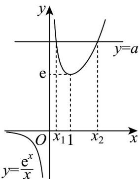

> [!faq]- 《第五章+一元函数的导数及其应用（高效培优讲义）数学人教A版2019高二选择性必修第二册》官方解析
>
> > [!success]- **【答案】** 证明见解析
>
> > [!note]- **【分析】**
> > 分 $x = 0$ 和 $x \neq 0$ 两种情况讨论，把函数的两个零点问题转化为曲线 $y = \frac{\mathrm{e}^x}{x}$ 与直线 $y = a$ 有两个交点的
> >
> > 问题，
> >
> > 求导得到 $y = \frac{\mathrm{e}^x}{x}$ 的单调性，进而得到 $0 < x_1 < 1 < x_2$ ，且 $\begin{cases} \mathrm{e}^{x_1} = ax_1 \\ \mathrm{e}^{x_2} = ax_2 \end{cases}$ ，从而把要证 $x_1 + x_2 > 2$ ，
> >
> > 转化为证明 $\frac{\mathrm{e}^{x_2 - x_1} + 1}{\mathrm{e}^{x_2 - x_1} - 1} >\frac{2}{x_2 - x_1}$ ，再通过构造函数进行证明.
>
> > [!note]- **【解析】**
> > ∵ 当 x=0 时， $f(0)=1$ ，∴ 0 不是 $f(x)=\mathrm{e}^{x}-ax$ 的零点；
> >
> > 当 $x \neq 0$ ，问题可以转化为曲线 $y = \frac{\mathrm{e}^x}{x}$ 与直线 $y = a$ 有两个交点，
> >
> > 曲线 $y = \frac{\mathrm{e}^x}{x}$ 求导得 $y' = \frac{\mathrm{e}^x(x - 1)}{x^2}$ ，当 $x > 1$ 时， $y' > 0$ ；当 $0 < x < 1$ 时， $y' < 0$ ；当 $x < 0$ 时， $y' < 0$ ，
> >
> > $\therefore y=\frac{e^{x}}{x}$ 在 $(-∞,0)$ 和 $(0,1)$ 上单调递减，在 $(1,+∞)$ 上单调递增，且 x=1 时，y=e
> >
> > 当 $x < 0$ 时， $y < 0$ ，当 $x > 0$ 时， $y > 0$ ，如下图所示，
> >
> > 
> >
> > $$
> > . 0 <   x _ {1} <   1 <   x _ {2}
> > $$
> >
> > $$
> > \left\{ \begin{array}{l} \mathrm{e} ^ {x _ {1}} = a x _ {1} \\ \mathrm{e} ^ {x _ {2}} = a x _ {2} \end{array} \right.
> > $$
> >
> > $$
> > . \mathrm{e} ^ {x _ {2}} - \mathrm{e} ^ {x _ {1}} = a x _ {2} - a x _ {1}
> > $$
> >
> > , 则有 $\left\{\begin{aligned}a &= \frac{e^{x_{2}} - e^{x_{1}}}{x_{2} - x_{1}} \\ x_{2} + x_{1} &= \frac{e^{x_{2}} + e^{x_{1}}}{a}\end{aligned}\right.$
> >
> > $\therefore$ 要证 $x_{1} + x_{2} > 2$ ，即证 $\frac{\mathrm{e}^{x_2} + \mathrm{e}^{x_1}}{a} >2$ ，即证 $\frac{\mathrm{e}^{x_2} + \mathrm{e}^{x_1}}{\mathrm{e}^{x_2} - \mathrm{e}^{x_1}} = \frac{\mathrm{e}^{x_2 - x_1} + 1}{\mathrm{e}^{x_2 - x_1} - 1} >\frac{2}{x_2 - x_1}$
> >
> > 令 $t = x_{2} - x_{1}$ ， $\because x_{1} <   x_{2}$ ， $\therefore t > 0$ ，不等式转化为 $\frac{\mathrm{e}^t + 1}{\mathrm{e}^t - 1} >\frac{2}{t}$ ，即证明 $t\left(\mathrm{e}^{t} + 1\right) > 2\left(\mathrm{e}^{t} - 1\right)$
> >
> > 设 $g(t) = t\left(\mathrm{e}^t +1\right) - 2\left(\mathrm{e}^t -1\right)$ ，求导得 $g^{\prime}(t) = te^{t} - \mathrm{e}^{t} + 1$
> >
> > 令 $u(t) = g'(t) = te^t - e^t + 1$ ，求导得 $u'(t) = te^t$ ， $\because t > 0$ ， $\therefore u'(t) = te^t > 0$
> >
> > $\therefore g^{'}(t)$ 单调递增， $g^{'}(t)>g^{'}(0)=0$
> >
> > ∴ $g(t)$ 单调递增， $g(t) > g(0) = 0$
> >
> > ∴ 原不等式成立，即 $x_{1} + x_{2} > 2$ ，命题得证。
