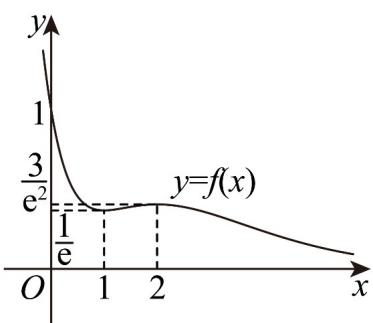

> [!faq]- 《第五章+一元函数的导数及其应用（高效培优讲义）数学人教A版2019高二选择性必修第二册》官方解析
>
> > [!success]- **【答案】** (1) $2x + y - 1 = 0$ (2)函数 $f(x)$ 的单调递增区间为 $(1,2)$ ，单调递减区间为 $(- \infty, 1), (2, +\infty)$ 极小值为 $\frac{1}{e}$ ，极大值为 $\frac{3}{e^{2}}$ (3) $0 < m < \frac{1}{\mathrm{e}}$ 或 $m > \frac{3}{\mathrm{e}^2}$
>
> > [!note]- **【分析】**
> > （1）对函数求导，然后求出切点的导数值和函数值，进而即可求出切线方程·
> >
> > (2) 根据导数的符号求出函数的单调区间以及极值点和极值.
> >
> > (3) 根据 (2) 的单调性和极值画出函数图象，进而可确定 $m$ 的范围
>
> > [!note]- **【解析】**
> > （1）因为函数 $f(x)=\frac{x^{2}-x+1}{\mathrm{e}^{x}}$ ，对函数求导得
> >
> > $$
> > f ^ {\prime} (x) = \frac {(2 x - 1) \mathrm{e} ^ {x} - (x ^ {2} - x + 1) \mathrm{e} ^ {x}}{\mathrm{e} ^ {2 x}} = \frac {- x ^ {2} + 3 x - 2}{\mathrm{e} ^ {x}} = - \frac {(x - 2) (x - 1)}{\mathrm{e} ^ {x}}.
> > $$
> >
> > 所以 $f'(0) = -\frac{2}{1} = -2$ ，因为 $f(0) = \frac{1}{1} = 1$ ，
> >
> > 所以曲线在点 $(0,1)$ 处的切线方程为 $y - 1 = -2x$ ，即 $2x + y - 1 = 0$
> >
> > (2) 令 $f'(x) = 0$ ，则 $x = 2$ 或 $x = 1$ .
> >
> > 当 $f'(x) > 0$ 时，因为 $e^{x} > 0$ ，所以 1 < x < 2，此时 $f(x)$ 在 $(1,2)$ 上单调递增；
> >
> > 当 $f^{\prime}(x) < 0$ 时，因为 $\mathrm{e}^{x} > 0$ ，所以 $x > 2$ 或 $x < 1$ ，此时 $f(x)$ 在 $(- \infty, 1)$ ， $(2, +\infty)$ 上单调递减；
> >
> > 所以 $f(x)$ 在 $x = 1$ 处取得极小值为 $f(1) = \frac{1 - 1 + 1}{\mathrm{e}^1} = \frac{1}{\mathrm{e}}$
> >
> > $f(x)$ 在 x=2 处取得极大值为 $f(2)=\frac{4-2+1}{\mathrm{e}^{2}}=\frac{3}{\mathrm{e}^{2}}$
> >
> > (3) 因为集合 $\left\{x \mid f(x) - m = 0\right\}$ 恰有一个元素，即 $f(x) - m = 0$ 只有一个根.
> >
> > 也就是说函数 $f(x)$ 与 $y = m$ 只有一个交点.
> >
> > 由（2）可画出函数 $f(x)$ 的图象如下所示，
> >
> > 
> >
> > 因为 $f(x)=\frac{x^{2}-x+1}{\mathrm{e}^{x}}=\frac{\left(x-\frac{1}{2}\right)^{2}+\frac{3}{4}}{\mathrm{e}^{x}}>0$ ， $x\to+\infty$ 时， $f(x)\to0$ ，
> >
> > 所以根据图象可以得出当 $0 < m < \frac{1}{\mathrm{e}}$ 或 $m > \frac{3}{\mathrm{e}^2}$ 时，集合 $\{x \mid f(x) - m = 0\}$ 恰有一个元素
