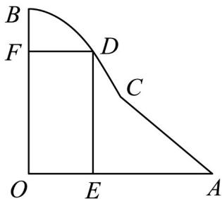

<!-- question-source:start -->
【变式1】某公园有一块如图所示的区域 OACB，该场地由线段 OA，OB，AC 及曲线段 BC 围成·经测量，

$\angle AOB = 90^{\circ}$ ， $OA = OB = 100$ 米，曲线 $BC$ 是以 $OB$ 为对称轴的抛物线的一部分，点 $C$ 到 $OA$ 和 $OB$ 的距离都

是 $^{50}$ 米·现拟在该区域建设一个矩形游乐场 OEDF，其中点 D 在线段 AC 或曲线段 BC 上，点 E，F 分别在线

段 $OA$ ， $OB$ 上，且该游乐场最短边长不低于30米·设 $DF = x$ 米，游乐场的面积为 $S$ 平方米·

(1)试建立平面直角坐标系，求曲线段 $BC$ 的方程；

(2)求面积 S 关于 x 的函数解析式 $S = f(x)$ ;

(3)试确定点 D 的位置，使得游乐场的面积 S 最大·（结果精确到 0.1 米）
<!-- question-source:end -->

![[高中/课堂同步/题库/人教A版高中数学同步讲义(2026)/04_选择性必修第二册/第五章一元函数的导数及其应用/第五章+一元函数的导数及其应用（高效培优讲义）数学人教A版2019高二选择性必修第二册/题型09_利用导数解决实际问题/questions/answers/Q00082011A1.md]]
