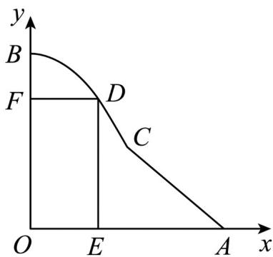

> [!faq]- 《第五章+一元函数的导数及其应用（高效培优讲义）数学人教A版2019高二选择性必修第二册》官方解析
>
> > [!success]- **【答案】** (1) $y = -0.02x^{2} + 100(0 \leq x \leq 50)$ (2) $f(x) = \begin{cases} x(-0.02x^2 + 100), & 30 \leq x \leq 50 \\ x(-x + 100), & 50 < x \leq 70 \end{cases}$ (3)当点 D 在曲线段 BC 上且其到 OA 的距离约为 66.7 米时，游乐场的面积 S 最大
>
> > [!note]- **【分析】**
> > （1）以 O 为坐标原点，OA、OB 所在直线分别为 x 轴、y 轴，然后根据题意求解析式即可；
> >
> > (2) 分别求出 $D$ 在不同线段的解析式，然后计算面积；
> >
> > (3) 在不同情况计算最大值，然后比较两个最大值就可以得到面积最大值，然后确定点 D 的位置.
>
> > [!note]- **【解析】**
> > （1）以 $O$ 为坐标原点， $OA$ 、 $OB$ 所在直线分别为 $x$ 轴、 $y$ 轴，建立平面直角坐标系·如图所示，则
> >
> > $A(100,0)$ $C(50,50)$ $B(0,100)$
> >
> > 
> >
> > 设曲线段 BC 所在抛物线的方程为 $y = ax^{2} + b (a < 0)$ .
> >
> > 由题意可知，点 $B(0,100)$ 和 $C(50,50)$ 在此抛物线上，
> >
> > 故 $a = -0.02$ ， $b = 100$
> >
> > 所以曲线段 BC 的方程为： $y = -0.02x^{2} + 100(0 \leq x \leq 50)$
> >
> > (2) 由题意，线段 AC 的方程为 $y = -x + 100 (50 \leq x \leq 100)$ .
> >
> > 当点 D 在曲线段 BC 上时， $S = x\left(-0.02x^{2} + 100\right)\left(30 \leq x \leq 50\right)$ .
> >
> > 当点 D 在线段 AC 上时， $S = x(-x + 100)(50 \leq x \leq 70)$ .
> >
> > 所以 $f(x)=\left\{\begin{aligned}&x(-0.02x^{2}+100),30\leq x\leq50\\&x(-x+100),50\leq x\leq70\end{aligned}\right.$
> >
> > (3) 当 $30 \leq x \leq 50$ 时， $f'(x) = -0.06x^{2} + 100$ ，令 $-0.06x^{2} + 100 = 0$ ，得 $x_{1} = \frac{50\sqrt{6}}{3}$ ， $x_{2} = -\frac{50\sqrt{6}}{3}$ （舍去）.
> >
> > 当 $x \in \left[30, \frac{50\sqrt{6}}{3}\right)$ 时， $f'(x) > 0$ ；当 $x \in \left(\frac{50\sqrt{6}}{3}, 50\right)$ 时， $f'(x) < 0$ 。
> >
> > 因此当 $x = \frac{50\sqrt{6}}{3}$ 时， $S = f\left(\frac{50\sqrt{6}}{3}\right) = \frac{10000\sqrt{6}}{9}$ 是极大值，也是最大值
> >
> > 当 $50 < x \leq 70$ 时， $f(x) = -(x - 50)^2 + 2500$
> >
> > 当 x=50 时， $S=f(50)=2500$ 是最大值
> >
> > 因为 $\frac{10000\sqrt{6}}{9} > 2500$
> >
> > 所以当 $x=\frac{50\sqrt{6}}{3}$ 时，S 取得最大值，此时 $D\left(\frac{50\sqrt{6}}{3},\frac{200}{3}\right)$
> >
> > 所以当点 D 在曲线段 BC 上且其到 OA 的距离约为 66.7 米时，游乐场的面积 S 最大
