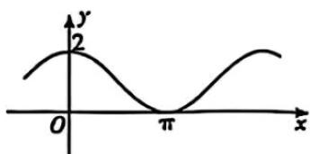

<!-- question-source:start -->
【变式1】函数 $f(x) = A\cos \omega x + b (A > 0, \omega > 0)$ 的图象如图所示，若 $f(x)$ 的图象与 $g(x) = ae^x$ 的图象在 $x = x_0$ 处有公切线，其中 $x_0 \in (\pi, 2\pi)$ ，则（）

A $A = 1, b = 1$

B. $f\left(x - \frac{\pi}{2}\right)$ 为奇函数

C. $a = e^{-\frac{3\pi}{2}}$

D. $f(x)$ 的图象与 $g(x) = ae^x$ 的图象在 $x = x_0$ 处的公切线为 $y = x - \frac{3\pi}{2} + 1$
<!-- question-source:end -->

![[高中/课堂同步/题库/人教A版高中数学同步讲义(2026)/04_选择性必修第二册/第五章一元函数的导数及其应用/讲义/专题5_1_导数的概念及其意义_高效培优讲义_数学人教A版2019高二/_compact/answers/Q00061352A1.md]]
