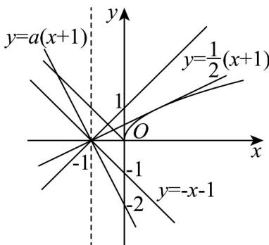

> [!faq]- 《专题5_1_导数的概念及其意义_高效培优讲义_数学人教A版2019高二》官方解析
>
> > [!success]- **【答案】** $(- \infty, -1) \cup (\frac{1}{2}, +\infty) \cup \{0\}$
>
> > [!note]- **【分析】**
> > 由题意可得直线 $y = a(x + 1)$ 与函数 $y = f(x)$ 的图象只有一个交点，对函数 $y = \sqrt{x}$ 求导，求出过
> >
> > (-1,0)
> >
> > 的切线的斜率，结合图象求解即可·
>
> > [!note]- **【解析】**
> > 由题意可得直线 $y = a(x + 1)$ 与函数 $y = f(x)$ 的图象只有一个交点，
> >
> > 又因为直线 $y = a(x + 1)$ 过定点 $(-1, 0)$ ，
> >
> > 作出函数 $y = f(x)$ 的图象，如图所示：
> >
> > 
> >
> > 过点 $(-1,0)$ 作曲线 $y = \sqrt{x}$ 的切线，设切点为 $(x_0,\sqrt{x_0})$
> >
> > 因为 $y'=\frac{1}{2\sqrt{x}}$
> >
> > 所以切线方程为 $y - \sqrt{x_0} = \frac{1}{2\sqrt{x_0}} (x - x_0)$
> >
> > 代入 $(-1,0)$ ，得 $-\sqrt{x_{0}}=\frac{1}{2\sqrt{x_{0}}}(-1-x_{0})$
> >
> > 解得 $x_0 = 1$
> >
> > 所以切线的斜率 $k=\frac{1}{2\sqrt{x_{0}}}=\frac{1}{2}$
> >
> > 所以当 $a > \frac{1}{2}$ 或 $a < -1$ 时，直线 $y = a(x + 1)$ 与函数 $y = f(x)$ 的图象只有一个交点，
> >
> > 又因为当 $a = 0$ 时，也满足题意，
> >
> > 综上，实数 $a$ 的取值范围是 $(- \infty, -1) \cup (\frac{1}{2}, +\infty) \cup \{0\}$ .
> >
> > 故答案为： $(- \infty, -1) \cup (\frac{1}{2}, +\infty) \cup \{0\}$
