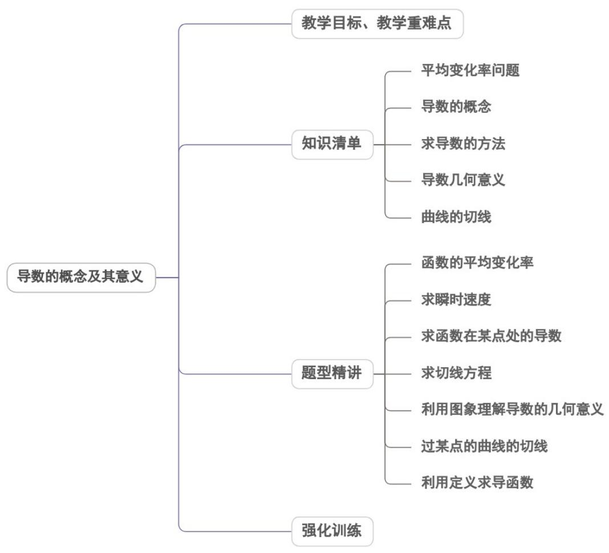

## 专题5.1 导数的概念及其意义

## 内容概览

## 教学目标、教学重难点

<table><tr><td>教学目标</td><td>1.初步了解导数概念的背景,掌握平均变化率与瞬时变化率的概念及几何意义。2.会求函数的平均变率与瞬时变化率。3.能结合实际问题求曲线在某点处与某点附近点的切线与割线的斜率的极限值。</td></tr><tr><td>教学重难点</td><td>1.重点求函数的平均变化率与瞬时变化率.,在与过的切线问题,利用定义求导数.2.难点</td></tr></table>
