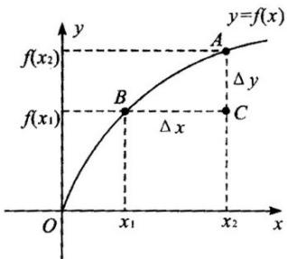
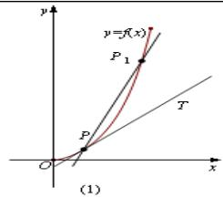
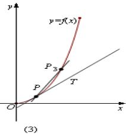
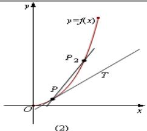
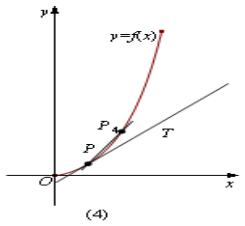
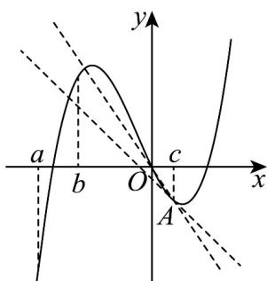

## 知识点 04 导数几何意义

## 1、平均变化率的几何意义——曲线的割线

函数 $y = f(x)$ 的平均变化率 $\frac{\Delta y}{\Delta x} = \frac{f(x_2) - f(x_1)}{x_2 - x_1}$ 的几何意义是表示连接函数 $y = f(x)$ 图像上两点割线的斜率.

如图所示，函数 $f(x)$ 的平均变化率 $\frac{\Delta y}{\Delta x} = \frac{f(x_2) - f(x_1)}{x_2 - x_1}$ 的几何意义是：直线 $AB$ 的斜率.

事实上， $k_{AB} = \frac{y_A - y_B}{x_A - x_B} = \frac{f(x_2) - f(x_1)}{x_2 - x_1} = \frac{\Delta y}{\Delta x}$ ．换一种表述：曲线上一点 $P(x_0, y_0)$ 及其附近一点

$Q(x_0 + \Delta x, y_0 + \Delta y)$ ，经过点 $P$ 、 $Q$ 作曲线的割线 $PQ$ ，则有 $k_{PQ} = \frac{(y_0 + \Delta y) - y_0}{(x_0 + \Delta x) - x_0} = \frac{\Delta y}{\Delta x}$

## 2、导数的几何意义——曲线的切线

图1

如图1，当 $P_{n}(x_{n},f(x_{n}))(n = 1,2,3,4)$ 沿着曲线 $f(x)$ 趋近于点 $P(x_0,f(x_0))$ 时，割线 $PP_{n}$ 的变化趋势是什么？我们发现，当点 $P_{n}$ 沿着曲线无限接近点 $P$ 即 $\Delta x\to 0$ 时，割线 $PP_{n}$ 趋近于确定的位置，这个确定位置的直线 $PT$

称为曲线在点 P 处的切线。

定义：如图，当点 $Q(x_0 + \Delta x, y_0 + \Delta y)$ 沿曲线无限接近于点 $P(x_0, y_0)$ ，即 $\Delta x \to 0$ 时，割线 $PQ$ 的极限位置直线 $PT$ 叫做曲线在点 $P$ 处的切线． $T$ 也就是：当 $\Delta x \to 0$ 时，割线 $PQ$ 斜率的极限，就是切线的斜率．

即： $k=\lim_{\Delta x\to0}\frac{\Delta y}{\Delta x}=\lim_{\Delta x\to0}\frac{f(x_{0}+\Delta x)-f(x)}{\Delta x}=f'(x_{0})$

【即学即练】

1. 如图是函数 $f(x)$ 的部分图象，记 $f(x)$ 的导函数为 $f'(x)$ ，则下列选项中值最小的是（）

A. $f^{\prime}(a)$ B. $f(b)$ C. $f(c)$ D. $cf^{\prime}(c)$

【答案】C

【分析】由函数的图象，结合导数的几何意义，即可判断·

【详解】由图知 $f'(a) > 0$ ， $f(b) > 0$ ， $f(c) < 0$ ， $cf'(c) < 0$ ，所以排除 A，B；

设 $f(x)$ 的图象在 x=c 处的点为 A，

显然 $OA$ 的斜率 $k_{OA}$ 小于在 $A$ 处的切线斜率 $f^{\prime}(c)$

则 $\frac{f(c) - 0}{c - 0} < f'(c)$ ，且 $c > 0$ ，可转化为 $f(c) < cf'(c)$

所以 $f(c)$ 的值最小，排除 D.

故选：C.

2. 函数 $f(x)$ 的图像如图所示，下列数值排序正确的是（）

A. $f^{\prime}(1) > f^{\prime}(2) > f^{\prime}(3) > 0$ B. $f^{\prime}(1) <   f^{\prime}(2) <   f^{\prime}(3) <   0$ C. $0 <   f^{\prime}(1) <   f^{\prime}(2) <   f^{\prime}(3)$ D. $f^{\prime}(1) > f^{\prime}(2) > 0 > f^{\prime}(3)$

【答案】A

【分析】由导数的几何意义分析可得 $f'(1)$ ， $f'(2)$ 和 $f'(3)$ 的几何意义，结合图像可得解。
【详解】由函数 $f(x)$ 的图像可知，
∵ 当 x 0 时， $f(x)$ 单调递增，
∴ $f'(1) > 0$ ， $f'(2) > 0$ ， $f'(3) > 0$ .

随着 $x$ 的增大，曲线在每个点处的斜率在逐渐减小，即导函数是单调递减的， $\therefore f'(1) > f'(2) > f'(3) > 0.$

故选：A.
