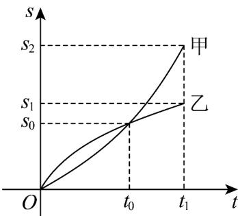

## 题型 05 利用图象理解导数的几何意义

【典例1】物体甲、乙在时间 $0$ 到 $t_1$ 范围内，路程的变化情况如图所示，下列说法正确的是（）

A. 在 $0$ 到 $t_0$ 范围内，甲的平均速度大于乙的平均速度
B. 在 $0$ 到 $t_0$ 范围内，甲的平均速度小于乙的平均速度
C. 在 $t = t_{\mathbf{0}}$ 时，甲的瞬时速度大于乙的瞬时速度
D. 在 $t = t_{\mathbf{0}}$ 时，甲的瞬时速度等于乙的瞬时速度

【答案】C

【分析】利用平均速度、瞬时速度的定义逐项判断即可·

$$
s _ {0}
$$

【详解】在 $^{0}$ 到 $t_{0}$ 范围内，甲、乙的平均速度都为 $t_{0}$ ，故A、B错误；

因为甲对应的曲线在 $t = t_{0}$ 处的切线的斜率大于乙对应的曲线在 $t = t_{0}$ 处的切线的斜率

故在 $t = t_{0}$ 处，甲的瞬时速度大于乙的瞬时速度，故 C 正确，D 错误

故选：C.

## 方法技巧

导数的几何意义就是切线的斜率，所以比较导数大小的问题可以用数形结合思想来解决。

（1）曲线 $f(x)$ 在 $x_0$ 附近的变化情况可通过 $x_0$ 处的切线刻画． $f'(x_0) > 0$ 说明曲线在 $x_0$ 处的切线的斜率为正值，从而得出在 $x_0$ 附近曲线是上升的； $f'(x_0) < 0$ 说明在 $x_0$ 附近曲线是下降的．

(2) 曲线在某点处的切线斜率的大小反映了曲线在相应点处的变化情况，由切线的倾斜程度，可以判断出曲

线升降的快慢.

![[高中/课堂同步/题库/人教A版高中数学同步讲义(2026)/04_选择性必修第二册/第五章一元函数的导数及其应用/讲义/专题5_1_导数的概念及其意义_高效培优讲义_数学人教A版2019高二/_compact/Q00061352.md]]
![[高中/课堂同步/题库/人教A版高中数学同步讲义(2026)/04_选择性必修第二册/第五章一元函数的导数及其应用/讲义/专题5_1_导数的概念及其意义_高效培优讲义_数学人教A版2019高二/_compact/Q00061353.md]]
![[高中/课堂同步/题库/人教A版高中数学同步讲义(2026)/04_选择性必修第二册/第五章一元函数的导数及其应用/讲义/专题5_1_导数的概念及其意义_高效培优讲义_数学人教A版2019高二/_compact/Q00061354.md]]
