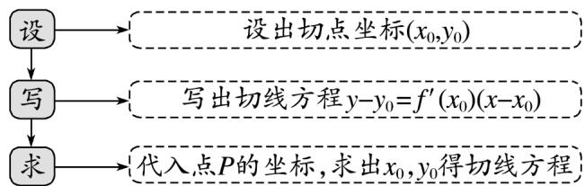

## 题型04 利用导数研究曲线的切线方程（在点 $P$ 处与过点 $P$ 处）

【典例1】已知函数 $f(x) = -x^3 + x + 1$ ， $g(x) = e^{-2x}$ .

(1)求曲线 $y = f(x)$ 在点(1,1)的切线方程；

(2)若曲线 $y = f(x)$ 在点(1,1)处的切线与曲线 $y = g(x)$ 在 $x = t(t \in \mathbb{R})$ 处的切线平行，求 $t$ 的值.

【答案】(1) $2x + y - 3 = 0$

(2)0

【分析】（ $^{1}$ ）求出函数的导数，根据导数的几何意义即可求解；

(2) 结合 (1) 的结论，根据曲线 $y = f(x)$ 在点 (1,1) 处的切线与曲线 $y = g(x)$ 在 $x = t(t \in \mathbb{R})$ 处的切线平行，可

得切线斜率相等，根据导数的几何意义列式求解，即得答案·

【详解】（1）由 $f(x) = -x^{3} + x + 1$ 得 $f'(x) = -3x^{2} + 1$

则 $y = f(x)$ 在点 $(1,1)$ 处的切线斜率 $k = f'(1) = -2$

故切线方程为 $y-1=-2(x-1)$

从而切线方程为 $2x + y - 3 = 0$ .

(2) 由 (1) 可得曲线 $y = f(x)$ 在点 (1,1) 的切线方程为 $2x + y - 3 = 0$

由 $g^{\prime}(x) = -2\mathrm{e}^{-2x}$ ，可得曲线 $y = g(x)$ 在 $x = t(t\in \mathbb{R})$ 处的切线斜率为 $g^{\prime}(t) = -2\mathrm{e}^{-2t}$

由题意可得 $-2e^{-2t} = -2$ ，从而 t = 0。

## 方法技巧

(1) 利用导数的几何意义解决切线问题的两种情况

① 若已知点是切点，则在该点处的切线斜率就是该点处的导数；

② 若已知点不是切点，则应先设出切点，再借助两点连线的斜率公式进行求解。

(2) 求过点 P 与曲线相切的直线方程的三个步骤

![[高中/课堂同步/题库/人教A版高中数学同步讲义(2026)/04_选择性必修第二册/第五章一元函数的导数及其应用/讲义/专题5_2_导数的运算_高效培优讲义_数学人教A版2019高二选择性必/_compact/Q00061381.md]]
![[高中/课堂同步/题库/人教A版高中数学同步讲义(2026)/04_选择性必修第二册/第五章一元函数的导数及其应用/讲义/专题5_2_导数的运算_高效培优讲义_数学人教A版2019高二选择性必/_compact/Q00061382.md]]
![[高中/课堂同步/题库/人教A版高中数学同步讲义(2026)/04_选择性必修第二册/第五章一元函数的导数及其应用/讲义/专题5_2_导数的运算_高效培优讲义_数学人教A版2019高二选择性必/_compact/Q00061383.md]]
