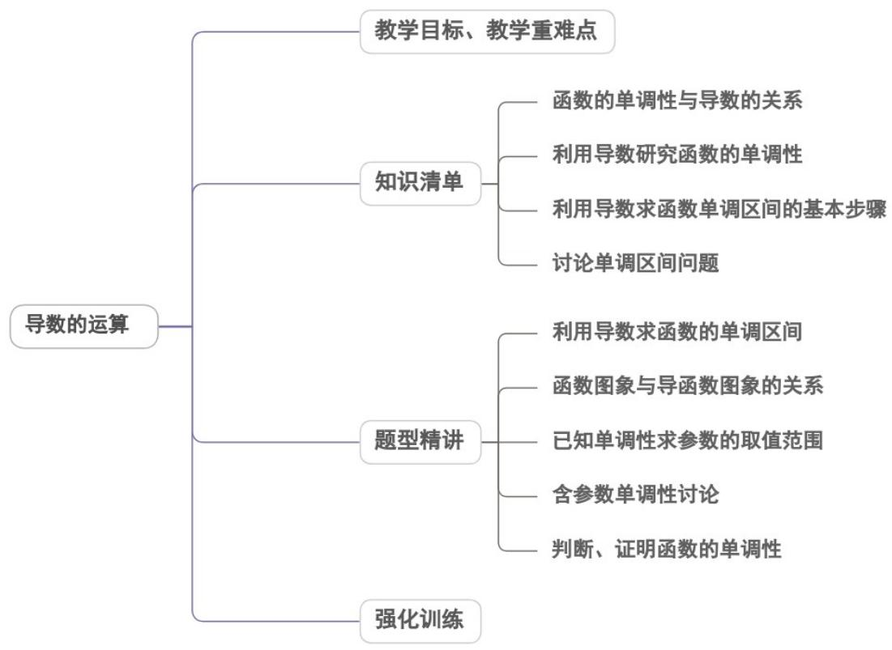

## 专题5.3.1 函数的单调性

## 内容概览

## 教学目标、教学重难点

<table><tr><td>教学目标</td><td>1.理解导数与函数的单调性的关系。2.掌握利用导数判断函数单调性的方法。3.能利用导数求不超过三次多项式函数的单调区间。4.会利用导数证明一些简单的不等式问题。5.掌握利用导数研究含参数的单调性的基本方法。</td></tr><tr><td>教学重难点</td><td>1.重点利用函数的导数判断函数的单调性,会求简单函数的单调区间,能证明简单的不等式.2.难点利用导数解决单调性与含参数相关的问题</td></tr></table>
