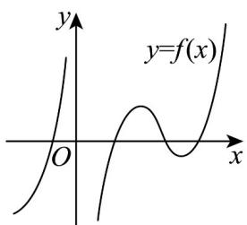
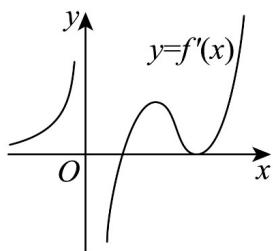

<!-- question-source:start -->
13. 设函数 $y = f(x)$ 可导， $y = f(x)$ 的图象如图所示，则导函数 $f'(x)$ 图象可能为（）

A

B

<!-- source-part:2 pages:51-53 -->

C

D

<!-- question-source:end -->

![[高中/课堂同步/题库/人教A版高中数学同步讲义(2026)/04_选择性必修第二册/第五章一元函数的导数及其应用/讲义/专题5_3_1_函数的单调性_高效培优讲义_数学人教A版2019高二选/强化训练_sec_13/questions/answers/Q00061432A1.md]]
