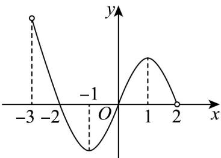

> [!faq]- 《专题5_3_1_函数的单调性_高效培优讲义_数学人教A版2019高二选》官方解析
>
> > [!success]- **【答案】** B
>
> > [!note]- **【分析】**
> > 结合图象，利用导数与函数单调性间的关系，得 $f'(x) < 0$ 和 $f'(x) > 0$ 时， $x$ 的取值范围，即可求解。
>
> > [!note]- **【解析】**
> > 由图可知 $f(x)$ 的减区间为 $(-3, -1)$ ， $(1, 2)$ ，增区间为 $(-1, 1)$ ，所以当 $x \in (-3, -1) \cup (1, 2)$ 时， $f'(x) < 0$ ，当 $x \in (-1, 1)$ 时， $f'(x) > 0$ ，又由图知，当 $x \in (-3, -2) \cup (0, 2)$ 时， $f(x) > 0$ ，当 $x \in (-2, 0)$ 时， $f(x) < 0$ ，所以 $f(x)f'(x) > 0$ 的解集为 $(-2, -1) \cup (0, 1)$ ，
> >
> > 
> >
> > 故选 **B**.
